# Phase 3 — Data Quality Assessment & Phase 4 — Exploratory Data Analysis

Generated by `src_research/02_data_quality.py` and `src_research/03_eda.py` against `data/bank_transactions_data_2.csv` (2,512 rows). Numeric outputs live in `artifacts_research/`; plots referenced below live in `research/plots/`.

---

## Phase 3 — Data Quality Assessment

### 3.1 Missing Values

0 missing cells out of 45,216 total cells (2,512 rows × 18 columns including parsed datetime helpers) — **0.0% missing across every column**. Confirmed directly from `df.isna().sum()`; no imputation strategy is required anywhere in this pipeline.

### 3.2 Duplicate Analysis

| Check | Result |
|---|---:|
| Exact duplicate rows (`df.duplicated()`) | **0** |
| Duplicate `TransactionID` values | **0** |
| Near-duplicates (same `AccountID` + same `TransactionAmount` + same `TransactionDate` rounded to the minute) | **0** |

`TransactionID` is confirmed unique across all 2,512 rows, and there are no near-duplicate rows under the same-account/same-amount/same-minute rule. This rules out one common data-quality risk (duplicated ledger entries inflating a "burst" signal) — any velocity/burst pattern found later in feature engineering reflects genuinely distinct transactions, not re-counted duplicates.

### 3.3 Outlier Analysis

Five detection methods were run independently on each of the five numeric features (`IQR` 1.5×, `Z-score` \|z\|>3, `Modified Z-score` MAD-based \|z\|>3.5, `Percentile` below 1st/above 99th, and `Isolation Forest` with `contamination=0.05` fit jointly on all five standardizable features at once). Full numbers: `artifacts_research/outlier_comparison.csv` and `artifacts_research/outlier_method_overlap.csv`.

**Flagged-row counts per method:**

| Feature | IQR | Z-score | Modified Z-score | Percentile (1st/99th) | Isolation Forest (joint) |
|---|---:|---:|---:|---:|---:|
| TransactionAmount | 113 | 48 | 100 | 52 | 126 |
| CustomerAge | 0 | 0 | 0 | 17 | 126 |
| TransactionDuration | 0 | 0 | 0 | 52 | 126 |
| LoginAttempts | 122 | 95 | 122 | 0 | 126 |
| AccountBalance | 0 | 0 | 0 | 52 | 126 |

Isolation Forest, fit jointly with `contamination=0.05`, flags exactly 126/2,512 rows (5.02%) — by construction the same 126-row set for every feature row above, since it is one joint multivariate flag, not five independent per-feature flags.

**Method agreement (Jaccard similarity, full pairwise table in `outlier_method_overlap.csv`):**

- **TransactionAmount** — the univariate methods disagree substantially with each other: IQR and Modified Z-score agree closely (Jaccard 0.885, 100 shared rows), but IQR vs. the 1st/99th percentile method only overlaps at Jaccard 0.187 (26 shared rows out of 113+52-26 unique flagged). Isolation Forest overlaps each univariate method only partially (Jaccard 0.16–0.24), because it is scoring joint deviation across all five features simultaneously, not just amount in isolation — a row can be jointly anomalous (odd combination of amount + duration + balance) without being a univariate amount outlier, and vice versa.
- **LoginAttempts** — IQR and Modified Z-score flag the *identical* 122 rows (Jaccard 1.0), which is expected given 95.14% of rows equal exactly 1 and the remaining 4.86% (122 rows) take values 2–5; both threshold methods land on the same natural break. The 1st/99th percentile method flags **zero** rows here because the 1st and 99th percentiles of a distribution that is 95% one repeated value are themselves both equal to 1, so nothing crosses the percentile bound — a real limitation of applying percentile-based cutoffs to a near-discrete variable.
- **CustomerAge, TransactionDuration, AccountBalance** — IQR, Z-score, and Modified Z-score all return **0** flagged rows. These three features are not skewed/heavy-tailed enough for whisker- or standard-deviation-based rules to trigger (consistent with their near-normal-to-moderate skew reported in Phase 2: 0.15, 0.60, 0.60 respectively, well short of the ~1.7+ skew where these classical rules typically start firing). Only the percentile method (which flags a fixed 2% of rows by definition, 17–52 rows depending on tied values) and Isolation Forest (multivariate) surface anything on these three columns in isolation.
- Isolation Forest vs. any single univariate method: Jaccard ranges from 0.00 (CustomerAge, TransactionDuration, AccountBalance vs. IQR/Z-score/Modified-Z, since those return empty sets) up to 0.535 (LoginAttempts vs. Z-score). This confirms the joint model is capturing genuinely different — and for a fraud use case, more relevant — structure than any single-feature rule: real fraud is rarely extreme on one feature alone, it is an unusual *combination*.

**No outliers are removed or capped.** In an unsupervised fraud-detection context, the "outliers" identified above (especially the ~126 Isolation Forest–flagged rows and the univariate TransactionAmount/LoginAttempts extremes) are candidate fraud signal, not noise to be cleaned away — removing them before modeling would delete the very population the system exists to find. These flags are retained as-is for downstream feature engineering and are not used to filter or transform the dataset.

---

## Phase 4 — Exploratory Data Analysis

### 4.1 Univariate Analysis

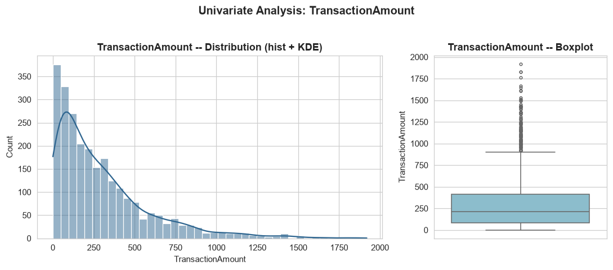

**TransactionAmount** — visibly right-skewed (skew 1.74) with a peak below $100 and a long thin tail out to $1,919.11; the boxplot shows a dense mass of flagged points above the upper whisker (~$930), consistent with the 113 IQR-flagged rows. For fraud detection this is the single most important feature to model *relative to account baseline* rather than in absolute terms, since a $1,500 transaction is unremarkable for a high-balance account and alarming for a low-balance one.

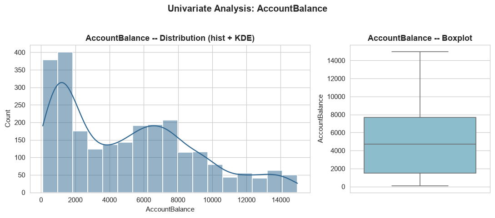

**AccountBalance** — right-skewed (skew 0.60) and spread across two-plus orders of magnitude ($101 to $14,978). This wide range is exactly why `TransactionAmount` needs a balance-relative feature (e.g. `TransactionAmount / AccountBalance`) to be discriminative rather than misleading.

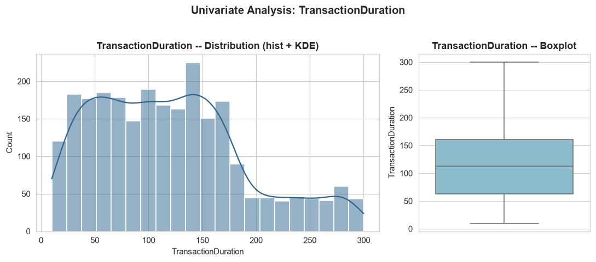

**TransactionDuration** — moderately right-skewed (skew 0.60), ranging 10–300 seconds with a median of 112.5s. The shape suggests a mixture of fast (likely ATM) and slow (likely Branch) transaction types rather than one homogeneous population — confirmed in the channel breakdown below.

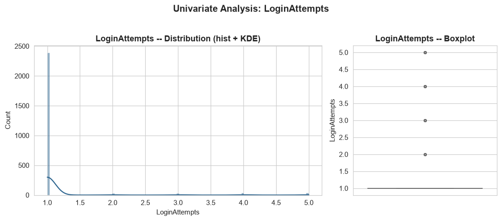

**LoginAttempts** — the most extreme univariate distribution in the dataset (skew 5.17, excess kurtosis 26.61): 95.14% of rows are exactly 1, with only 122 rows (4.86%) at 2–5. This is effectively a rare-event security flag disguised as a continuous integer column, and should be engineered as a near-binary "elevated login attempts" indicator rather than fed into models as a smooth numeric feature.

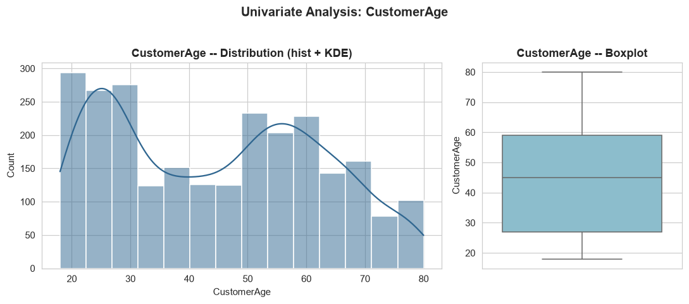

**CustomerAge** — close to symmetric (skew 0.15) across 18–80, mean 44.67/median 45.0, with a flatter-than-normal center (excess kurtosis -1.22). No shape anomaly here; age looks like ordinary demographic spread, not a data-quality concern.

### 4.2 Bivariate Analysis

**Numerical vs. numerical.**

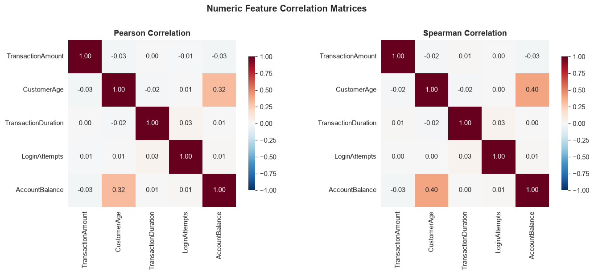

Pearson and Spearman correlations agree closely and both show the numeric feature set is almost entirely uncorrelated: the only relationship of any size is `CustomerAge` vs. `AccountBalance` (Pearson 0.320, Spearman 0.404 — older customers carry moderately higher balances). Every other pairwise correlation is below |0.03|.

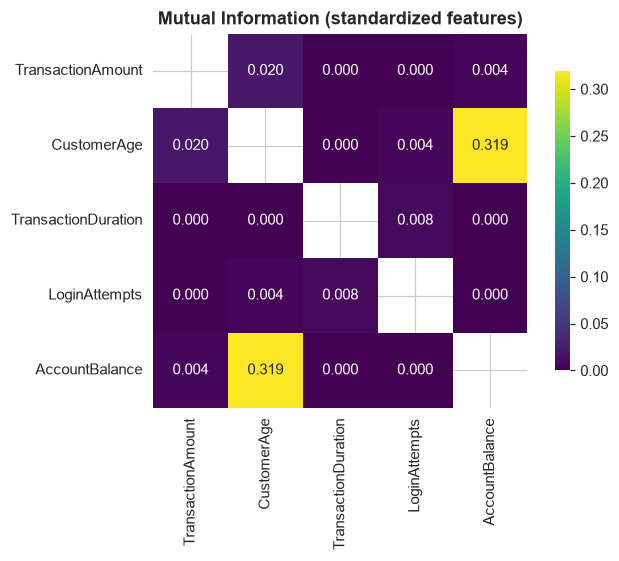

The mutual information matrix (`artifacts_research/mutual_information_matrix.csv`) tells the same story non-linearly: MI(CustomerAge, AccountBalance) = 0.319-0.320 nats dominates the matrix, and all other pairs are ≤0.02 — there is no hidden non-linear dependency that Pearson/Spearman are missing. Practically: the five numeric features carry largely independent information, which is good news for a joint anomaly detector (little redundancy to waste model capacity on) and is corroborated by the VIF analysis below.

**Numerical vs. categorical.**

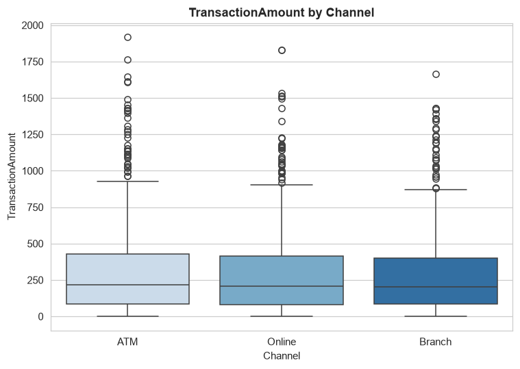

`TransactionAmount` by `Channel`: ATM mean $307.72 (median $218.96, n=833), Online mean $297.21 (median $206.63, n=811), Branch mean $288.23 (median $204.16, n=868). The three channels look very similar in central tendency and spread — channel alone does not strongly separate typical transaction size, though ATM shows a marginally higher mean driven by tail transactions.

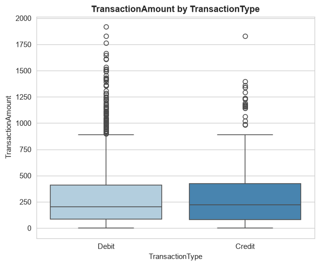

`TransactionAmount` by `TransactionType`: Credit mean $306.50 (median $223.36, n=568), Debit mean $294.99 (median $205.14, n=1,944). Again similar distributions — Credit transactions run marginally higher on average, but the overlap is substantial; `TransactionType` alone is a weak amount predictor.

**Categorical vs. categorical.** Crosstab of `Channel` × `TransactionType` (`artifacts_research/crosstab_channel_transactiontype.csv`):

| Channel | Credit | Debit | Credit share |
|---|---:|---:|---:|
| ATM | 73 | 760 | 8.76% |
| Branch | 251 | 617 | 28.92% |
| Online | 244 | 567 | 30.09% |

Chi-square test of independence: **χ² = 136.91, dof = 2, p = 1.87 × 10⁻³⁰**. This is a highly significant association — `Channel` and `TransactionType` are not independent. ATM transactions are overwhelmingly Debit (91.2%), while Branch and Online each carry a Credit share roughly 3.3× higher (~29–30%). This makes structural sense (ATMs are predominantly a cash-withdrawal channel) and means `Channel` and `TransactionType` should not both be treated as independent one-hot signals without acknowledging this coupling — an "ATM + Credit" transaction is itself a rarer, more distinctive combination (only 73/2,512 = 2.9% of all transactions) worth a dedicated interaction feature.

### 4.3 Multivariate Analysis

**VIF (multicollinearity check).** Since `statsmodels` is not installed in this environment, VIF was computed directly from first principles — `VIF_i = 1 / (1 - R²_i)`, where `R²_i` comes from an OLS regression (`sklearn.linear_model.LinearRegression`) of each standardized feature against the other four — which is mathematically identical to `statsmodels.stats.outliers_influence.variance_inflation_factor`.

| Feature | R² vs. other 4 features | VIF |
|---|---:|---:|
| TransactionAmount | 0.0011 | 1.001 |
| CustomerAge | 0.1031 | 1.115 |
| TransactionDuration | 0.0015 | 1.002 |
| LoginAttempts | 0.0014 | 1.001 |
| AccountBalance | 0.1029 | 1.115 |

All VIFs sit at 1.0–1.12, far below the conventional concern threshold of 5 (or even the stricter 2.5). **No multicollinearity issue exists among these five numeric features** — consistent with the near-zero correlation/MI matrix above. Every feature can be retained without redundancy concerns.

**PCA.**

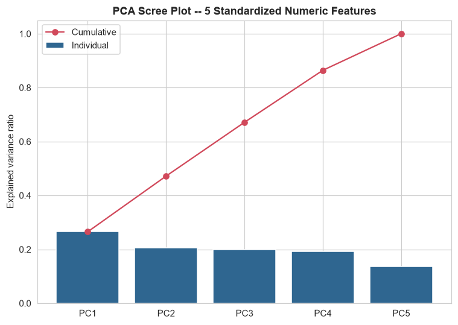

| Component | Explained variance | Cumulative |
|---|---:|---:|
| PC1 | 26.50% | 26.50% |
| PC2 | 20.67% | 47.17% |
| PC3 | 19.95% | 67.12% |
| PC4 | 19.30% | 86.42% |
| PC5 | 13.58% | 100.00% |

The scree plot is nearly flat — no small subset of components dominates. This is the direct consequence of the low inter-feature correlation found above: with near-orthogonal inputs, PCA has little redundancy to compress away, so all 5 components are needed to reach 100% variance and the first 2 components only capture 47.2%. Loadings (`artifacts_research/pca_loadings.csv`) confirm this reads almost as a relabeling of the original features: PC1 ≈ `CustomerAge`(0.702)/`AccountBalance`(0.701) contrast axis, PC2 ≈ `TransactionDuration`(0.708)/`LoginAttempts`(0.702), PC3 ≈ `TransactionAmount` almost alone (0.966), PC4 contrasts `LoginAttempts`(0.700) against `TransactionDuration`(-0.675), PC5 contrasts `CustomerAge`(0.706) against `AccountBalance`(-0.706).

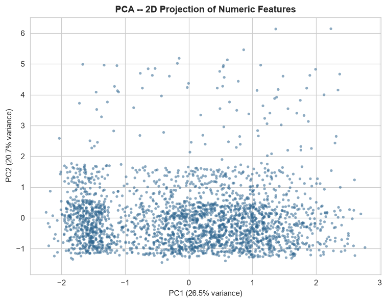

The 2D PCA projection (PC1 vs PC2, 47.2% of total variance) shows one dense central mass with no separated clusters, plus a sparse upward-scattered tail above PC2 ≈ 2 — given PC2's loading on `LoginAttempts` and `TransactionDuration`, this tail plausibly corresponds to the small population of elevated-`LoginAttempts` rows (122 rows, 4.86% of data) rather than a distinct customer segment. There is no clean multi-cluster structure in 2 components; that is expected given only 47% of variance is captured here.

**t-SNE.**

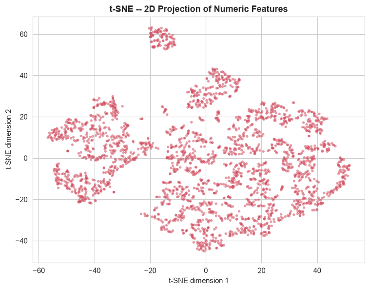

t-SNE (perplexity 30, PCA-initialized) shows a large diffuse main body fragmented into several loosely-separated sub-lobes, plus one small, tightly isolated cluster near the top of the plot. t-SNE is known to fragment continuous data into visual "clusters" that do not necessarily correspond to real group structure, so this should be read cautiously — but the fragmentation pattern is directionally consistent with `LoginAttempts` acting as a near-discrete variable (5 possible values, 95.1% at one value): a feature that takes only a handful of distinct values will tend to pull rows sharing that value into their own tight sub-region under t-SNE's local-neighborhood objective. No claim of confirmed customer segments is made here — it is offered as a plausible read of the projection, not a validated cluster label.

**UMAP.** `umap-learn` is **not installed** in this environment (`import umap` fails with `ModuleNotFoundError`) and was not installed to keep the environment matched to `requirements.txt`. PCA and t-SNE above are used as the two projection methods instead; both were confirmed to run end-to-end. If UMAP is added to the environment later, `src_research/03_eda.py` already contains a working `umap_analysis()` function (import-guarded) that will produce `research/plots/umap_2d_scatter.png` automatically without any other code change.

---

## Summary for Feature Engineering (Phase 5 handoff)

- No missing-value handling needed.
- No duplicate-row handling needed.
- Do not remove/cap outliers — they are candidate signal, not noise.
- `LoginAttempts` should get a dedicated near-binary "elevated attempts" treatment, not a plain numeric one.
- `TransactionAmount` and `AccountBalance` should be combined into a ratio/relative feature; both are wide-range and only weakly correlated (Pearson -0.03) with each other, so amount alone lacks context.
- `Channel` × `TransactionType` interaction is statistically justified (χ²=136.91, p<10⁻²⁹) and worth an explicit interaction feature, particularly isolating the rare ATM+Credit combination (2.9% of rows).
- The five numeric features show no multicollinearity (all VIF < 1.12) — safe to use all five directly in a linear or tree-based model without dropping any for redundancy.
- Absolute hour-of-day/day-of-week features from `TransactionDate` carry limited signal given the entire dataset is confined to a ~2.3-hour weekday window (Section on `TransactionDate` in `02_data_understanding.md`); prioritize inter-transaction gap/velocity features per `AccountID` instead.
