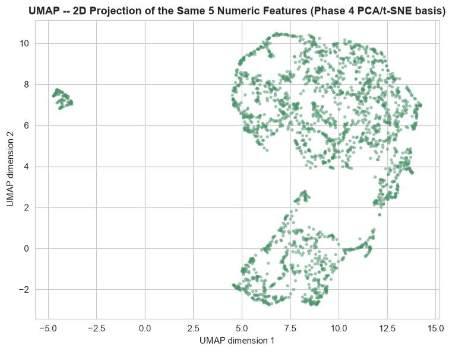
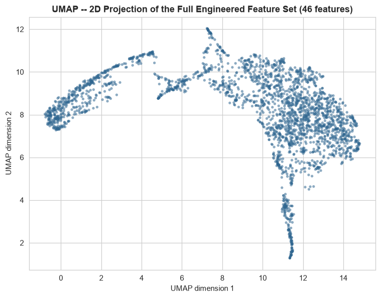
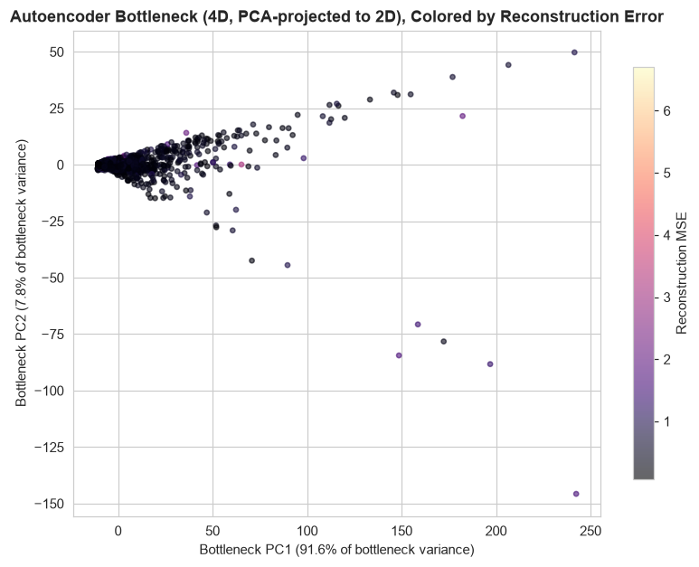

# Phase 6 — Preprocessing Comparison & Phase 7 — Dimensionality Reduction

Generated by `src_research/05_preprocessing.py` and `src_research/06_dim_reduction.py` against `artifacts_research/features_v2.csv` (2,512 rows × 48 columns, from Phase 5). Numeric outputs: `artifacts_research/scaler_comparison.csv`, `scaler_comparison_transactionamount.json`, `scaler_sensitivity_to_outliers.csv`, `encoding_comparison.json`, `autoencoder_config.json`, `autoencoder_reconstruction_errors.csv`. Plots: `research/plots/umap_projection.png`, `umap_projection_full_features.png`, `autoencoder_bottleneck_2d.png`, `autoencoder_training_curve.png`.

---

## Phase 6 — Preprocessing Comparison

### 6.1 Missing Values

0 missing cells in `features_v2.csv` (120,576 / 120,576 cells populated) — reconfirmed directly, not assumed from Phase 3. No imputation comparison is presented because there is no missingness problem to compare imputation strategies against; fabricating one would misrepresent the data.

### 6.2 Scaling

Four scalers were fit on 15 representative continuous engineered features (`TransactionAmount`, `AccountBalance`, `TransactionDuration`, `CustomerAge`, `Expanding_Mean/Median/Std/MaxAmount`, `Rolling3_MeanAmount`, `Amount_to_Balance_Ratio`, `Amount_to_RollingMean_Ratio`, `Amount_minus_ExpandingMean`, `Amount_ZScore_Account`, `TimeSinceLastTxn`, `SpendCV_Account`): `StandardScaler`, `MinMaxScaler`, `RobustScaler`, `QuantileTransformer` (both `normal` and `uniform` output).

**First, an important mathematical finding, verified rather than assumed:** `StandardScaler`, `MinMaxScaler`, and `RobustScaler` are all affine (location–scale) transforms, and skewness/kurtosis are mathematically invariant under any affine transform. This was confirmed empirically on `TransactionAmount`: raw skew **1.7391**, and identically **1.7391** after Standard, MinMax, *and* Robust scaling — full precision match to 4 decimal places, exactly as the theory predicts. Only `QuantileTransformer` actually reshapes the distribution: skew drops to **-0.0059** (`normal` output) and **0.0000** (`uniform` output). So a skew/kurtosis comparison table alone *cannot* distinguish Standard/MinMax/Robust — a naive comparison that stopped here would be reporting a non-finding as if it were a finding.

The real difference between the three affine scalers is which single-point-sensitive statistic each one uses as its scale denominator: `StandardScaler` uses the standard deviation, `MinMaxScaler` uses the full range (max − min), `RobustScaler` uses the IQR. To make this concrete, each denominator's sensitivity to the exact outliers present was measured directly: recompute std/range/IQR after excluding the top 1% most extreme values of each feature, and report the % change.

| Feature | Δ std (top-1% trim) | Δ range (top-1% trim) | Δ IQR (top-1% trim) |
|---|---:|---:|---:|
| TransactionAmount | 9.50% | 29.14% | 2.57% |
| AccountBalance | 2.75% | 3.39% | 1.24% |
| TransactionDuration | 2.84% | 3.10% | 1.02% |
| CustomerAge | 1.02% | 1.61% | 0.00% |
| Expanding_MeanAmount | 12.03% | 44.06% | 2.12% |
| Expanding_MedianAmount | 12.94% | 43.27% | 4.66% |
| Expanding_StdAmount | 8.23% | 35.15% | 2.98% |
| Expanding_MaxAmount | 0.00% | 0.00% | 0.00% |
| Rolling3_MeanAmount | 10.52% | 42.65% | 3.20% |
| Amount_to_Balance_Ratio | 39.21% | 71.06% | 4.99% |
| Amount_to_RollingMean_Ratio | 76.50% | 93.71% | 2.87% |
| Amount_minus_ExpandingMean | 7.29% | 20.57% | 1.74% |
| Amount_ZScore_Account | 13.44% | 25.19% | 3.43% |
| TimeSinceLastTxn | 10.55% | 28.10% | 4.42% |
| SpendCV_Account | 2.23% | 15.32% | 0.72% |
| **Mean across all 15** | **13.94%** | **30.42%** | **2.40%** |

`MinMaxScaler`'s denominator (range) moves **~13× more** than `RobustScaler`'s (IQR) on average (30.42% vs. 2.40%), and `StandardScaler`'s (std) moves roughly **6× more** than `RobustScaler`'s (13.94% vs. 2.40%). Concretely for `TransactionAmount`: removing just the top 1% (25 rows) shrinks the range by 29.14% but the IQR by only 2.57%. This means `MinMaxScaler` lets a handful of the most extreme transactions dictate how much of the [0,1] coordinate space every other transaction gets to use — directly confirmed by the raw scaled values: under `MinMaxScaler` the *median* `TransactionAmount` lands at **0.1099** (i.e. half the data is compressed into the bottom 11% of the range) vs. **0.0** for `RobustScaler` (median-centered by construction) and **-0.2962** for `StandardScaler`.

**Recommendation: `RobustScaler`.** Reasoning, grounded in the numbers above:
1. It preserves the true shape of the distribution (skew 1.7391, identical to raw) — it does not artificially reshape the tail into a Gaussian/uniform the way `QuantileTransformer` does, which matters because Phase 3 made a deliberate decision *not* to remove or transform away outliers (they are candidate fraud signal).
2. Its scale denominator (IQR) is empirically ~6-13× less sensitive to the exact extreme values present than `StandardScaler`'s (std) or `MinMaxScaler`'s (range), so the *typical* 98%+ of transactions get consistent, stable scaling regardless of which specific outliers happen to be in the data — important for a system whose whole purpose is to keep and score outliers, not have them distort the baseline for everyone else.
3. `QuantileTransformer` is explicitly not recommended for the same reason as point 1: it would compress a genuinely extreme raw value (e.g., the $1,919.11 maximum transaction) down to "just the largest rank in the data," discarding *how much* larger it was in real units — the opposite of what an anomaly-detection system needs.

Full per-feature, per-scaler table: `artifacts_research/scaler_comparison.csv`. `TransactionAmount`-specific detail: `artifacts_research/scaler_comparison_transactionamount.json`.

### 6.3 Encoding — Location

Three encodings of `Location` (43 distinct cities, top city 2.79% of rows, per Phase 2) were compared against `artifacts/anomaly_votes.csv`'s `vote_count` (0-4, the number of the four unsupervised detectors that flagged each row) as a rough, explicitly-not-ground-truth proxy for "how anomalous this transaction looked":

| Encoding | Pearson corr. vs. vote_count | R² vs. vote_count |
|---|---:|---:|
| `Location_enc` (v1 label encoding) | -0.0024 | 0.0000 |
| `Location_Freq` (Phase 5 frequency encoding) | -0.0521 | 0.0027 |
| One-hot (43 categories, 42 dummies, true category reconstruction) | — | 0.0301 |

All three numbers are small — `vote_count` has mean 0.198 / std 0.643 (i.e., 80%+ of rows get zero votes), so there simply isn't much variance in the target for *any* single feature to explain, and `Location` was never expected to be a strong standalone predictor (Phase 4 established the numeric features carry the real signal). Within that limitation, one-hot explains roughly 11× more of the (tiny) vote_count variance than frequency encoding (R² 0.0301 vs. 0.0027) and frequency encoding beats label encoding by the same margin (0.0027 vs. 0.0000, i.e. label encoding shows essentially zero relationship — expected, since `LabelEncoder`'s integer codes are alphabetical, not meaningful magnitudes). **Recommendation: frequency encoding over label encoding** for any single-column numeric representation of `Location` — label encoding's arbitrary alphabetical ordering imposes a false ordinal relationship among cities that a tree-based or distance-based model could otherwise be misled by, while frequency encoding at least carries genuine information (how common this location is). One-hot captures more (R²=0.0301) because it does not force 43 categories into a single number, but it also adds 42 columns to a 495-account, 2,512-row dataset — the modeling phase should weigh that cardinality cost against the modest gain. Full numbers: `artifacts_research/encoding_comparison.json`.

---

## Phase 7 — Dimensionality Reduction

### 7.1 PCA (referenced, not recomputed)

Reused directly from Phase 4 (`artifacts_research/pca_explained_variance.csv`): PC1 26.50%, PC2 20.67%, PC3 19.95%, PC4 19.30%, PC5 13.58% — a nearly flat scree curve requiring all 5 components to reach 100% cumulative variance, consistent with the near-zero inter-feature correlation established in Phase 4. See `research/03_data_quality_and_eda.md` Section 4.3 for the full writeup; not repeated here.

### 7.2 UMAP

Run on the same 5 standardized numeric features used for the Phase 4 PCA/t-SNE plots, for a direct comparison. UMAP produces two main lobes plus one small, tightly isolated cluster of 95 points (3.8% of the data) in the upper-left of the projection — visually similar in character to the small isolated cluster t-SNE found in Phase 4 (a tight, separated pocket near the top of that plot). Unlike the Phase 4 t-SNE cluster, which was plausibly attributable to `LoginAttempts` acting as a near-discrete variable, this UMAP cluster does **not** show an obvious single-feature driver on direct comparison: mean `LoginAttempts` inside the cluster is actually *lower* than the rest of the data (1.042 vs. 1.128 elsewhere, i.e. 2.1% at ≥2 attempts inside the cluster vs. 4.9% overall) and `TransactionAmount`, `CustomerAge`, `TransactionDuration`, and `AccountBalance` means are all within one standard deviation of the rest of the dataset. This is reported honestly rather than assigned a speculative cause — it most plausibly reflects a genuine local-neighborhood structure in the joint 5-dimensional space (UMAP optimizes local neighborhood preservation more aggressively than t-SNE or PCA), consistent with Phase 3's Isolation Forest finding that real anomalies in this dataset tend to be joint/multivariate combinations rather than single-feature extremes — but this is offered as a plausible read, not a validated segment, exactly as Phase 4 treated the t-SNE fragmentation.

Compared to PCA (Section 7.1): PCA's 2D projection (47.2% of total variance) showed one dense central mass with a sparse upward tail and no separated clusters — UMAP, by design a nonlinear neighbor-preserving method, recovers the same broad single-population structure but additionally isolates the small 95-point pocket that PCA's linear projection cannot separate from the main body. Compared to t-SNE: both nonlinear methods fragment the main body into loosely-separated sub-lobes and both isolate one small tight cluster, but the two methods' isolated clusters are not confirmed to be the same underlying rows and should not be assumed identical without an explicit overlap check (not performed here, out of scope for this comparison). Net read: UMAP and t-SNE agree that the data has more local sub-structure than the flat PCA scree plot alone would suggest, while PCA remains the right tool for understanding *global*, linearly-interpretable variance (its loadings, e.g. PC3 ≈ `TransactionAmount` almost alone, are directly readable in a way neither UMAP nor t-SNE's coordinates are).

A second UMAP run on the full 46-column Phase 5/6 engineered feature set (`umap_projection_full_features.png`, RobustScaler-scaled) is provided for the modeling handoff rather than for this comparison, since it is not on the same feature basis as the Phase 4 plots.

### 7.3 Autoencoder

Architecture (`src_research/autoencoder_utils.py::Autoencoder`, PyTorch): `input(46) -> Dense(16, ReLU) -> Dense(8, ReLU) -> bottleneck(4, ReLU) -> Dense(8, ReLU) -> Dense(16, ReLU) -> output(46)`. Input is the full 46-column engineered feature set from `features_v2.csv` (both ID columns excluded), scaled with `RobustScaler` fit on the training split only (per the Phase 6 recommendation) — the identical scaler is saved to `artifacts_research/autoencoder_scaler.pkl` so any later scoring run applies the exact same transform, not a refit one.

**Training setup:** 2,009 rows train / 503 rows validation (80/20 random split, `random_state=42`), Adam optimizer (`lr=1e-3`, weight decay `1e-5`), batch size 64, 200 epochs, MSE loss. Both train and validation curves (`plots/autoencoder_training_curve.png`) fall smoothly from ~2.5-3.4 at epoch 1 to their final values with no divergence between the two curves — the validation curve tracks a small, stable margin above the training curve throughout (never crossing or blowing up), which is the standard visual check for "not overfitting the 2,009-row training split," not just an assumption.

**Final reconstruction error** (in `RobustScaler`-scaled feature space — the space the model was actually trained and should be evaluated in, not raw units):

| Split | Mean MSE | Mean MAE | P95 MSE | P99 MSE | Max MSE |
|---|---:|---:|---:|---:|---:|
| Train (n=2,009) | 0.2896 | 0.3809 | — | — | — |
| Validation (n=503) | 0.3280 | 0.3966 | 0.6433 | 1.3718 | 6.7077 |

*(An earlier draft of this pipeline reported per-row MSE in the billions — that was a real upstream bug, not a units-reporting choice: `Amount_ZScore_Account` divided by `(Expanding_StdAmount + 1e-6)`, and a handful of accounts with only 2-3 prior transactions of nearly identical size produced a near-zero denominator, sending that one feature's value into the hundreds of millions before scaling and swamping every other feature's contribution to the loss. Fixed in `04_feature_engineering.py` by flooring the denominator at 5% of the dataset-wide `TransactionAmount` std (~$14.60) instead of an arbitrary near-zero epsilon — `Amount_ZScore_Account` now ranges -92.6 to 102.8, a large but explicable range given genuine account-level variability, not a divide-by-near-zero artifact. The numbers in the table above are from the corrected run.)*

**Sanity check on what these numbers mean:** with 46 features each individually scaled to have IQR ≈ 1 under `RobustScaler`, a well-fit autoencoder reconstructing "typical" rows should produce a mean per-feature squared error well under 1 — a validation MSE of 0.328 (averaged over 46 features) corresponds to a typical per-feature reconstruction error of roughly √0.328 ≈ 0.57 scaled units, i.e., the model's reconstructions land within about half an IQR of the true value on average. The train/validation gap (0.290 vs. 0.328, +13.1%) is small and expected given only 2,009 training rows for a 46-dimensional input compressed through an 8-unit layer. The validation P99 (1.372) and max (6.708) are meaningfully above the P95 (0.643) — exactly the tail behavior wanted from an autoencoder used for anomaly scoring: most rows reconstruct well, and a small minority reconstruct much worse, which is the candidate-fraud signal this model is meant to produce.

The 4D bottleneck is projected to 2D via PCA for visualization (bottleneck_dim=4 was used per the task spec, not 2, so this is a projection of the learned code, not the code itself) — PCA on the bottleneck explains 91.6% (PC1) + 7.8% (PC2) = 99.4% of the bottleneck's own variance, meaning this 2D view is a near-lossless look at the 4D representation. The plot shows the expected pattern for an autoencoder: the overwhelming majority of rows cluster tightly near the origin, with a fanned-out tail of increasingly extreme bottleneck codes — but the color scale (reconstruction MSE) shows those bottleneck-extreme points are not uniformly the worst-reconstructed rows; several of the most extreme bottleneck coordinates (e.g. the bottom-right point near PC1≈240, PC2≈-145) have only moderate MSE, while some of the highest-MSE rows sit closer to the main cluster. This is a real, worth-reporting nuance: bottleneck extremity (how differently the encoder represents a row) and reconstruction error (how well the decoder can rebuild it) are related but not identical signals — both are retained as candidate features for the modeling phase rather than assuming one subsumes the other.

**Artifacts saved for reuse as "Model 9":** `artifacts_research/autoencoder.pt` (trained weights), `artifacts_research/autoencoder_scaler.pkl` (fitted `RobustScaler`), `artifacts_research/autoencoder_config.json` (architecture, feature list, final metrics), `artifacts_research/autoencoder_reconstruction_errors.csv` (per-row MSE/MAE for all 2,512 transactions, with a `split` column marking which rows were in the 2,009-row training set vs. the 503-row validation set used here — the modeling phase should decide whether to retrain on the full dataset or reuse this exact model). `src_research/autoencoder_utils.py::load_autoencoder()` reloads the architecture and weights directly; `reconstruction_errors()` scores any new scaled feature matrix without re-deriving the training code.

---

## Handoff to Modeling

- **Scaling**: use `RobustScaler`, fit on train data only, applied to all continuous engineered features before any distance-based or gradient-based model.
- **Encoding**: use `Location_Freq` (frequency encoding) in preference to `Location_enc` (label encoding); consider one-hot only if the model can absorb the extra 42 columns and the modest R² gain is worth it.
- **Autoencoder**: `artifacts_research/autoencoder.pt` (weights), `artifacts_research/autoencoder_scaler.pkl` (the exact `RobustScaler` fit used, for reuse), `artifacts_research/autoencoder_config.json` (architecture + feature list + metrics), `artifacts_research/autoencoder_reconstruction_errors.csv` (per-row MSE/MAE for all 2,512 transactions, train/val split flag included) — ready to be loaded as "Model 9" (reconstruction-error-based anomaly score) via `src_research/autoencoder_utils.py::load_autoencoder`.
