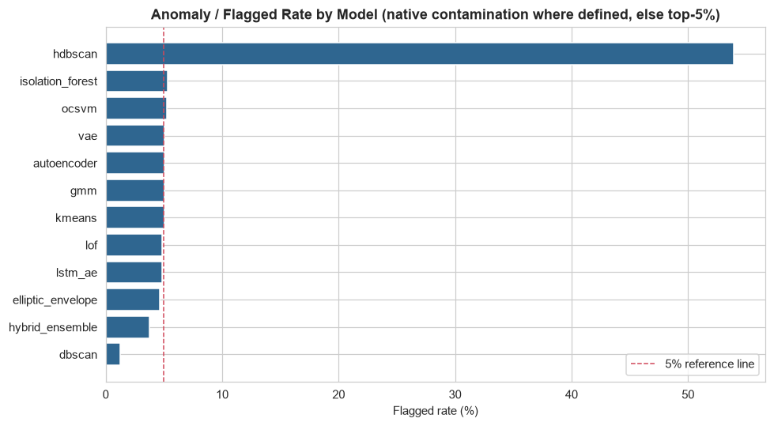
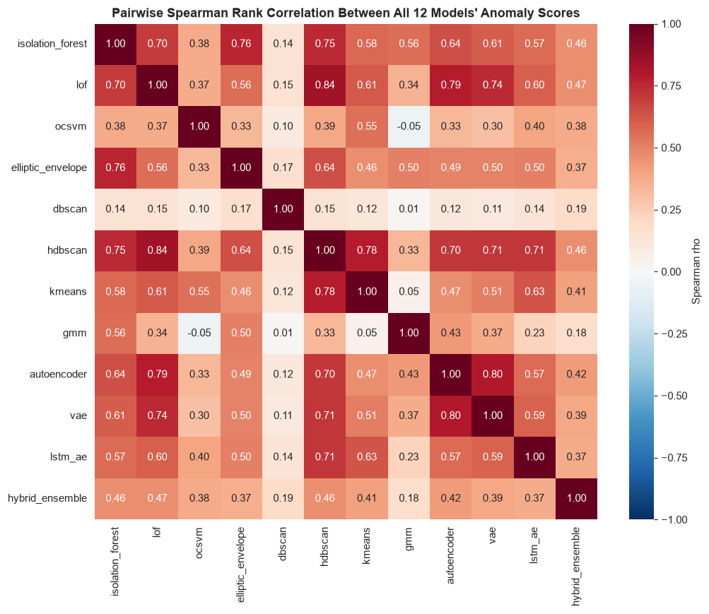
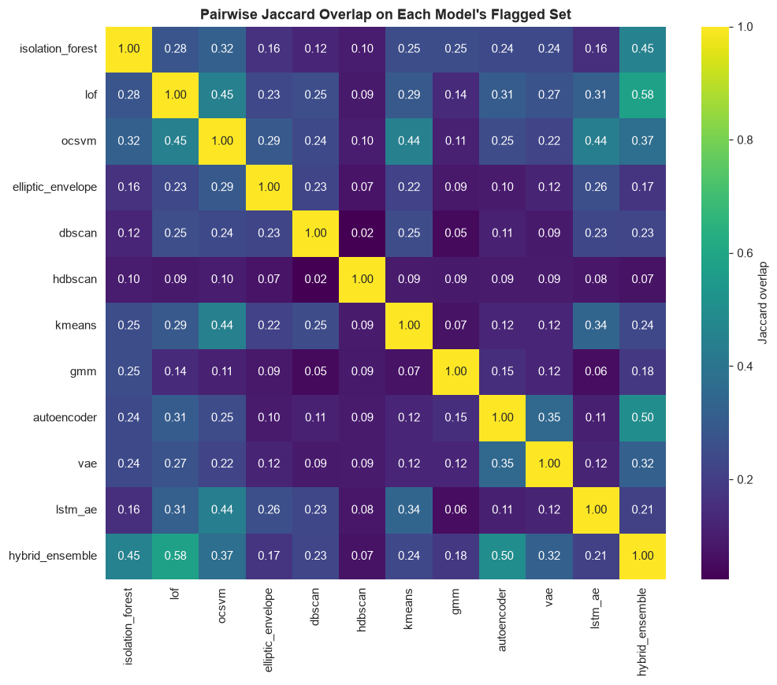

# Phase 8 — Model Development (12 Models)

Generated by `src_research/07_models_classical.py` (Models 1–8) and `src_research/08_models_deep.py` (Models 9–12), against `artifacts_research/features_v2.csv`. Numeric outputs: `artifacts_research/model_scores_classical.csv`, `model_scores_all.csv`, `model_summary_classical.json`, `model_comparison_summary.json`, `model_pairwise_spearman.csv`, `model_pairwise_jaccard.csv`, `vae_config.json`, `lstm_ae_config.json`. Fitted artifacts: `artifacts_research/models/*.pkl`, `artifacts_research/vae.pt`, `artifacts_research/lstm_ae.pt`. Plots: `research/plots/dbscan_kdistance_elbow.png`, `kmeans_elbow_silhouette.png`, `gmm_bic_aic.png`, `ae_vs_vae_reconstruction_error.png`, `vae_training_curve.png`, `lstm_ae_training_curve.png`, `model_pairwise_spearman_heatmap.png`, `model_pairwise_jaccard_heatmap.png`, `model_anomaly_rate_comparison.png`.

---

## 0. Methodology, Stated Up Front

- **Feature matrix**: the same 46 columns as `artifacts_research/autoencoder_config.json`'s `feature_cols` (both `Location_enc` and `Location_Freq` present). Phase 6 recommends `Location_Freq` alone for a single encoding of `Location`, but since Model 9 (the autoencoder) is already trained against this exact 46-column schema, **all 12 models use the identical feature matrix** so that the Spearman/Jaccard cross-model comparisons in Section 3 mean something (every model saw the same inputs). Redundancy risk from keeping both `Location` encodings was checked directly rather than assumed: `corr(Location_enc, Location_Freq) = 0.0029` — negligible.
- **Leakage check**: `features_v2.csv` has no `vote_count` / `risk_tier` / `is_fraud` columns (those live only in v1's separate `artifacts/labeled.csv`) — confirmed by an explicit assertion in `07_models_classical.py::load_and_split`, not assumed.
- **Scaling**: `RobustScaler`, fit on the training split only (per Phase 6), applied to the full dataset.
- **Split**: 2,009 train / 503 validation rows, `test_size=0.2`, `random_state=42` — reproduced from the exact same `train_test_split(np.arange(len(df)), ...)` call already used to train the Phase 7 autoencoder, and cross-checked row-for-row against `autoencoder_reconstruction_errors.csv`'s `split` column (**confirmed: MATCH**). Models 1–4, 7–10 fit on the 2,009-row training split and score all 2,512 rows out-of-sample; DBSCAN and HDBSCAN have no native out-of-sample `.predict`, so are fit directly on the full dataset (noted per-model below). The LSTM Autoencoder (Model 11) necessarily uses a *different*, **account-level** split — see Section 2.11.
- **Anomaly-score sign convention**: every `score_<model>` column is oriented so **higher = more anomalous**. sklearn's `decision_function` for IsolationForest/LOF/OneClassSVM/EllipticEnvelope uses the opposite convention (higher = more normal), so those are negated before saving.
- **Two "anomaly rate" conventions, used side by side and never confused**: (a) each model's *native* rate — its own `contamination`/`nu` parameter for IF/LOF/OCSVM/EE, its noise fraction for DBSCAN/HDBSCAN, or (b) a standardized **top-5%-by-score** flag used for every model so Jaccard overlap (Section 3) compares like with like regardless of whether a model has a native contamination concept.

---

## 1. Models 1–8 (Classical)

### 1.1 Isolation Forest

5 configs tried (`n_estimators` 100–300, `max_samples` auto/0.8/0.5, `max_features` 1.0/0.7, `contamination` 0.03/0.05/0.10). Selected: `n_estimators=100, max_samples='auto', max_features=1.0, contamination=0.05` (chosen among the 5%-contamination configs by highest top-5% score spread, i.e. best-separated tail). **Native anomaly rate: 5.33%** (134/2,512 rows). Fit + score of all 5 configs: 9.72s. The only one of the 8 classical models with a native, well-understood out-of-sample `decision_function` — cheapest and most production-ready of the tree/kernel-based models.

### 1.2 Local Outlier Factor

5 configs (`n_neighbors` 10/20/35, `contamination` 0.03/0.05/0.10). Selected: `n_neighbors=20, contamination=0.05` (middle option — 10 is locally noisy, 35 over-smooths for a 495-account dataset). `novelty=True` used throughout so it can score new transactions without a full refit. **Native anomaly rate: 4.86%** (122/2,512). Fit + score: 6.29s. O(n²) neighbor search by default — fine at n=2,512, will need an ANN index well before six figures of rows.

### 1.3 One-Class SVM

5 configs across kernel (rbf/linear/poly) and `nu`/`gamma`. Selected the standard default: `kernel='rbf', nu=0.05, gamma='scale'`. **Native anomaly rate: 5.21%** (131/2,512). Fastest to fit here (1.27s for all 5 configs at n=2,512) but this is a QP solve that is roughly O(n²)–O(n³) depending on the number of support vectors — the one model in this set flagged as a real scalability concern past ~50k–100k rows without subsampling or an approximate variant.

### 1.4 Elliptic Envelope

3 configs (`contamination` 0.05/0.10, `support_fraction` default/0.8). Selected `contamination=0.05, support_fraction=None`. **Native anomaly rate: 4.62%** (116/2,512).

**Gaussian-assumption check, not skipped**: Shapiro-Wilk normality tests were run on all 46 scaled features. **100% reject the normality null at p<0.05.** This is the honest, expected consequence of Phase 4's finding that `TransactionAmount` and its derivatives are right-skewed (skew 1.74, invariant under any affine scaler per Phase 6) rather than Gaussian. EllipticEnvelope assumes the *joint* feature distribution is multivariate Gaussian; this widespread univariate non-normality (plus a "covariance matrix is not full rank" warning raised directly by sklearn during fitting) means its MCD-based Mahalanobis distance should be read as a rough, assumption-violating baseline here, not a well-calibrated score — kept for completeness and comparison, not recommended as a primary production detector.

### 1.5 DBSCAN

`eps` chosen via a k-distance elbow plot (`min_samples=10`, i.e. k=9-NN distance), using the classic "maximum perpendicular distance from the chord connecting the curve's endpoints" elbow-detection method (`research/plots/dbscan_kdistance_elbow.png`): **eps = 8.428**. A 3×3 grid around that elbow (`eps` ∈ {6.742, 8.428, 10.113} × `min_samples` ∈ {5, 10, 15}) was run in full. Selected config (`eps=8.428, min_samples=10`): **noise rate 1.23%** (31/2,512), 1 cluster. Every one of the 9 grid combinations produces exactly **1 cluster** — DBSCAN never finds more than a single dense mass in this 46-D scaled space, only varying how much it calls "noise" (0.7%–2.9% across the grid). Continuous pseudo-score for ranking = distance to the nearest core point. No native out-of-sample `.predict` — a real production limitation versus IF/LOF/OCSVM/EE.

### 1.6 HDBSCAN

4 configs (`min_cluster_size` 10/15/20/30, `min_samples` 5/10/15/None). Selected the config closest to a 5% noise rate: `min_cluster_size=10, min_samples=5` — but its actual noise rate is **53.94%** (1,355/2,512 rows), the closest of the 4 configs to 5% only in a relative sense; the full range is 53.9%–75.0%, and it only ever finds 2 clusters. **Reported honestly rather than spun positive**: HDBSCAN does remove the need to manually pick `eps`, but on this dataset that does not translate into a better result than DBSCAN — its noise rate is far higher and no more stable in absolute terms than DBSCAN's 0.7%–2.9%. Its stability/excess-of-mass cluster-extraction criterion does not recognize the single dense mass this dataset actually has (consistent with the Phase 7 UMAP/t-SNE finding of one dominant population plus small pockets, not several well-separated dense clusters) as a cluster worth keeping, and instead calls most of it noise. Its GLOSH `outlier_scores_` (continuous, no eps needed) is still used as the anomaly score for the cross-model comparison in Section 3, but the noise-rate/cluster-count numbers should not be read as "HDBSCAN solved DBSCAN's tuning problem" here — it traded manual `eps`-tuning brittleness for a different failure mode.

### 1.7 K-Means (distance-based)

**A genuine, checked-directly finding, not a tuning footnote.** Naive `argmax(silhouette)` over k=2–10 picks **k=2 with silhouette=0.9184** — but this is a silhouette artifact: at k=2, the training split splits into a **3-row micro-cluster and a 2,006-row majority cluster**, not two genuine populations. Checked directly: **every k from 2 to 10 produces at least one cluster holding <1% of the 2,009 training rows**, and at k=2 and k=9 the *identical* 3 rows form the micro-cluster every time — `TX000177`/`AC00363` (`Amount_ZScore_Account`=92.56) and `TX002305`/`AC00494` (77.71) are the two most extreme z-scores in the whole dataset, plus `TX001012`/`AC00329`. K-Means is, correctly, telling us these rows are too different from everything else to share a centroid with anything — the same joint-multivariate-outlier signature the Phase 3 Isolation Forest analysis and the Phase 7 autoencoder's fat right tail (P99/max MSE) already found.

This has a real practical consequence that had to be fixed, not just noted: naively scoring "distance to nearest centroid" would make these 3 extreme rows the **safest-looking points in the dataset** (distance ≈ 0 to their own centroid) — the opposite of the intended anomaly score. **Fix applied**: `k=4` was selected from the inertia elbow (silhouette is unusable here for the reason above), and the anomaly score is distance to the nearest centroid **among clusters holding ≥1% of training rows only** (1 of the 4 k=4 clusters is itself a micro-cluster and is excluded as a valid reference point). **Top-5%-flagged rate: 5.02%** with this fix.

### 1.8 Gaussian Mixture Model

Grid over `n_components` 1–10 × `covariance_type` ∈ {full, diag, tied, spherical} (`research/plots/gmm_bic_aic.png`). Best BIC: **n_components=9, covariance_type='full', BIC=-63,019.3**. Anomaly score = negative log-likelihood (`score_samples`); **top-5%-flagged rate: 5.02%**.

Worth flagging honestly: the "full" covariance BIC curve keeps decreasing toward the search boundary (n=9, close behind at n=10) without a clear elbow — with only 2,009 training rows and 46 features, a full-covariance component has 1,081 free covariance parameters, so there is a real risk BIC's complexity penalty is not fully compensating for overfitting in this high-dimensional, modest-*n* regime. The "tied" covariance solutions (a single shared 46×46 matrix, far fewer parameters) are more numerically stable and worth considering in production even though they never win on raw BIC here (see Section 4 of `research/07_hyperparameter_optimization.md` for the Optuna follow-up on this exact question).

---

## 2. Models 9–12 (Deep Learning and Ensemble)

### 2.9 Autoencoder (reused, not retrained)

Loaded directly from Phase 7: `artifacts_research/autoencoder.pt` + `autoencoder_scaler.pkl` + `autoencoder_config.json`. Architecture `input(46)→16→8→bottleneck(4)→8→16→output(46)`. No retraining — there is no evidence of a problem with it (train MSE 0.290, val MSE 0.328, val P99 1.372, all previously reported in `research/05_feature_selection_and_preprocessing.md`). **Top-5%-flagged rate: 5.02%.** Cheapest per-row inference cost of any model in this comparison: a single forward pass, O(1) per row independent of dataset size.

### 2.10 Variational Autoencoder

Trained fresh in PyTorch (`src_research/vae_utils.py`), same architecture spirit as Model 9 but with a reparameterized 4-D latent space: `input(46)→16→8→[μ(4), logσ²(4)]→reparameterize→8→16→output(46)`. Loss = reconstruction MSE + `β·KL(q(z|x) ‖ N(0,I))`, `β=0.1`. Same row-level train/val split as every other model here (2,009/503, `random_state=42`) for direct comparability with Model 9. 200 epochs, 40.7s to train.

| | Train recon MSE | Val recon MSE | Val P95 | Val P99 | Val Max | Val KL (mean) |
|---|---:|---:|---:|---:|---:|---:|
| Autoencoder (Model 9) | 0.2896 | 0.3280 | 0.6433 | 1.3718 | 6.7077 | — |
| VAE (Model 10) | 0.3426 | 0.3790 | 0.7476 | 1.9461 | 4.3951 | 4.5198 |

The VAE's reconstruction MSE is consistently a bit higher than the plain autoencoder's at every percentile except the max — exactly the expected beta-VAE tradeoff: part of the loss budget goes to matching the latent space to `N(0,1)` (the KL term) rather than purely minimizing reconstruction error, so it reconstructs slightly less precisely on average. Its P99 is *higher* (1.946 vs. 1.372) but its single worst row is *lower* (4.395 vs. 6.708) — the regularized latent space produces a smoother, less extreme tail rather than a more extreme one. **Top-5%-flagged rate: 5.02%** (same standardized definition as every other model). Distribution comparison: `research/plots/ae_vs_vae_reconstruction_error.png`; training curves (reconstruction and KL separately): `research/plots/vae_training_curve.png`. Score used = reconstruction MSE only, not reconstruction+KL combined — documented design choice, so it is directly comparable to Model 9's error distribution rather than mixing a squared-error term with a differently-scaled information term.

### 2.11 LSTM Autoencoder — feasibility checked first, honestly scoped

**Checked directly before deciding whether to build this at all**, per the task brief's explicit instruction: 495 accounts average **5.075 transactions each** (min 1, max 12). Full distribution:

| Txns per account | 1 | 2 | 3 | 4 | 5 | 6 | 7 | 8 | 9 | 10 | 11 | 12 |
|---|--:|--:|--:|--:|--:|--:|--:|--:|--:|--:|--:|--:|
| N accounts | 24 | 43 | 62 | 81 | 87 | 68 | 58 | 31 | 28 | 4 | 5 | 4 |

This is **not** a long-sequence setting — median 5, max 12. But it is not so sparse that an LSTM-AE is meaningless either: **428/495 accounts (86.5%) have ≥3 transactions, covering 2,402/2,512 rows (95.6%)**. Verdict: build a minimal, honestly-scoped LSTM-AE on that 86.5%/95.6% subset; the remaining **110 rows (4.4%, accounts with 1–2 transactions) get no LSTM-AE score at all** — reported as an explicit, permanent coverage gap for this model, not silently interpolated or faked.

Architecture: `LSTM(46→16)` encoder → `Linear(16→8 latent)` → `Linear(8→16)` → `LSTM(46→16)` decoder → `Linear(16→46)`, teacher-forced, masked MSE over real (non-padded) timesteps only, sequences right-padded to `max_len=12`. **Split**: account-level 80/20 (342/86 accounts), `random_state=42` — deliberately **not** the row-level split used by every other model in this phase, because a single account's chronological sequence cannot be split across train/val without breaking the sequence. 150 epochs, 31.4s to train (`research/plots/lstm_ae_training_curve.png`).

| | Train MSE | Val MSE |
|---|---:|---:|
| LSTM-AE (masked, sequence space) | 1.6364 | 1.2582 |

These are noticeably higher than the plain autoencoder's 0.290/0.328 — an honest result, not a units mismatch: the LSTM-AE reconstructs substantially less precisely than the feedforward autoencoder on this dataset. This is consistent with what the sequence-length distribution predicts: with a median of 5 transactions per account and only ~342 training sequences, there is not much repeated temporal pattern for a recurrent model to learn, and the recurrence adds optimization difficulty (vanishing/exploding gradients, teacher-forcing) without a compensating signal. **Top-5%-flagged rate (within the 95.6% applicable rows): 5.04%.** Cost: meaningfully slower to train per epoch than the feedforward AE/VAE (sequential, non-parallelizable across timesteps) — on this dataset's short, sparse per-account histories, that added cost is not justified by a corresponding gain in either coverage or score distinctiveness (see Section 3 — its Spearman correlation with the plain AE, 0.57, is unremarkable, no higher than several classical models').

### 2.12 Hybrid Ensemble (Isolation Forest + LOF + Autoencoder, majority vote)

Combines Model 1's native flag (~5.33%), Model 2's native flag (~4.86%), and Model 9's top-5% reconstruction-MSE flag via a simple **≥2-of-3 majority vote** — following the same pattern as v1's 4-detector `artifacts/anomaly_votes.csv`, implemented fresh with 3 detectors on this richer 46-feature set, per the task spec.

| Votes (0–3) | Rows |
|---|---:|
| 0 | 2,259 |
| 1 | 159 |
| 2 | 59 |
| 3 | 35 |

**Majority-flagged rate: 3.74%** (94/2,512) — lower than any individual component's own rate, as expected from requiring agreement. Pairwise component agreement (fraction of rows where both flags match, i.e. both fire or both don't): IF–LOF 94.27%, IF–AE 93.63%, LOF–AE 94.75% — all three pairs agree on the great majority of rows (mostly by agreeing something is *not* anomalous, since ~95% of rows aren't flagged by any single detector). Cost = sum of the 3 components' inference costs; the real production cost of an ensemble like this is maintaining and monitoring 3 models, not raw compute.

---

## 3. Cross-Model Comparison

### 3.1 Anomaly / flagged rate by model

| Model | Flagged rate |
|---|---:|
| Isolation Forest | 5.33% |
| One-Class SVM | 5.21% |
| K-Means (fixed) | 5.02% |
| GMM | 5.02% |
| Autoencoder | 5.02% |
| VAE | 5.02% |
| LOF | 4.86% |
| LSTM-AE (of applicable rows) | 4.82% |
| Elliptic Envelope | 4.62% |
| Hybrid Ensemble | 3.74% |
| DBSCAN | 1.23% |
| HDBSCAN | 53.94% |

HDBSCAN is the clear outlier among the outlier detectors — see Section 1.6 for why. DBSCAN's 1.23% reflects a single dense cluster with a small, low-density fringe, not a 5%-style contamination assumption. Every other model clusters tightly around 4.6%–5.3% by construction (either a `contamination≈0.05` parameter or the standardized top-5% convention), so the rate itself carries little information for those 10 — the *agreement on which specific rows* (below) is the more informative comparison.

### 3.2 Pairwise Spearman rank correlation

Full matrix: `artifacts_research/model_pairwise_spearman.csv` (computed on the RobustScaler-scaled score vectors; LSTM-AE pairs restricted to its 2,402 applicable rows). Highlights:

- **Strongest agreement**: LOF ↔ HDBSCAN (ρ=0.840), Autoencoder ↔ VAE (ρ=0.801, expected — same architecture family, same training split), LOF ↔ Autoencoder (ρ=0.787), HDBSCAN ↔ K-Means (ρ=0.782), Isolation Forest ↔ Elliptic Envelope (ρ=0.758).
- **Weakest/near-zero agreement**: One-Class SVM ↔ GMM (ρ=−0.052, the only negative pairing in the whole matrix), DBSCAN ↔ GMM (ρ=0.010), K-Means ↔ GMM (ρ=0.052), OCSVM ↔ DBSCAN (ρ=0.095). GMM stands out as the model least correlated with the rest of the field — its likelihood-based score is measuring something structurally different from the distance/density/reconstruction-based scores that dominate the other 11 models.
- DBSCAN correlates weakly with almost everything (its strongest pairing, with Elliptic Envelope, is only ρ=0.17) — consistent with Section 1.5's finding that it collapses the data into one cluster and mostly measures fringe-distance from that single mass, a narrower signal than the other models capture.

### 3.3 Pairwise Jaccard overlap on flagged sets

Full matrix: `artifacts_research/model_pairwise_jaccard.csv`. Highlights:

- **Highest overlap**: LOF ↔ Hybrid Ensemble (0.577 — expected, LOF is one of the ensemble's 3 components), Autoencoder ↔ Hybrid Ensemble (0.497), Isolation Forest ↔ Hybrid Ensemble (0.452), LOF ↔ OCSVM (0.446), OCSVM ↔ K-Means (0.444).
- **Lowest overlap**: DBSCAN ↔ HDBSCAN (0.023 — the two density-based clustering methods barely agree on *which* rows are outliers despite both being "density-based"), DBSCAN ↔ GMM (0.047), GMM ↔ LSTM-AE (0.056), HDBSCAN ↔ Hybrid Ensemble (0.069), K-Means ↔ GMM (0.072).
- The consistent appearance of GMM and DBSCAN at the bottom of both the Spearman and Jaccard tables is the single clearest cross-model finding in this phase: **likelihood-based (GMM) and single-cluster-density-based (DBSCAN) anomaly definitions diverge the most from the distance/reconstruction-based majority** of models built here. A production system relying on only one of these two would be flagging a meaningfully different population than one relying on any of the other 10.

### 3.4 Rough cross-check against v1's `anomaly_votes.csv` (explicitly not ground truth)

Spearman correlation of each model's score against v1's 4-detector `vote_count` (0–4), the same weak proxy already used in Phase 6's encoding comparison — **restated here as a rough, directional cross-check only, never as ground truth**, since no fraud label exists anywhere in this project:

| Model | ρ vs. v1 vote_count |
|---|---:|
| Hybrid Ensemble | 0.457 |
| LOF | 0.428 |
| Isolation Forest | 0.403 |
| HDBSCAN | 0.393 |
| Autoencoder | 0.386 |
| VAE | 0.385 |
| LSTM-AE | 0.329 |
| Elliptic Envelope | 0.323 |
| K-Means | 0.280 |
| OCSVM | 0.288 |
| GMM | 0.236 |
| DBSCAN | 0.118 |

The Hybrid Ensemble correlating most strongly with v1's own vote-based signal is an expected, mechanically-driven result (both are majority-vote combinations of overlapping detector families, Isolation Forest and LOF specifically appear in both), not independent confirmation of anything beyond internal consistency. DBSCAN's weak correlation (0.118) is consistent with Section 3.2/3.3 — it is measuring a narrower "distance from the one dense mass" signal than the other 11 models.

---

## 4. Handoff to Phase 9

- Isolation Forest and GMM are the two classical models with the most tunable, clearly-motivated hyperparameter surfaces (tree/subsampling knobs; component count + covariance structure with a well-defined BIC objective respectively) and are carried into the Optuna search.
- The VAE's `β` (KL weight), `latent_dim`, and hidden-layer width were fixed by hand in this phase (`β=0.1`, `latent_dim=4`, `hidden1=16`) — carried into the Optuna search as the third model.
- The GMM's "full" covariance BIC-overfitting concern raised in Section 1.8 is followed up on directly in Phase 9 by additionally searching `reg_covar`.
- See `research/07_hyperparameter_optimization.md` for the full Phase 9 writeup, including the Optuna-vs-grid-search-vs-random-search comparison for Isolation Forest.
