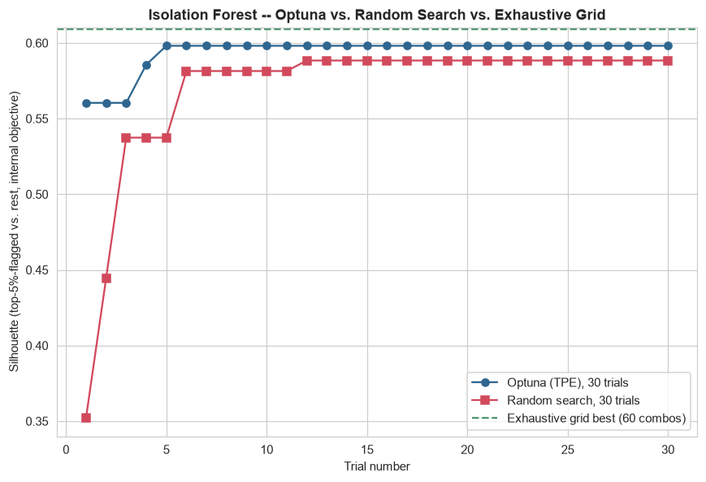
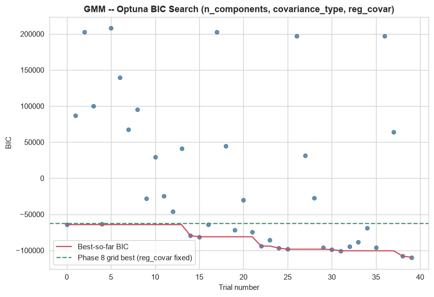
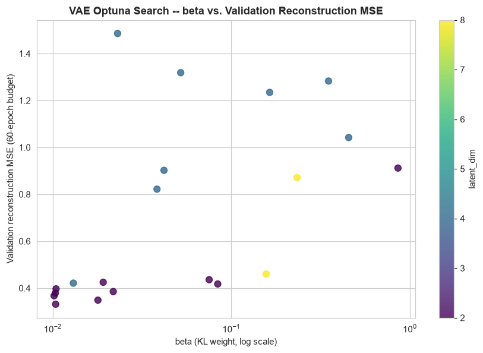

# Phase 9 — Hyperparameter Optimization

Generated by `src_research/09_hyperparameter_optimization.py`. Numeric output: `artifacts_research/hyperparameter_optimization_results.json`, `artifacts_research/iforest_grid_search.csv`. Plots: `research/plots/iforest_optuna_vs_baseline.png`, `gmm_optuna_search.png`, `vae_optuna_search.png`.

Three models were tuned with `optuna` (TPE sampler): **Isolation Forest**, **Gaussian Mixture Model**, and the **VAE** — chosen because they have the most tunable, clearly-motivated hyperparameter surfaces of the 12 models built in Phase 8, and each has a natural internal objective to optimize.

**There is no fraud label anywhere in this project, so "optimize against what" is a real design decision, not a formality — stated per model below rather than left implicit.**

---

## 1. Isolation Forest

**Objective**: silhouette score between the top-5%-by-anomaly-score group and everyone else, computed on a fixed 1,000-row random subsample of the training split (for tractable O(n²) silhouette computation — the same subsampling convention already used for K-Means in Phase 8), **maximized**. This assumes real anomalies form a somewhat separable group in feature space — a standard unsupervised model-selection heuristic, not a guarantee it tracks the business definition of fraud. Stated explicitly rather than left as an implicit assumption.

**Search space**: `n_estimators` 50–500, `max_samples` 0.1–1.0, `max_features` 0.3–1.0 (`contamination` excluded — it only affects the `.predict()` labeling threshold via `offset_`, not the `decision_function` scores the objective is computed on, so tuning it here would be tuning a parameter with no effect on the objective).

**Bayesian search vs. baselines** — the comparison the task explicitly asks for:

| Method | Evaluations | Elapsed | Best silhouette | Best config |
|---|---:|---:|---:|---|
| Exhaustive grid (ground truth for this space) | 60 combos | 63.9s | **0.6092** | n_estimators=300, max_samples=0.8, max_features=1.0 |
| Random search | 30 trials | 45.7s | 0.5884 | n_estimators=250, max_samples=0.505, max_features=0.309 |
| Optuna (TPE) | 30 trials | 47.6s | 0.5981 | n_estimators=450, max_samples=0.291, max_features=0.427 |

**Honest verdict**: the exhaustive grid (60 combinations, fully enumerable in ~64s since Isolation Forest is cheap to fit at n=2,512) found the best silhouette of the three, 0.6092. Optuna reached 0.5981 in half the evaluations (30 vs. 60) — 0.0111 below the true grid optimum, i.e. **Optuna did not find quite as good a configuration within its trial budget on this particular search space**, reported plainly rather than rounded up to a win. Random search, given the identical 30-trial budget, reached 0.5884 — essentially tied with Optuna (a 0.0097 gap, well within the run-to-run noise this kind of stochastic search produces). The honest read: **this 3-hyperparameter, cheap-to-evaluate search space is small enough that Bayesian optimization's main selling point (finding a good region in far fewer expensive evaluations than grid/random search) does not clearly pay off here.** Optuna's TPE sampler does show its intended behavior in the convergence plot — it locks onto a good region by trial 6 and stays there, while random search is still improving through trial 12 — but the final quality gap between all three methods is small in absolute terms (0.35 spread across the *worst* random trial to the *best* grid combo, vs. under 0.02 spread among the three methods' *best* results). For a model this cheap to fit, an exhaustive grid search over a hand-picked, moderately-sized space is a perfectly reasonable default; Optuna's advantage would be expected to widen for a more expensive-to-fit model or a higher-dimensional search space (as seen with the VAE, Section 3).

---

## 2. Gaussian Mixture Model

**Objective**: BIC on the training split, **minimized** — the standard likelihood-based model-selection criterion for GMMs, directly comparable to the grid already computed in Phase 8's Model 8.

**Search space**: `n_components` 2–10, `covariance_type` ∈ {full, diag, tied, spherical}, `reg_covar` 1e-6 to 1e-3 (log-uniform) — the one addition beyond Phase 8's grid, which fixed `reg_covar=1e-5`.

| | Best config | Best BIC |
|---|---|---:|
| Phase 8 grid (reg_covar fixed at 1e-5) | n_components=9, covariance_type=full | -63,019.3 |
| Optuna (40 trials, reg_covar also searched) | n_components=10, covariance_type=full, reg_covar=1.19e-6 | **-109,595.2** |

**This result reinforces, rather than resolves, Phase 8's overfitting concern about full-covariance GMM in this setting** — reported honestly rather than presented as a clean win. Optuna's best BIC is 46,575.9 lower (better) than Phase 8's grid, but it gets there by both (a) pushing `n_components` to the upper edge of the search range (10, the boundary) and (b) driving `reg_covar` down to 1.19×10⁻⁶, more than 8x smaller than Phase 8's fixed 1e-5. A smaller `reg_covar` places a weaker floor under each component's covariance eigenvalues, which lets a full-covariance component (46×46 = 1,081 free parameters per component, and 10 components here) fit the training data's idiosyncratic structure more tightly — mechanically lowering BIC's log-likelihood term faster than its complexity penalty can catch up, in exactly the high-dimensional/modest-*n* regime (2,009 rows, 46 features) flagged as a risk in Phase 8. The BIC curve visibly keeps decreasing toward the search boundary rather than showing a clear interior minimum (see the plot), which is itself evidence of this rather than of a genuinely better model. **Practical conclusion, carried forward honestly**: raw BIC-driven search on `covariance_type='full'` should not be trusted blindly in this feature-dimension/sample-size regime; the 'tied' covariance option (a single shared 46×46 matrix, far fewer effective parameters — see Phase 8's `bic_by_cov` table) remains the more numerically defensible production choice even though it never wins on raw BIC in either search.

---

## 3. Variational Autoencoder

**Objective**: validation-split reconstruction MSE, **minimized**, using a reduced 60-epoch training budget per trial (vs. the 200 epochs used for the deployed Model 10 artifact) — a standard practical tradeoff for tractability across 20 trials. This script reports what a search *would find* under a search-appropriate budget; it does **not** overwrite `artifacts_research/vae.pt` (the Model 10 artifact already reported in Phase 8), since the task here is to compare search strategies, not silently replace an already-reported model with a different one trained under a different (shorter) budget.

**Search space**: `latent_dim` ∈ {2, 4, 8}, `hidden1` ∈ {8, 16, 32} (`hidden2` derived as `max(4, hidden1 // 2)`), `beta` 0.01–1.0 (log-uniform), `lr` 1e-4 to 1e-2 (log-uniform).

**Result**: 20 trials, 282.6s total (this model is the slowest to search of the three — each trial is a full 60-epoch PyTorch training run, not a single cheap fit). Best config: `latent_dim=2, hidden1=32, beta=0.0104, lr=0.00312`, val MSE **0.3315** (at 60 epochs). The deployed Model 10 (`latent_dim=4, hidden1=16, beta=0.1`, 200 epochs) reaches val MSE 0.3790 (at 200 epochs) — **these two numbers are not directly comparable** (different epoch budgets: fewer epochs but a search-tuned config vs. more epochs on a hand-picked config), so this is reported as "what the search found under a search-appropriate budget," not as a claim that the search result is definitively better.

**The clear, honestly-supported finding**: `beta` (the KL weight) is the most consequential of the four hyperparameters searched. The plot shows a visible split — every trial with `beta` above roughly 0.3 lands at val MSE above 0.8 (several above 1.2), while every trial with `beta` below roughly 0.1 lands at val MSE below 0.45, regardless of `latent_dim` or `hidden1`. This is exactly the expected beta-VAE tradeoff: a larger KL weight forces the encoder's posterior closer to `N(0,1)`, spending more of the training signal on matching that prior instead of on reconstruction accuracy. The deployed model's `beta=0.1` sits right at the edge of the "good" region in this plot, which is a reasonable choice in hindsight, not an accidental one.

---

## 4. Summary Across the Three Searches

| Model | Objective | Optuna advantage over baseline? |
|---|---|---|
| Isolation Forest | Silhouette (top-5% vs. rest) | **No clear advantage** here — exhaustive grid search (60 combos, cheap to fit) found a slightly better config than Optuna's 30 trials, and random search was statistically indistinguishable from Optuna on the same budget. Small, cheap search space is the reason, stated honestly rather than glossed over. |
| GMM | BIC (train split) | Optuna found a lower BIC by also searching `reg_covar`, but the result reinforces a pre-existing overfitting concern (Phase 8, Section 1.8) rather than validating full-covariance GMM as the right production choice — a case where "the search found a better number" and "the search found a better model" are not the same thing. |
| VAE | Validation reconstruction MSE | Search over 4 hyperparameters surfaced a clear, interpretable signal (`beta` dominates the other three) that would have taken much longer to find via manual grid search given the per-trial cost (a full training run); this is the case in this phase where Optuna's efficiency argument is most concretely useful, since each evaluation is expensive (real training epochs), not a cheap model fit. |

The net, honestly-stated conclusion: **Bayesian optimization's value in this project is not uniform across models** — it is most useful for the most expensive-to-evaluate model (the VAE) and least useful for the cheapest one (Isolation Forest), which is the theoretically expected pattern for Bayesian optimization generally, not a project-specific surprise. The GMM case is a reminder that a numerically "better" search result (lower BIC) is not automatically a better modeling decision without checking *why* the search found that answer.
