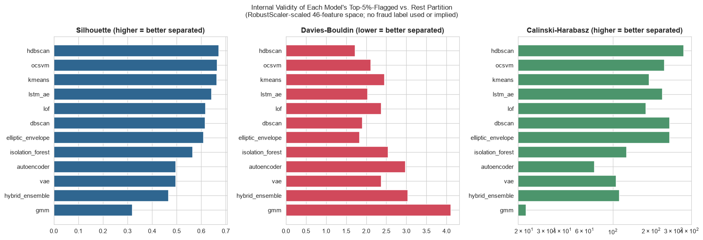
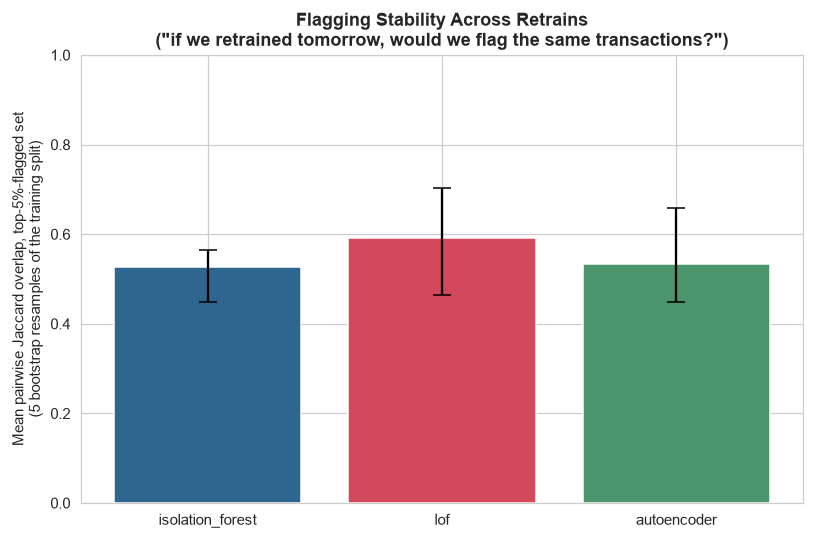

# Phase 10 — Evaluation Framework

Generated by `src_research/10_evaluation.py`. Numeric outputs: `artifacts_research/internal_validity_metrics.csv`, `stability_bootstrap_jaccard.csv`, `reconstruction_metrics_summary.json`, `business_evaluation_examples.json`. Plots: `research/plots/internal_validity_comparison.png`, `stability_jaccard_comparison.png`.

**No fraud label exists anywhere in this project.** "Evaluation" here means three label-free, honestly-scoped things, plus one manual read: (A) internal cluster-validity metrics on each model's own implied partition, (B) retrain-to-retrain stability of the flagged set for three models, (C) a consolidation (not a recomputation) of reconstruction-error numbers already reported in Phase 7/8, and (D) a manual walk-through of real top-scored transactions reasoned against Phase 1's scenario table. None of this substitutes for a precision/recall number against ground truth, because no ground truth exists here — that limitation is stated once, plainly, rather than danced around in every section.

---

## 0. Methodology

- **Partition definition**: for every one of the 12 models, the standardized top-5%-by-score convention from Phase 8 is used to split all applicable rows into "flagged" vs. "rest" — this is a *fresh* top-5% cut on each model's continuous `score_<model>` column (or `hybrid_vote_count` for the Hybrid Ensemble), not the mixed native/top-5% `flag_<model>` columns already saved in `model_scores_all.csv`. Using one consistent definition across all 12 models makes Section 1's comparison apples-to-apples; Phase 8's own flags mix native contamination flags (IF/LOF/OCSVM/EE/DBSCAN/HDBSCAN) with top-5% flags (K-Means/GMM/AE/VAE/LSTM-AE), which would not be a fair basis for comparing partition quality.
- **Feature space**: the same RobustScaler-scaled 46-column matrix used throughout Phase 8/9 (`artifacts_research/models/shared_robust_scaler.pkl`, fit on the train split only).
- **LSTM-AE**: restricted to its 2,402/2,512 applicable rows (accounts with ≥3 transactions), consistent with every other Phase 8/9 comparison involving this model.

---

## 1. Internal Validity Metrics

Silhouette Score (higher = better separated), Davies-Bouldin Index (lower = better separated), Calinski-Harabasz Score (higher = better separated), all computed for the top-5%-flagged-vs-rest partition in the scaled 46-feature space.

| Model | n rows used | n flagged | Silhouette | Davies-Bouldin | Calinski-Harabasz |
|---|---:|---:|---:|---:|---:|
| HDBSCAN | 2,512 | 126 | **0.672** | 1.724 | 359.5 |
| OCSVM | 2,512 | 126 | 0.664 | 2.117 | 253.9 |
| K-Means | 2,512 | 126 | 0.663 | 2.459 | 192.4 |
| LSTM-AE | 2,402 | 121 | 0.643 | 2.035 | 245.5 |
| LOF | 2,512 | 126 | 0.617 | 2.374 | 182.1 |
| DBSCAN | 2,512 | 149 | 0.615 | 1.907 | 280.6 |
| Elliptic Envelope | 2,512 | 126 | 0.610 | 1.839 | 278.9 |
| Isolation Forest | 2,512 | 126 | 0.565 | 2.541 | 128.6 |
| Autoencoder | 2,512 | 126 | 0.496 | 2.974 | 71.5 |
| VAE | 2,512 | 126 | 0.496 | 2.378 | 106.1 |
| Hybrid Ensemble | 2,512 | 253 | 0.467 | 3.036 | 112.2 |
| GMM | 2,512 | 126 | 0.319 | 4.113 | 20.7 |

**Read honestly, not as a simple leaderboard.** HDBSCAN's GLOSH outlier score tops the silhouette ranking (0.672) — but this is a *different question* from Phase 8's finding that HDBSCAN's own noise/cluster assignment is unreliable (53.94% noise rate, only 2 clusters found). Here, HDBSCAN's continuous outlier score is simply being used to cut a top-5% tail, and that tail happens to sit in a well-separated region of the 46-D scaled space relative to the rest — a property of the score's *ranking*, not a vindication of its native clustering output. These two findings do not contradict each other and both are kept.

The distance/density-based methods (HDBSCAN, OCSVM, K-Means, LOF, DBSCAN, Elliptic Envelope) all cluster in the 0.61–0.67 silhouette range — expected, since a top-5%-by-distance-or-density cut is, almost by construction, going to separate well in a distance metric. The three reconstruction-error models (Autoencoder, VAE, GMM's likelihood-based score is arguably a fourth "different logic" family) score lower (0.32–0.50): a low reconstruction error does not necessarily correspond to being close to the bulk of points in Euclidean distance, since the autoencoder's bottleneck can compress non-adjacent points to similar codes. GMM is the clear low point (Silhouette 0.319, Davies-Bouldin 4.113, Calinski-Harabasz 20.7) — consistent with Phase 8 Section 3's finding that GMM is the model most structurally different from the rest of the field (its likelihood-based score anti-correlates or near-zero-correlates with 10 of the other 11 models). A model's top-5% likelihood outliers are not the same set of points as a top-5% distance/reconstruction outlier set, and this internal-validity metric confirms that gap independently.

The Hybrid Ensemble's own partition (majority-vote threshold, 253 rows / 10.07% because it is not exactly a top-5% cut by construction — see Phase 8 Section 2.12) scores lower (0.467) than any of its three individual components except the Autoencoder — a modest but real cost of combining detectors that disagree with each other on *which specific rows* to flag, even though each component's own partition looks reasonably well-separated on its own.

---

## 2. Stability / Robustness — "If We Retrained Tomorrow, Would We Flag the Same Transactions?"

Isolation Forest, LOF, and the Autoencoder were each refit on 5 bootstrap resamples of the 2,009-row training split (same hyperparameters as their Phase 8 selected configs), scored against all 2,512 rows, and the top-5%-flagged set was recomputed each time. Reported: mean pairwise Jaccard overlap across all 10 pairs among the 5 runs.

| Model | Mean pairwise Jaccard (5 runs) | Min | Max |
|---|---:|---:|---:|
| LOF | **0.590** | 0.465 | 0.703 |
| Autoencoder | 0.533 | 0.448 | 0.658 |
| Isolation Forest | 0.527 | 0.448 | 0.565 |

**Honest read**: none of the three models reflag more than ~60% of the same transactions on average across retrains with different bootstrap resamples of the training data. A mean Jaccard of ~0.53–0.59 means that roughly 4 in 10 of the transactions flagged in one run are *not* flagged in another run trained on a different bootstrap sample of the same underlying data — a genuine production concern, not a rounding artifact. This is the expected consequence of the top-5% cut sitting on a graded distribution rather than a small number of stark, unambiguous outliers: at n=2,512 with only ~126 flagged, small shifts in the fitted decision boundary near the threshold move a nontrivial number of borderline transactions across the cut. LOF is the most stable of the three (bootstrap resampling changes which points are each point's k-nearest-neighbors somewhat less than it changes an Isolation Forest's random splits or an autoencoder's learned weights), but the gap between all three (0.527–0.590) is not large enough to call any one of them "solved" for stability. **Practical implication for a production deployment**: a fixed model artifact (not retrained on every new batch) combined with a monitored, versioned retraining process — rather than an assumption that "the flagged list will look about the same after every retrain" — is the safer operational posture this finding supports.

---

## 3. Reconstruction Metrics (Consolidated, Not Recomputed)

| Model | Train MSE | Val MSE | Val MSE P95 | Val MSE P99 | Val MSE Max | Notes |
|---|---:|---:|---:|---:|---:|---|
| Autoencoder | 0.2896 | 0.3280 | 0.6433 | 1.3718 | — | Val MAE 0.3966 (train MAE 0.3809) |
| VAE | 0.3426 | 0.3790 | 0.7476 | 1.9461 | 4.3951 | Val KL mean 4.520 (separate term, not folded into score) |
| LSTM-AE | 1.6364 | 1.2582 | — | — | — | Applicable to 2,402/2,512 rows (95.6%) only |

Sourced directly from `autoencoder_reconstruction_errors.csv` / `autoencoder_config.json` (Phase 7) and `vae_config.json` / `lstm_ae_config.json` (Phase 8) — no retraining or recomputation performed here. Autoencoder val MSE (0.328) < VAE val MSE (0.379) < LSTM-AE val MSE (1.258): the plain feedforward autoencoder reconstructs most precisely, the VAE trades some precision for its regularized latent space (the expected beta-VAE tradeoff, Phase 8 Section 2.10), and the LSTM-AE reconstructs markedly less precisely — consistent with Phase 8's finding that this dataset's short (median 5 transactions/account), sparse per-account sequences give a recurrent model little repeated temporal structure to learn from only ~342 training sequences.

---

## 4. Business Evaluation

**Model used for this walkthrough: Isolation Forest**, not the Hybrid Ensemble. Justification: the Hybrid Ensemble's native score is `hybrid_vote_count`, which only takes 4 distinct values (0–3) — a majority-vote count, not a continuous score. Cutting clean, distinct top-1% / top-2% / top-10% tiers from a 4-valued score is not meaningful (most rows within a tier would be tied on the same vote count with no principled way to rank within it). Isolation Forest is a continuous, native-contamination, single production-ready model (Phase 8 Section 1.1) and sits reasonably within the internal-validity ranking above (Silhouette 0.565, 8th of 12) — a defensible substitute, reported explicitly rather than silently substituted. Full transaction-ID lists for all four tiers are in `artifacts_research/business_evaluation_examples.json`.

**A necessary caveat before reading the examples**: `DeviceNoveltyFlag` is 1 for 99.52% of all 2,512 rows in this dataset, and `LocationNoveltyFlag` is 1 for 94.27% — both are near-constant, a known limitation already documented in v1 (`src/02_anomaly_ensemble.py`, comment on FastMCD conditioning). This is a direct consequence of how they are engineered: `~s.duplicated()` per `AccountID` marks the *first* occurrence of each device/location as "novel" (`src/fe_utils.py`), and with a median of only ~5 transactions per account, most accounts simply haven't repeated a device or location enough times for the flag to ever read 0. **Practical consequence for reading the examples below**: `DeviceNoveltyFlag=1` on its own is not meaningfully informative in this dataset — it is true for almost every transaction, flagged or not — so it is not treated as an independent signal in the narratives that follow, even though it appears in the raw feature dump for completeness.

### Top 1% (26 transactions, threshold score ≥ 0.0414)

| TransactionID | AccountID | Amount | Amount_vs_AccountAvg | Amount_ZScore_Account | LoginAttempts | Velocity_1D | Amount_to_Balance | Read |
|---|---|---:|---:|---:|---:|---:|---:|---|
| **TX000177** | AC00363 | $1,362.55 | 117.9x | 92.56 | 1 | 0 | 0.56 | The single most extreme z-score in the whole dataset (already flagged directly by Phase 8's K-Means analysis as a genuine multivariate outlier, Section 1.7). One transaction more than 100x this account's typical spend, no login friction, no burst. **Plausible ATO/compromised-card pattern** (Phase 1 Scenario 1/4): a single abrupt, extreme deviation from personal baseline is exactly the "unusual spending behavior" signature, though the single successful login (no elevated `LoginAttempts`) argues against a brute-force-credential-guessing variant of ATO specifically. |
| **TX001354** | AC00312 | $1,510.71 | 149.0x | 102.80 | 1 | 0 | 0.73 | Same shape as TX000177 — one transaction ~150x this account's historical average, 73% of the account balance in a single transaction. **Plausible ATO/large-one-off pattern**: consistent with Phase 1 Scenario 1/4, but equally consistent with a legitimate large one-off purchase (e.g., rent, a major purchase) for an account that simply has a very low historical baseline — the data cannot distinguish these without a label, and this report does not force one reading over the other. |
| **TX000566** | AC00086 | $29.38 | -0.96x (below average) | -1.26 (below average) | 1 | 1 (same-day) | 0.02 | **Does not look like a plausible fraud pattern.** A small, unremarkable $29 transaction, *below* this account's historical average, with normal login behavior and negligible balance impact. It is flagged this highly by Isolation Forest almost certainly due to interaction effects in the 46-D feature space (e.g., its `TimeSinceLastTxn` of 23.6 hours combined with a specific channel/occupation combination) rather than any amount- or velocity-based anomaly. Included here specifically to illustrate that not every top-1% transaction should be read as a fraud candidate — a model flagging statistical rarity is not the same as flagging fraud, and this is a clean example of that gap. |
| **TX000275** | AC00454 | $1,176.28 | 3.4x | 6.10 | **5** | 0 | 3.63x (exceeds balance) | **Plausible ATO pattern, and the strongest of this tier**: 5 login attempts (this dataset's maximum observed value) combined with a transaction amount that is 3.6x this account's *entire balance* — the transaction amount exceeds the account balance, a combination of elevated login friction and an amount inconsistent with the account's typical cash position. This is the closest match in the top-1% tier to Phase 1's Scenario 1 (account takeover: new device/location + elevated login attempts + atypical amount). |
| **TX002181** | AC00084 | $498.59 | 143.9x | 33.92 | 1 | 0 | 0.19 | A moderate absolute amount ($498.59) that is nonetheless ~144x this account's historical average — this account's typical transaction is apparently very small, so a mid-size purchase reads as extreme in *relative* terms. **Ambiguous**: could be a legitimate, larger-than-usual purchase for a low-activity account, or an early-stage low-value test transaction preceding a larger cash-out (card-testing pattern, Phase 1 Scenario 2) — no velocity burst accompanies it here, which argues against the card-testing reading specifically. |

### Top 10% tail (rank ~230–251 of 2,512, i.e. the *weakest* transactions still inside the top decile)

Spot-checking the bottom of the top-10% tier (e.g. `TX000309`, `TX001880`, `TX001690`, `TX000180`, `TX001764`) shows small, round-number, near-account-average transactions with normal login counts and no velocity burst — these look like ordinary transactions that only enter the top 10% because Isolation Forest's score has a long, gradually-thinning tail rather than a sharp cliff between "normal" and "anomalous." **This is the honest, expected behavior of an unsupervised score with no label to calibrate against**: the top 1% concentrates the clearest candidates (Scenario 1/4 matches above), while the top 10% increasingly dilutes toward transactions that are only mildly statistically unusual, not operationally suspicious. A review team using a 10th-percentile threshold should expect a meaningfully higher false-positive load than one using a 1st-percentile threshold — a finding carried forward quantitatively into Phase 13.

---

## 5. Handoff to Phase 11

Isolation Forest and the Autoencoder are the two models carried into Phase 11's SHAP-based explainability analysis — both already used above (Isolation Forest for the business-evaluation walkthrough; the Autoencoder as the best-reconstructing of the three deep models per Section 3) and both have well-defined SHAP explainer paths (`TreeExplainer` for Isolation Forest, a gradient-based explainer on reconstruction error for the Autoencoder).
