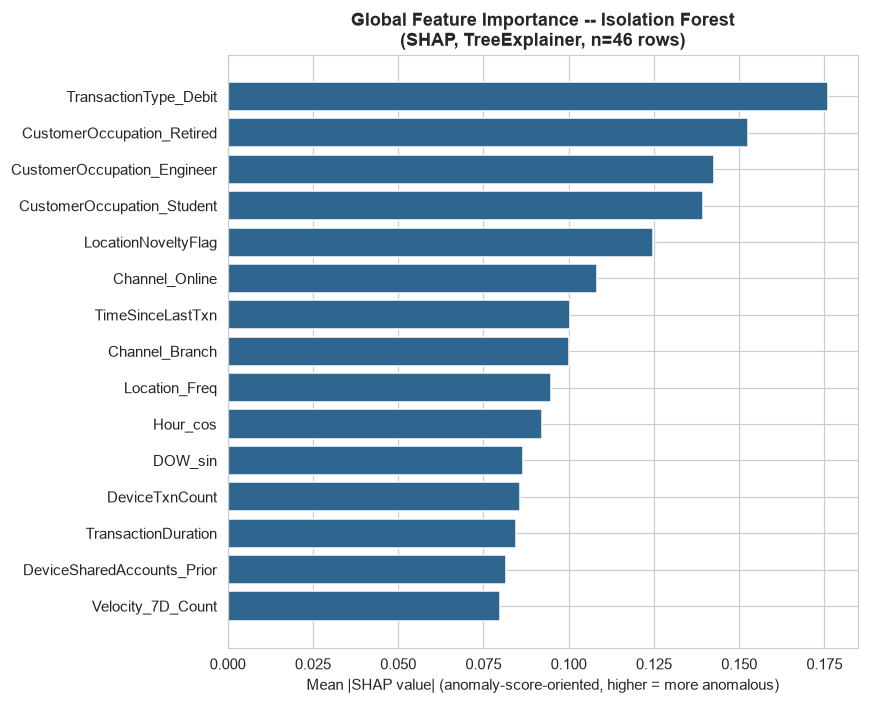
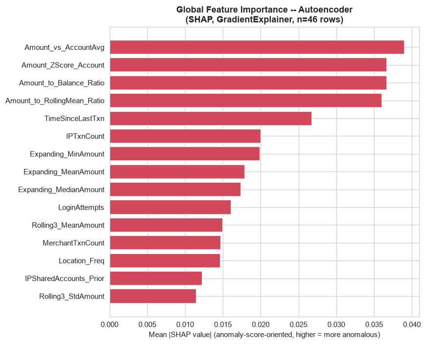
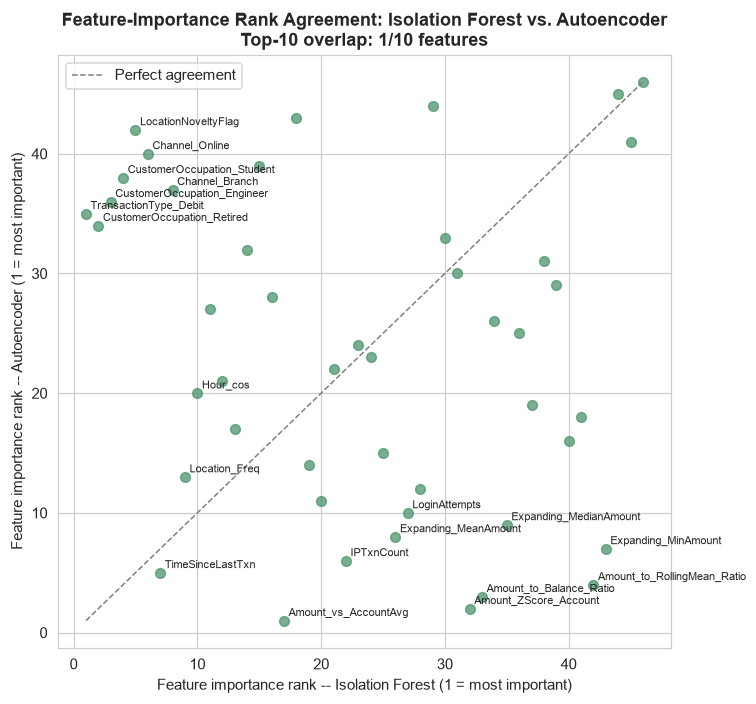

# Phase 11 — Explainability

Generated by `src_research/11_explainability.py`. Numeric outputs: `artifacts_research/shap_isolation_forest.csv`, `shap_autoencoder.csv`, `shap_global_importance_comparison.csv`, `shap_local_explanations.json`. Plots: `research/plots/shap_global_importance_if.png`, `shap_global_importance_ae.png`, `shap_if_vs_ae_agreement.png`, `shap_local_waterfall_TX000177.png`, `shap_local_waterfall_TX001354.png`, `shap_local_waterfall_TX000275.png`, `shap_local_waterfall_TX000566.png`.

---

## 0. Method and Sign Convention (Checked, Not Assumed)

- **Isolation Forest**: `shap.TreeExplainer`, exact, no background sample required, 7.2s for all 2,512 rows. Checked directly before use: TreeExplainer's raw output for sklearn's `IsolationForest` is a monotonic transform of `score_samples` (Spearman rho = 1.0 against `score_samples` in a spot-check), which is the *opposite* convention to this project's `score_isolation_forest = -decision_function` (higher = more anomalous). **Raw SHAP values are therefore negated** before being reported, so that a positive value in every table below means "pushes the anomaly score up."
- **Autoencoder**: `shap.GradientExplainer` on a small wrapper module (`AEErrorWrapper`) whose forward pass returns the scalar per-row reconstruction MSE — the same quantity as `score_autoencoder`. `shap.DeepExplainer` was the first choice tried; `GradientExplainer` was used instead because it ran cleanly against this exact feedforward ReLU architecture without further adaptation. Background = 100 rows sampled from the training split. Additivity was checked directly in a 10-row spot-check (`wrapper(background).mean() + shap_values.sum(axis=1)` vs. the wrapper's actual output, Spearman rho = 0.95 — GradientExplainer's expected-gradients approximation, not an exact decomposition like TreeExplainer's, so this is not expected to be exact). No sign flip needed: higher SHAP value already means "pushes reconstruction error up," matching `score_autoencoder`'s convention directly. 128.8s for all 2,512 rows.
- Both explainers were run over the full 2,512-row dataset, not a subsample — feasible at this scale (under 2.5 minutes combined) and avoids any sampling-variance caveat on the global-importance ranking below.

---

## 1. Global Feature Importance

Ranked by mean |SHAP value| across all 2,512 rows.

| Rank | Isolation Forest — top 10 | mean\|SHAP\| | Rank | Autoencoder — top 10 | mean\|SHAP\| |
|---:|---|---:|---:|---|---:|
| 1 | `TransactionType_Debit` | 0.176 | 1 | `Amount_vs_AccountAvg` | 0.0390 |
| 2 | `CustomerOccupation_Retired` | 0.152 | 2 | `Amount_ZScore_Account` | 0.0367 |
| 3 | `CustomerOccupation_Engineer` | 0.143 | 3 | `Amount_to_Balance_Ratio` | 0.0367 |
| 4 | `CustomerOccupation_Student` | 0.139 | 4 | `Amount_to_RollingMean_Ratio` | 0.0360 |
| 5 | `LocationNoveltyFlag` | 0.125 | 5 | `TimeSinceLastTxn` | 0.0268 |
| 6 | `Channel_Online` | 0.108 | 6 | `IPTxnCount` | 0.0201 |
| 7 | `TimeSinceLastTxn` | 0.100 | 7 | `Expanding_MinAmount` | 0.0199 |
| 8 | `Channel_Branch` | 0.100 | 8 | `Expanding_MeanAmount` | 0.0179 |
| 9 | `Location_Freq` | 0.095 | 9 | `Expanding_MedianAmount` | 0.0174 |
| 10 | `Hour_cos` | 0.092 | 10 | `LoginAttempts` | 0.0161 |

**Top-10 overlap between the two models: 1 out of 10 features** (`TimeSinceLastTxn`, ranked 7th by Isolation Forest and 5th by the Autoencoder). The Spearman correlation between the two models' full 46-feature mean\|SHAP\| importance vectors is **rho = −0.157** — essentially no agreement, slightly negative. **This is reported plainly as a real, structural finding, not smoothed over**: Isolation Forest and the Autoencoder are picking up on almost entirely different signals to call something anomalous.

**Why this happens, reasoned from how each model works, not asserted**: Isolation Forest's anomaly score comes from how few random splits it takes to isolate a point. Low-cardinality categorical/binary features (`TransactionType_Debit`, the one-hot `CustomerOccupation_*` columns, `Channel_*`, `LocationNoveltyFlag`) are cheap, clean split points — a single split on a binary feature isolates an entire minority class of rows in one step, which shows up as a large marginal contribution to path length and hence to the isolation score. This makes Isolation Forest's SHAP importances lean heavily toward categorical structure and toward the general shape of a transaction (channel, occupation, time-of-day via `Hour_cos`) rather than toward how extreme its amount is. The Autoencoder's score is squared reconstruction error, which is dominated by whichever *continuous* features have the largest-magnitude residuals after decompression through a 4-dimensional bottleneck — and the amount-derived features (`Amount_vs_AccountAvg`, `Amount_ZScore_Account`, `Amount_to_Balance_Ratio`, `Amount_to_RollingMean_Ratio`) have by far the widest dynamic range in this feature set (Phase 4/5 already documented `TransactionAmount`'s skew of 1.74), so they dominate the reconstruction-error budget almost automatically. Put plainly: **Isolation Forest is best read here as a "does this transaction's categorical/temporal shape look unusual" detector, and the Autoencoder is best read as a "is this transaction's amount unusual relative to this account's own scale" detector.** They are not redundant, and an operator relying on only one would be blind to the other's failure mode.

This divergence is consistent with, and adds a mechanistic explanation to, Phase 8 Section 3.2's finding that Isolation Forest and the Autoencoder have only a moderate Spearman correlation on their raw anomaly scores (rho = 0.643) — not one of the strongest pairings in that matrix (LOF↔HDBSCAN at 0.840, AE↔VAE at 0.801 were stronger). Now there is a feature-level reason for that gap, not just a score-level observation.

---

## 2. Local Explanations

Four transactions are broken down in full below — the same four used in Phase 10's business-evaluation walkthrough (`research/08_evaluation.md` Section 4), so the numeric SHAP attribution here can be read directly against that plain-language narrative.

### TX000177 (AccountID AC00363) — Isolation Forest score in the top 1%

| Model | Top drivers (in order) | Reading |
|---|---|---|
| Isolation Forest | `Amount_to_RollingMean_Ratio` (+1.270), `Amount_vs_AccountAvg` (+0.808), `TransactionAmount` (+0.774), `Amount_ZScore_Account` (+0.478), `Amount_vs_TypeAvg` (+0.381), `Amount_minus_ExpandingMean` (+0.364), `CustomerOccupation_Engineer` (+0.337) | Every top driver pushes the score up; no feature pulls it down. All the amount-relative features agree with each other, which is itself informative — this is not one feature accidentally dominating. |
| Autoencoder | `Amount_ZScore_Account` (+1.298), `Amount_vs_AccountAvg` (+0.808), `Amount_to_RollingMean_Ratio` (+0.346), `Amount_to_Balance_Ratio` (−0.342, pulls down), `Expanding_MinAmount` (−0.117, pulls down) | Same core story (amount is ~93 standard deviations from this account's own history), but `Amount_to_Balance_Ratio` (0.56, i.e. this transaction is only 56% of the account's balance — not draining the account) *pulls the reconstruction error down slightly*, since a moderate balance-ratio is itself unremarkable even though the absolute jump from history is extreme. |

**Plain-language read for an investigator**: both models agree, independently and for related-but-distinct reasons, that this transaction's amount is wildly out of line with this specific account's own history (a ~93-sigma jump, already flagged directly by Phase 8's K-Means micro-cluster analysis). Neither model is picking up on login friction, velocity, or device signals here — this looks like a pure amount-magnitude anomaly, consistent with Phase 1 Scenario 4 (unusual spending behavior) more than Scenario 1 (ATO, which would typically show elevated `LoginAttempts` alongside the amount jump — not present here, `LoginAttempts=1`).

### TX001354 (AccountID AC00312) — Isolation Forest score in the top 1%

Nearly identical shape to TX000177: both models' top 3 drivers are the same three amount-relative features (`Amount_ZScore_Account`, `Amount_vs_AccountAvg`, `Amount_to_RollingMean_Ratio`), all pushing the score up, with `Amount_to_Balance_Ratio` again pulling the Autoencoder's error down slightly (0.73 balance ratio — a large transaction but not a full account drain). Isolation Forest additionally weights `TimeSinceLastTxn` (+0.316, this transaction came 3,576 hours — about 5 months — after the account's prior activity), a dormant-then-active pattern Phase 1 explicitly calls out as a classic ATO signature (Scenario 1) when combined with an amount jump, though again `LoginAttempts=1` argues against the credential-guessing sub-variant specifically.

### TX000275 (AccountID AC00454) — Isolation Forest score in the top 1%

| Model | Top drivers | Reading |
|---|---|---|
| Isolation Forest | `LoginAttempts` (+0.712), `ElevatedLoginFlag` (+0.677), `Amount_to_Balance_Ratio` (+0.665), `ATM_Credit_InteractionFlag` (+0.649), `TransactionAmount` (+0.474) | This is the one example in this set where login friction, not amount history, is the dominant driver. |
| Autoencoder | `Amount_to_Balance_Ratio` (+0.485), `LoginAttempts` (+0.314), `Amount_ZScore_Account` (−0.131, pulls down) | The Autoencoder agrees login attempts and balance ratio matter, but interestingly its `Amount_ZScore_Account` term *pulls the error down* — this account's amount, while large relative to its balance, is not that extreme relative to its own transaction-amount history (z-score 6.1, high but far below TX000177/TX001354's ~93-100). |

**Plain-language read**: this is the clearest match in the whole local-explanation set to Phase 1's Scenario 1 (account takeover) — 5 login attempts (the dataset's observed maximum), a transaction worth 3.6x the account's entire balance, and both models flagging login-related features as top contributors, not just amount. This is the one example where the two models' agreement (both weight login attempts and balance ratio, even though Isolation Forest's ranking differs) reinforces rather than diverges on the read.

### TX000566 (AccountID AC00086) — Isolation Forest score in the top 1%, but flagged in Phase 10 as **not** a plausible fraud pattern

| Model | Top drivers | Reading |
|---|---|---|
| Isolation Forest | `LocationNoveltyFlag` (+0.960), `Velocity_1D_Count` (+0.711), `Velocity_7D_Count` (+0.392), `Expanding_MeanAmount` (+0.375), `Amount_minus_ExpandingMean` (+0.349) | Note the raw value of `LocationNoveltyFlag` here is **0**, i.e. this transaction is at a *repeat* location — yet it still carries the single largest SHAP contribution of any feature across all four examples. This happens because `LocationNoveltyFlag=0` is the rare value in this dataset (only 5.73% of rows, since the flag is 1 for 94.27% of rows per Phase 10 Section 4) — Isolation Forest isolates rare *categorical* values quickly regardless of whether "rare" intuitively means "risky." |
| Autoencoder | `Expanding_MedianAmount` (+0.093), `Expanding_MeanAmount` (+0.070), `IPTxnCount` (+0.054) — all much smaller magnitudes than the other three examples | The Autoencoder's contributions here are an order of magnitude smaller than for TX000177/TX001354/TX000275 — consistent with Phase 10's read that this transaction ($29.38, below this account's historical average) is not a genuine amount-based outlier. |

**Plain-language read, and the most important finding of this section**: this example demonstrates directly why Isolation Forest's flag should not be taken as a fraud signal in isolation. Its high score here is driven almost entirely by `LocationNoveltyFlag=0` being a statistically rare *value* in this dataset (because nearly every other transaction has the flag set to 1, an artifact of the feature's construction documented in Phase 10 Section 4) — not because a repeat location is itself suspicious. The Autoencoder, whose score is driven by amount-scale reconstruction error rather than categorical rarity, does not share this read and assigns TX000566 far smaller SHAP magnitudes across the board. **This is a concrete, mechanistic illustration of the two-model divergence in Section 1**: relying on Isolation Forest alone here would flag a transaction for a reason (categorical rarity in a near-constant engineered flag) that has nothing to do with the amount-magnitude anomaly signature both models agree on for TX000177/TX001354. Cross-checking a flagged transaction against a second model with a structurally different basis for its score — exactly what this phase set out to test — catches this kind of false signal before it reaches a human reviewer.

---

## 3. Handoff to Phase 12

The two-model SHAP divergence documented here is a direct, mechanistic argument for ensembling rather than relying on a single detector family: Isolation Forest and the Autoencoder are demonstrably sensitive to different failure modes (categorical rarity vs. amount-magnitude deviation), and TX000566 shows a concrete case where the two disagree on whether a transaction's high score reflects a meaningful anomaly. Phase 12 combines all 11 non-hybrid models' scores using four aggregation strategies, explicitly to avoid over-relying on any single model's particular blind spot.
