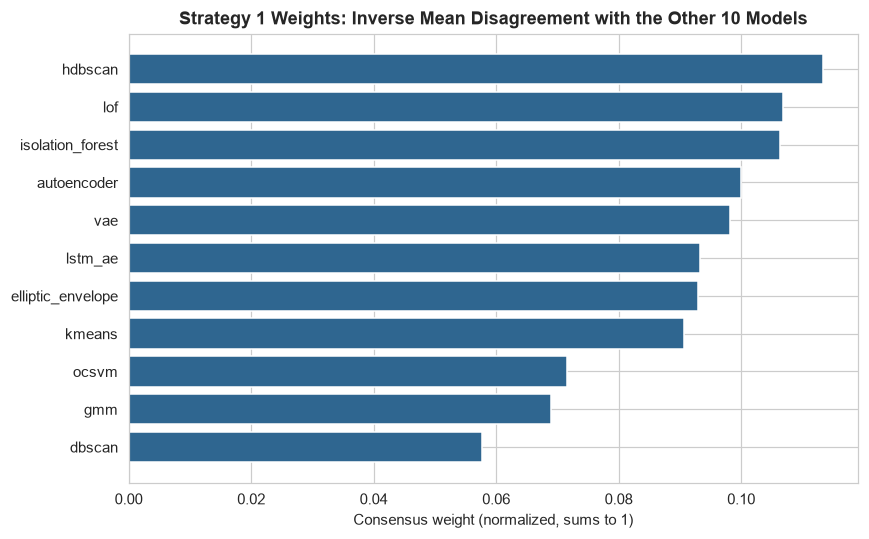
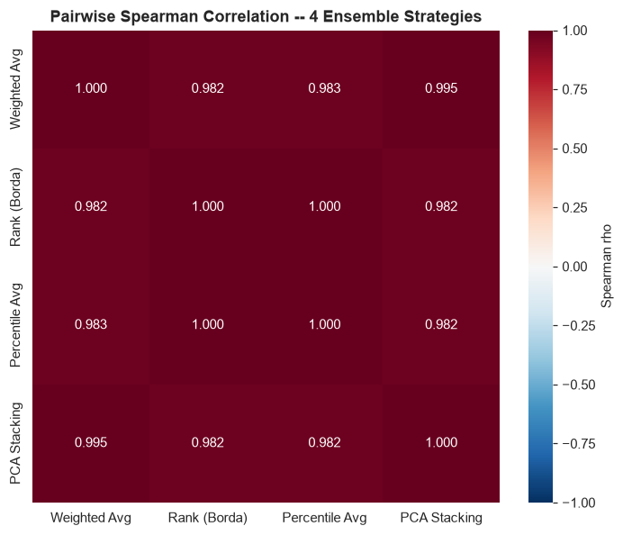
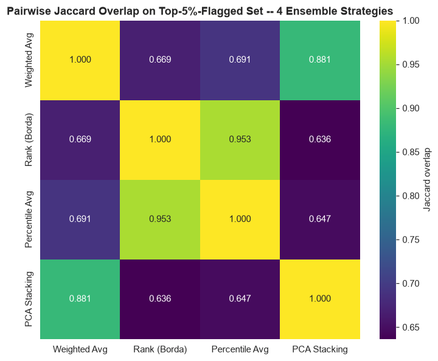
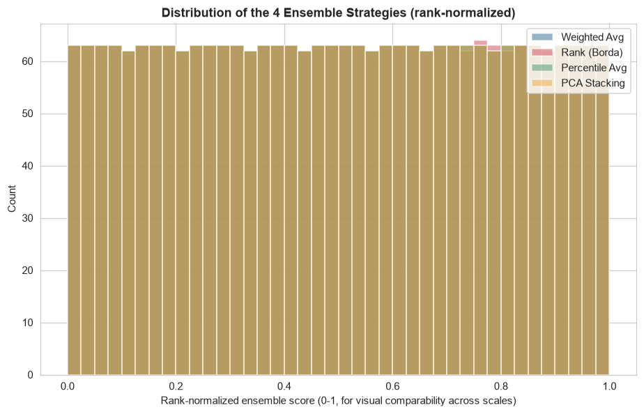

# Phase 12 — Ensemble Anomaly Scoring

Generated by `src_research/12_ensemble_scoring.py`. Numeric outputs: `artifacts_research/ensemble_scores.csv`, `ensemble_weights.json`, `ensemble_pairwise_comparison.csv`, `ensemble_vs_v1_crosscheck.json`. Plots: `research/plots/ensemble_weights_barplot.png`, `ensemble_pairwise_spearman_heatmap.png`, `ensemble_pairwise_jaccard_heatmap.png`, `ensemble_score_distributions.png`.

---

## 0. Which Models Go Into the Ensemble, and Why

**11 of the 12 Phase 8 models are combined**: `isolation_forest, lof, ocsvm, elliptic_envelope, dbscan, hdbscan, kmeans, gmm, autoencoder, vae, lstm_ae`. **The Hybrid Ensemble (Model 12) is deliberately excluded as an input.** It is itself already a majority vote of Isolation Forest + LOF + Autoencoder (Phase 8 Section 2.12) — folding it back in as a 12th "model" here would double-count those three detectors relative to the other 8, silently over-weighting whatever those three already agree on. This is the "well-justified subset" the task allows for, and it is stated here rather than left implicit. The Hybrid Ensemble's `vote_count` is retained as a comparison point in Section 3, not as an ensemble input.

**LSTM-AE is NaN for 110/2,512 rows** (accounts with <3 transactions, Phase 8 Section 2.11). Every strategy below handles this explicitly and differently, documented per strategy rather than papered over with a single blanket imputation choice.

---

## 1. Four Strategies

### 1.1 Weighted Average (consensus-weighted)

Each model's score is z-score standardized (own mean/std over its non-null values), then combined with weight `w_m = 1 / (disagreement_m + 0.05)`, normalized to sum to 1, where `disagreement_m` is the mean of `(1 - Spearman rho) / 2` between model `m` and each of the other 10 (source: `artifacts_research/model_pairwise_spearman.csv`, Phase 8, not recomputed) — mapping correlation from `[-1, 1]` to a `[0, 1]` disagreement scale. Rows missing a model's score are combined using only the available models, with weights renormalized over just those.

| Model | Disagreement | Weight |
|---|---:|---:|
| HDBSCAN | 0.199 | 0.113 |
| LOF | 0.215 | 0.107 |
| Isolation Forest | 0.216 | 0.106 |
| Autoencoder | 0.233 | 0.100 |
| VAE | 0.238 | 0.098 |
| LSTM-AE | 0.253 | 0.093 |
| Elliptic Envelope | 0.254 | 0.093 |
| K-Means | 0.262 | 0.091 |
| OCSVM | 0.345 | 0.072 |
| GMM | 0.360 | 0.069 |
| DBSCAN | 0.440 | 0.058 |

This matches Phase 8 Section 3.2's finding directly: DBSCAN and GMM, the two models shown there to correlate weakest with the rest of the field, get the lowest weights here (0.058 and 0.069) — this scheme is explicitly designed to down-weight, not exclude, models that structurally disagree with the consensus, rather than pretend all 11 detectors are equally trustworthy.

### 1.2 Rank Aggregation (Borda Count)

Each model's raw ordinal rank (1 = least anomalous .. N = most anomalous, ties averaged) is computed on its own non-null rows; a row missing a model's score gets that model's **median/neutral rank** (documented substitution, not a silent zero or max), so a missing detector neither helps nor hurts a row's aggregate. The 11 models' ranks are summed (a classic Borda count).

### 1.3 Percentile Aggregation

Each model's score is converted to its own empirical percentile in `(0, 1)` via `(rank - 0.5) / n_valid`. Unlike Borda, missing values here are **skipped, not imputed** — a row's percentile-average is the mean over only the models actually available for it. This is the more theoretically standard way to combine scores on different native scales (continuous MSE, discrete 0–3 vote-adjacent scores, GLOSH outlier scores) without assuming anything about their relative shapes.

### 1.4 Stacking Proxy (explicitly NOT supervised)

**No fraud label exists anywhere in this project, so there is no target to fit a supervised meta-learner against.** As an unsupervised substitute, PCA's first principal component is computed across the 11 z-scored score columns (LSTM-AE's 110 missing rows are zero-imputed here specifically, since PCA requires a complete matrix — a documented, not incidental, choice), oriented so higher PC1 = more anomalous (checked against the percentile-average ordering, no sign flip was needed). **PC1 explains 52.65% of the total variance across the 11 standardized score columns** — just over half, not the dominant share that would suggest a single, sharply-defined "consensus anomaly axis." This is an honest, moderate number: it means the 11 detectors share meaningful common variance (consistent with several strong pairwise correlations found in Phase 8, e.g. LOF↔HDBSCAN 0.840), but there is real independent information beyond one dimension too. **This is stated plainly as a proxy, not a validated stacking result** — with a label, a supervised stacker would very likely outperform this; without one, this is the most defensible unsupervised substitute available, not a claim that it is equivalent to real stacking.

---

## 2. Comparing the Four Strategies

| Strategy pair | Spearman rho | Jaccard (top-5%-flagged) |
|---|---:|---:|
| Weighted Avg vs. Rank (Borda) | 0.9825 | 0.669 |
| Weighted Avg vs. Percentile Avg | 0.9827 | 0.691 |
| Weighted Avg vs. PCA Stacking | 0.9947 | 0.881 |
| **Rank (Borda) vs. Percentile Avg** | **0.9999** | **0.953** |
| Rank (Borda) vs. PCA Stacking | 0.9818 | 0.636 |
| Percentile Avg vs. PCA Stacking | 0.9819 | 0.647 |

**Honest finding, stated rather than hidden**: Rank (Borda) aggregation and Percentile aggregation are **nearly mathematically identical here** (Spearman rho = 0.9999, Jaccard 0.953 on the top-5% set). This is expected, not a coincidence to celebrate: converting a score to `rank / N` (percentile) versus summing raw ranks are the same operation up to a per-model normalization constant, and the two only diverge at all because of how each handles LSTM-AE's 110 missing rows differently (median-rank imputation vs. skip-and-renormalize). **These two strategies should not be treated as materially different signals in production** — reported plainly per this project's stated standard for saying so when a technique doesn't cleanly differentiate itself, rather than manufacturing an artificial distinction between them.

The Weighted Average and PCA Stacking strategies are the two genuinely distinct alternatives here (rho = 0.995 with each other, but rho = 0.982–0.983 with the rank/percentile pair — still very high in absolute terms, but the lowest correlations in the table, and the Jaccard overlaps at 0.64–0.69 mean roughly a third of the top-5%-flagged sets differ from the rank/percentile pair). This divergence is exactly what would be expected from Section 1's design choices: Weighted Average explicitly down-weights DBSCAN/GMM, while Rank/Percentile aggregation treats every model's *rank contribution* equally regardless of that model's overall agreement with the field.

### 2.1 Cross-check against v1's vote_count and the Hybrid Ensemble's vote_count (rough proxies only)

| Strategy | rho vs. v1 `vote_count` (rough proxy, not ground truth) | rho vs. Hybrid Ensemble `vote_count` |
|---|---:|---:|
| Weighted Avg | 0.444 | **0.504** |
| PCA Stacking | 0.442 | 0.502 |
| Rank (Borda) | 0.442 | 0.485 |
| Percentile Avg | 0.442 | 0.486 |

All four strategies correlate almost identically with v1's independent 4-detector proxy (0.442–0.444, a difference well within noise) — no strategy is a clear winner by this rough cross-check. Weighted Average and PCA Stacking correlate marginally more strongly with the Hybrid Ensemble's own vote count (0.50 vs. 0.49) — a small, mechanically unsurprising effect, since both of those strategies use standardized raw scores (closer in spirit to a vote-weighted combination) rather than pure rank position.

---

## 3. Recommendation

**Recommended: Percentile Aggregation**, for three concrete reasons, not by default:

1. **Robust to heterogeneous native scales without any tuned weighting**: the 11 input scores span continuous reconstruction MSE (Autoencoder, VAE, LSTM-AE), a bounded kernel decision function (OCSVM), a GLOSH outlier score (HDBSCAN), a negative log-likelihood (GMM), and a discrete-ish distance-to-centroid measure (K-Means) — percentile aggregation converts all of them onto the same `(0, 1)` scale using only each model's own distribution, with no assumption about shape or relative variance.
2. **No tuned weights to defend to a reviewer.** Weighted Average's disagreement-based weights are a reasonable, principled choice, but they are still a modeling decision computed from a correlation matrix that could shift with more data or a different train/val split — an extra layer of judgment a percentile average does not require. For a system that may eventually face compliance review, "the average of what percentile each detector places this transaction at" is a one-sentence, defensible explanation; "the disagreement-inverse-weighted z-score average" requires defending the weighting scheme itself.
3. **Mathematically near-identical to Rank Aggregation** (Section 2), so choosing it is not a meaningful sacrifice relative to that alternative — and it handles the LSTM-AE missing-data case (skip, not impute) slightly more conservatively than Borda's median-rank substitution.

**Where Weighted Average would be the better choice instead**: if a team specifically wants to discount DBSCAN and GMM's known divergence from the rest of the field (Phase 8 Section 3, reinforced by Section 1.1 above) rather than let every model's rank count equally, Weighted Average is the more deliberate tool for that — it is not a wrong choice, just a different, more opinionated one. **PCA Stacking is not recommended as the primary production score**: its "consensus axis" framing is harder to explain to a non-technical reviewer than a percentile average, and its 52.65% explained variance means nearly half of the cross-model signal is left out of a single component that a downstream user has no direct way to interrogate feature-by-feature.

`artifacts_research/ensemble_scores.csv`'s `ensemble_percentile_average` column is the score carried forward into Phase 13's threshold analysis.

---

## 4. Handoff to Phase 13

Percentile Aggregation produces a continuous score in `(0, 1)` for every transaction (all 2,512 rows have a value — no missing rows, since percentile aggregation renormalizes over available models rather than dropping incomplete rows). Phase 13 applies percentile- and statistics-based thresholds to this column and reasons about the resulting operational load.
