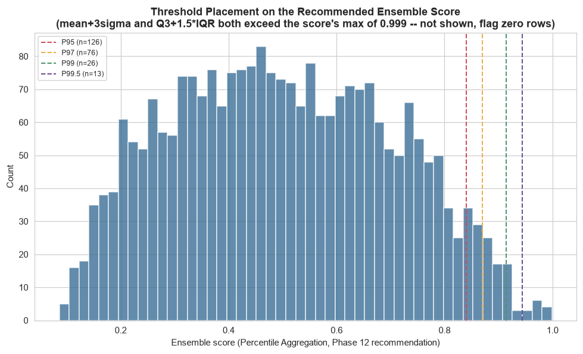

# Phase 13 — Threshold Optimization

Generated by `src_research/13_threshold_optimization.py`. Numeric outputs: `artifacts_research/threshold_analysis.json`, `threshold_flagged_counts.csv`. Plot: `research/plots/threshold_score_distribution.png`.

**Score thresholded**: `ensemble_percentile_average` (Phase 12's recommended strategy, `artifacts_research/ensemble_scores.csv`). Distribution: mean 0.5001, std 0.2029, min 0.0862, max 0.9988, Q1 0.3381, Q3 0.6574.

---

## 1. What This Phase Can and Cannot Honestly Do

**No fraud label exists anywhere in this project.** v1's `src/06_evaluation.py` computes a true cost-minimizing threshold by sweeping a decision boundary against its supervised proxy labels and picking the threshold that minimizes `FP x $5 + FN x $250` (v1's own stated illustrative figures, `src/config.py` — not real bank numbers either). **That methodology cannot be reproduced here**, because computing a false-negative count requires knowing which *unflagged* transactions are actually fraud, and computing a true-positive count requires knowing which *flagged* transactions are actually fraud — neither is knowable without a label. Reproducing v1's cost-curve output format with numbers computed against no label would misrepresent what was actually done, so it is not done. What this phase *can* honestly show: how many transactions land above each threshold, what that implies for review-team operational load, and an upper-bound illustrative cost assuming every flagged transaction is a false positive (a cost ceiling, not a cost estimate).

---

## 2. Percentile Thresholds

| Threshold | Score value | Transactions flagged | % of dataset |
|---|---:|---:|---:|
| 95th percentile | 0.8406 | 126 | 5.02% |
| 97th percentile | 0.8700 | 76 | 3.02% |
| 99th percentile | 0.9145 | 26 | 1.04% |
| 99.5th percentile | 0.9443 | 13 | 0.52% |

---

## 3. Statistical Thresholds — A Genuine, Unforced Finding

Applying the classic statistical thresholds directly to the recommended score:

| Method | Threshold value | Transactions flagged |
|---|---:|---:|
| mean + 3σ | 1.1088 | **0** |
| Q3 + 1.5×IQR | 1.1363 | **0** |

**Both thresholds exceed the score's actual maximum of 0.9988 — flagging zero transactions.** This is reported plainly as a real methodological finding, not an error or a case to force a workaround for. `ensemble_percentile_average` is an average of 11 models' percentile ranks, each bounded in `(0, 1)`; averaging several roughly-independent percentiles compresses the tails of the resulting distribution (a CLT-like effect — the same reason an average of several fair coin flips clusters tighter around 0.5 than any single flip), producing a distribution with a maximum well short of what 3 standard deviations above the mean would require, or what Tukey's IQR fence would require. **Classic normal-distribution-derived statistical thresholds are not well-suited to an already-bounded, already-aggregated percentile score.**

To confirm this is a property of the score's construction, not a general property of this dataset, the identical thresholds were applied to two **unbounded** scores for context:

| Score | mean+3σ threshold | n flagged | Q3+1.5×IQR threshold | n flagged |
|---|---:|---:|---:|---:|
| Isolation Forest raw score | 0.0417 | 25 | 0.0275 | 43 |
| Phase 12 Weighted-Average ensemble | 2.1516 | 17 | 0.9413 | 87 |

Both unbounded scores produce non-trivial, usable statistical thresholds. **Practical conclusion**: if a sigma/IQR-style statistical threshold is wanted in production (for example, because it is easier to explain to some stakeholders as "more than three standard deviations from typical"), it should be applied to an unbounded, z-scored ensemble score such as Phase 12's Weighted Average, not to the bounded Percentile Average recommended for day-to-day scoring. This is not a flaw in Percentile Aggregation as a scoring method — it remains the Phase 12 recommendation for the reasons given there — it is specifically a mismatch between one statistical-thresholding convention and one particular score's shape, now documented rather than silently worked around.

---

## 4. Business Impact Framing

Using v1's own stated illustrative figures (`src/config.py`: FP = $5, FN = $250 — not real bank numbers, restated here with the same caveat v1 itself carries) and each percentile threshold's flagged count, an **upper-bound review cost** can be computed under the assumption that every flagged transaction turns out to be a false positive (the worst case for review-labor cost, not an expected-cost estimate):

| Threshold | Transactions flagged | Upper-bound review cost if 100% are false positives | Operational load (this 364-day, 2,512-row sample) |
|---|---:|---:|---|
| 95th percentile | 126 | $630 | ~0.35 transactions/day |
| 97th percentile | 76 | $380 | ~0.21 transactions/day |
| 99th percentile | 26 | $130 | ~0.07 transactions/day |
| 99.5th percentile | 13 | $65 | ~0.04 transactions/day |

**What this table is, and is not**: it is an honest ceiling on review-labor cost if the review team's entire flagged queue turned out to contain no real fraud. It is **not** a total-cost estimate, because the false-negative side of v1's cost equation (`FN x $250`) cannot be computed without knowing how much fraud exists among the *unflagged* 95–99.5% of transactions — a quantity this unlabeled dataset cannot supply. A lower threshold is not "cheaper" in any total-cost sense from this table alone; it only reviews fewer transactions, which trades off against catching fewer of whatever fraud is actually present, in a direction this project cannot quantify.

**Operational-load caveat, stated explicitly rather than glossed over**: this dataset covers 364 days and 2,512 transactions across 495 accounts — an average of **6.90 transactions/day**. This is a small research sample, not representative of a real bank's transaction volume, so the "transactions/day" figures above describe *this sample's* scale only. They should not be read as a claim about real-world review-queue throughput; a production deployment processing thousands or millions of transactions/day would see proportionally larger absolute flagged counts at the same percentile thresholds, and the *relative* review-load comparison across thresholds (95th flags ~5x as many transactions as 99.5th) is the part of this table that generalizes, not the absolute daily counts.

---

## 5. Recommendation

**A two-tier threshold, mirroring v1's own review/block structure (`artifacts/thresholds.json`) but built without borrowing v1's cost-optimized values (which come from a different feature set and a different, supervised-proxy-label pipeline)**:

- **99th percentile (26 transactions, 1.04% of the dataset) as a "priority review" tier.** This is the tier where Phase 10's business evaluation found the clearest, most plausible fraud-pattern matches (e.g. `TX000275`'s combination of 5 login attempts and a transaction worth 3.6x the account balance) — Phase 11's SHAP analysis confirms these top-tier flags are driven by amount-magnitude and login-friction features consistently across both Isolation Forest and the Autoencoder, not by the near-constant `DeviceNoveltyFlag`/`LocationNoveltyFlag` artifacts documented in Phase 10 Section 4.
- **95th percentile (126 transactions, 5.02%) as a broader "standard review" tier**, acknowledging Phase 10 Section 4's finding that the tail toward the 10th percentile dilutes into transactions that are only mildly statistically unusual, not operationally suspicious — a review team with more capacity could extend into this wider tier, understanding the marginal transactions added between the 99th and 95th percentile carry a weaker signal on average than the top 1%.

**This recommendation is explicitly a workload/signal-strength trade-off reasoned from the internal evidence available (Phases 10–12), not a cost-minimized threshold** — that distinction is the central, honest finding of this phase, and it is stated here one final time rather than left implicit in the tables above.
