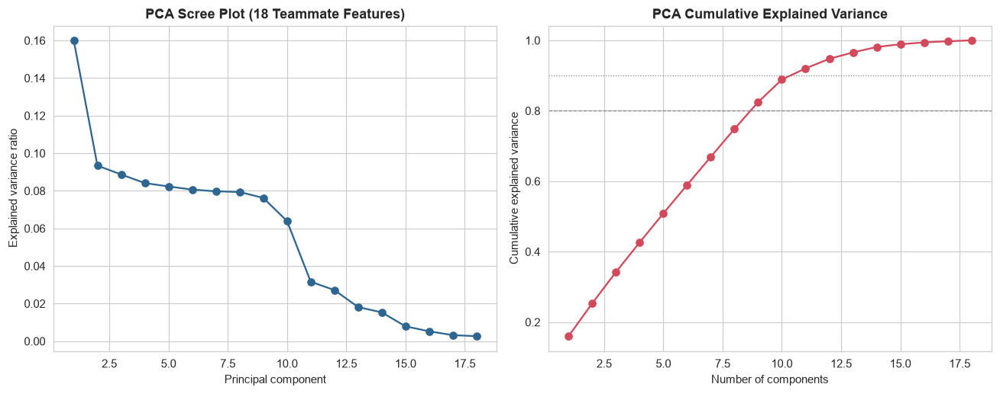
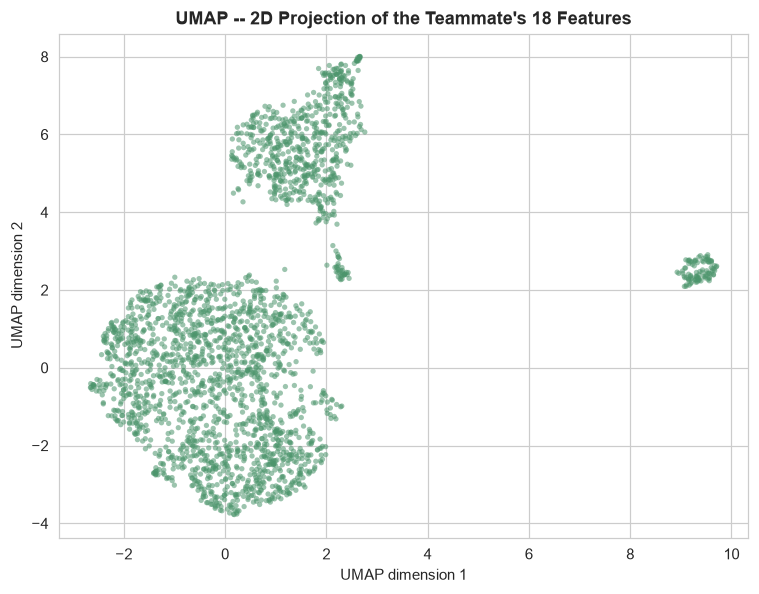
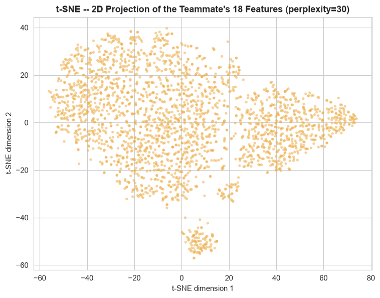
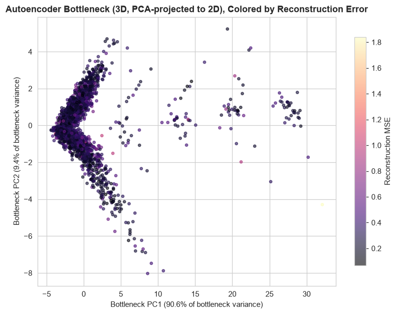

# Phase 6 (v2) — Preprocessing Verification & Phase 7 (v2) — Dimensionality Reduction

Generated by `src_research_v2/04_feature_verification.py` (Phase 6) and `src_research_v2/05_dim_reduction.py` (Phase 7) against `artifacts_research/features_teammate_merged.csv` (2,512 rows × 18 features, from `research_v2/04_feature_engineering.md`). Numeric outputs: `artifacts_research_v2/phase5_6_feature_verification.json`, `pca_explained_variance.csv`, `pca_loadings.csv`, `phase7_dim_reduction_summary.json`, `autoencoder_config.json`, `autoencoder_reconstruction_errors.csv`. Plots: `research_v2/plots/pca_scree_cumulative.png`, `umap_projection_v2.png`, `tsne_projection_v2.png`, `autoencoder_bottleneck_2d_v2.png`, `autoencoder_training_curve_v2.png`.

---

## Phase 6 — Preprocessing Verification

### 6.1 Missing values / duplicates

0 missing cells (0/70,336), 0 duplicate rows, 0 duplicate `TransactionID`s — reconfirmed directly against `features_teammate_merged.csv`, per `research_v2/04_feature_engineering.md` Section 2.1. No imputation comparison is presented, for the same reason the in-house Phase 6 skipped one: there is no missingness to compare strategies against.

### 6.2 Scaling — already done upstream, verified rather than assumed

Unlike the in-house pipeline, this feature set arrives pre-scaled. All 18 columns were verified directly (`research_v2/04_feature_engineering.md`, Section 2.2): the 14 continuous columns (5 raw-value features + 4 frequency counts + `amount_to_balance_ratio` + `Location_FE`, plus the ID/display columns excluded) are StandardScaler-scaled to mean≈0/std≈1, and the 4 binary/dummy families are correctly left as 0/1 flags. There is therefore no scaler *comparison* to make in the sense the in-house Phase 6 made one (Standard vs. MinMax vs. Robust vs. Quantile) — that decision was already made upstream by the teammate's pipeline and is not re-litigated here.

What this phase *does* add on top of the teammate's StandardScaler pass: every model in Phase 8 (v2) additionally fits a `RobustScaler` on the 18-column matrix (train split only), for two reasons — (1) consistency with the in-house pipeline's Phase 6 recommendation (IQR-based scaling is less sensitive to the exact extreme values present than a second round of mean/std scaling would be), and (2) because `StandardScaler`'s mean/std are themselves outlier-sensitive, a single additional `RobustScaler` pass gives distance-based models (LOF, OCSVM, DBSCAN, HDBSCAN, K-Means) a scale reference that is not re-distorted by the handful of extreme rows (e.g. `LoginAttempts` z-scores up to 6.43, `amount_to_balance_ratio` up to 8.32) that the raw StandardScaler pass could not itself be robust to.

### 6.3 Encoding

`Location_FE` (frequency encoding) is the only `Location` representation present — no label-encoded or one-hot alternative exists in this feature set, so there is no encoding comparison to run (the in-house Phase 6 comparison, `research/05_feature_selection_and_preprocessing.md` Section 6.3, is referenced for context: frequency encoding outperformed label encoding there too, so this is a reasonable choice, not re-verified against a proxy target here since doing so would require re-deriving a vote-count proxy this pipeline does not build).

### 6.4 Spot checks (full detail: `research_v2/04_feature_engineering.md` Sections 2.3–2.5)

- `amount_to_balance_ratio` correlates r=0.9467 with the raw `TransactionAmount/AccountBalance` ratio — same concept as the in-house `Amount_to_Balance_Ratio`, independently arrived at.
- `high_amount_transaction` is a global top-5%-by-raw-amount flag (empirically recovered threshold: $878.63 minimum among flagged rows vs. the dataset's 95th percentile of $878.18).
- One-hot dummy baselines recovered: `TransactionType` drops Credit, `Channel` drops ATM, `CustomerOccupation` drops Doctor.

---

## Phase 7 — Dimensionality Reduction

All four techniques below run on the full 18-column feature matrix — there is no "5-feature subset vs. full set" split to draw the way the in-house Phase 7 did, since 18 is already the complete feature set here.

### 7.1 PCA

Full 18-component decomposition (`artifacts_research_v2/pca_explained_variance.csv`): **PC1 = 16.01%, PC2 = 9.34%, PC3 = 8.87%**, then a long, gently-declining tail (PC4–PC9 each between 6.4% and 8.4%) before a real drop-off after PC10 (PC11 = 3.16%, PC12 = 2.72%, ... PC18 = 0.27%). **9 components are needed to reach 80% cumulative variance, 11 for 90%.** This is a materially flatter, more spread-out variance profile than a small handful of dominant components would produce — consistent with the in-house Phase 4 finding on its own (different) 5-numeric-feature PCA (near-flat, PC1 26.5%) in the general sense that this dataset's numeric features do not compress into 2-3 dominant directions, though the two are not a fair apples-to-apples comparison (different feature counts, 5 vs. 18).

Loadings on the first 3 components (`artifacts_research_v2/pca_loadings.csv`) are directly interpretable:
- **PC1** (16.0%): dominated by `amount_to_balance_ratio` (+0.594), `AccountBalance` (−0.520), `CustomerAge` (−0.471), `TransactionAmount` (+0.299) — reads as a "large transaction relative to a smaller, younger account" axis.
- **PC2** (9.3%): `TransactionAmount` (+0.716), `CustomerAge` (+0.408), `device_frequency` (−0.258), `amount_to_balance_ratio` (+0.253) — a more transaction-size-centric axis, separate from PC1's ratio-driven one.
- **PC3** (8.9%): `LoginAttempts` (+0.502), `ip_frequency` (−0.457), `Location_FE` (+0.406), `device_frequency` (+0.281) — a security/network-context axis, distinct from the two amount-related axes above.

The fact that `LoginAttempts` and the frequency-encoded network features load most heavily on a *third*, separate component (not folded into the amount-related PC1/PC2) is a genuinely useful finding for later phases: it suggests "unusual amount behavior" and "unusual login/network behavior" are close to orthogonal signals in this 18-feature space, not two views of the same underlying anomaly.

### 7.2 UMAP

UMAP resolves **three distinct groups**, not the single-dominant-mass-plus-one-small-pocket structure the in-house Phase 7 UMAP found on its 46-feature set. Checked directly by partitioning the embedding and comparing feature means per group (not assumed from the plot alone):

| Group | Rows | % | Defining feature(s) |
|---|---:|---:|---|
| Main mass | 1,802 | 71.7% | No occupation dominance (Engineer 32.8%, Retired 32.1%, Student only 2.9%, i.e. mostly Doctor/Engineer/Retired) |
| Upper cluster | 614 | 24.4% | `CustomerOccupation_Student` = 94.8% of this group (vs. 26.2% overall) — almost entirely students, with `CustomerAge` z-score mean **−1.162** and `AccountBalance` z-score mean **−1.012** (younger, lower-balance, exactly as expected for students) |
| Isolated pocket | 96 | 3.8% | `LoginAttempts` z-score mean **4.755** (vs. ~0 overall) — this is the elevated-login-attempts population, cleanly separated |

This is a materially cleaner and more explicable finding than the in-house UMAP's ambiguous 95-point pocket (no single-feature driver identified there). Here, the segmentation is directly attributable to two of the one-hot/near-discrete features (`CustomerOccupation_Student`, `LoginAttempts`) dominating the local-neighborhood structure UMAP optimizes for — a real and expected consequence of mixing continuous z-scores with one-hot dummies and a near-discrete count in the same unweighted 18-dimensional space, not evidence of a genuine multivariate fraud signal on its own. The student cluster in particular is a demographic segment, not an anomaly population — worth flagging explicitly so it is not mistaken for one downstream.

### 7.3 t-SNE

Run at perplexity=30 (the in-house pipeline's Phase 4 default), t-SNE **independently reproduces the same two findings as UMAP**, checked directly rather than assumed from visual similarity: a bottom-isolated pocket of 99 rows (3.94%) with `LoginAttempts` z-score mean **4.655** (matching UMAP's 96-row, 4.755-mean pocket almost exactly), and a right-side cluster of 383 rows (15.25%, a partial view of UMAP's larger 614-row student cluster — t-SNE's tighter local packing splits it differently) with `CustomerOccupation_Student` = 94.5% and the same age/balance signature (`CustomerAge` z-score −1.155, `AccountBalance` z-score −1.075). Two independent nonlinear projection methods agreeing on the same two structural drivers (elevated login attempts, student occupation) is a much stronger form of validation than either method alone — this is a real, reproducible structure in the feature space, not a projection artifact of one specific method's hyperparameters.

### 7.4 Autoencoder

Architecture (`src_research_v2/autoencoder_utils.py::Autoencoder`, PyTorch): `input(18) -> Dense(8, ReLU) -> Dense(4, ReLU) -> bottleneck(3, ReLU) -> Dense(4, ReLU) -> Dense(8, ReLU) -> output(18)` — mirrors the in-house `autoencoder_utils.py`'s class/function API exactly, sized down for an 18-dimensional input (the task spec's `8->4->bottleneck(2 or 3)->4->8`; 3 was chosen for the bottleneck to retain slightly more representational capacity than 2 while still being small enough to visualize directly). Input is the 18-column matrix scaled with `RobustScaler` fit on the training split only (2,009/503, `random_state=42`, identical split convention to the in-house pipeline).

**Training setup:** Adam (`lr=1e-3`, weight decay `1e-5`), batch size 64, 200 epochs, MSE loss. Both train and validation curves (`plots/autoencoder_training_curve_v2.png`) fall smoothly and track closely throughout (train 0.750→0.287, val 0.693→0.297 from epoch 1 to 200) with no divergence — the standard "not overfitting" visual check, satisfied here for a 2,009-row training set on an 18-dimensional input (a much less demanding compression ratio than the in-house 46-dimensional case).

**Final reconstruction error** (in `RobustScaler`-scaled feature space):

| Split | Mean MSE | Mean MAE | P95 MSE | P99 MSE | Max MSE |
|---|---:|---:|---:|---:|---:|
| Train (n=2,009) | 0.2858 | 0.4025 | — | — | — |
| Validation (n=503) | 0.2966 | 0.4105 | 0.5551 | 0.6339 | 0.9633 |

The train/validation gap is small (0.2858 vs. 0.2966, +3.8%) — proportionally tighter than the in-house 46-feature autoencoder's train/val gap (0.2896 vs. 0.3280, +13.2%), consistent with an 18-dimensional input being an easier reconstruction task for the same bottleneck-style architecture than a 46-dimensional one. The validation P99 (0.634) and max (0.963) sit meaningfully above the P95 (0.555) but the tail is proportionally much less extreme than the in-house autoencoder's (whose val max of 6.708 was over 10x its P95) — a direct, expected consequence of this feature set having no personal-baseline features like `Amount_ZScore_Account` that can produce very large per-row deviations; the teammate's 18 columns are all population-level or already-standardized, so no single feature here has the same potential for an extreme outlier value.

The 3D bottleneck is projected to 2D via PCA for visualization. Artifacts saved for reuse as "Model 9": `artifacts_research_v2/autoencoder.pt`, `autoencoder_scaler.pkl`, `autoencoder_config.json`, `autoencoder_reconstruction_errors.csv`. `src_research_v2/autoencoder_utils.py::load_autoencoder()` / `reconstruction_errors()` reload and score exactly as the in-house module does.

---

## Handoff to Modeling

- **Scaling**: teammate's `StandardScaler` pass is already applied and verified; an additional `RobustScaler` (train-fit) is layered on top before any distance-based/gradient-based model, matching the in-house Phase 6 recommendation.
- **Encoding**: `Location_FE` is the only, and sufficient, `Location` representation — no further comparison needed.
- **A genuinely new finding for this feature set, not present in the in-house pipeline**: PCA/UMAP/t-SNE all agree this feature space has two identifiable non-fraud structural drivers — a student-occupation demographic segment (~24-25% of rows) and an elevated-`LoginAttempts` population (~4% of rows) — that should not be mistaken for anomaly clusters in Phase 8's unsupervised models; both are legitimate population segments, not fraud signal, and this is flagged explicitly rather than left for a reader to misinterpret from the plots alone.
- **Autoencoder**: `artifacts_research_v2/autoencoder.pt` (weights), `autoencoder_scaler.pkl`, `autoencoder_config.json`, `autoencoder_reconstruction_errors.csv` — ready to be loaded as "Model 9" via `src_research_v2/autoencoder_utils.py::load_autoencoder`.
