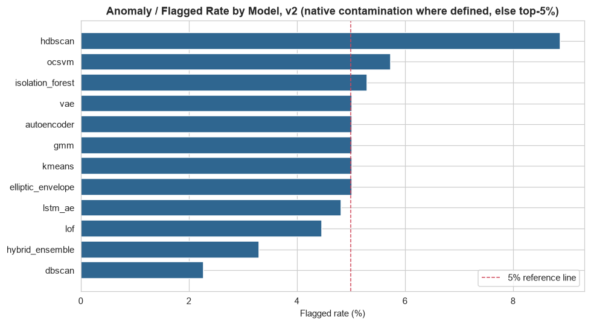
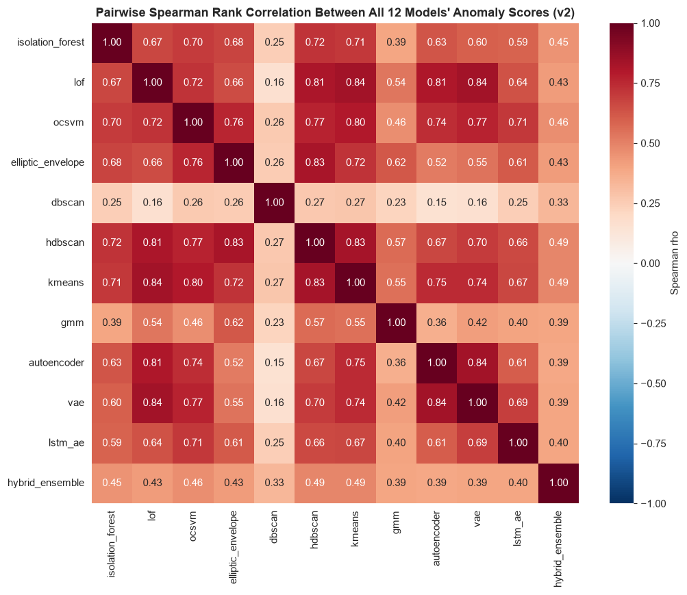
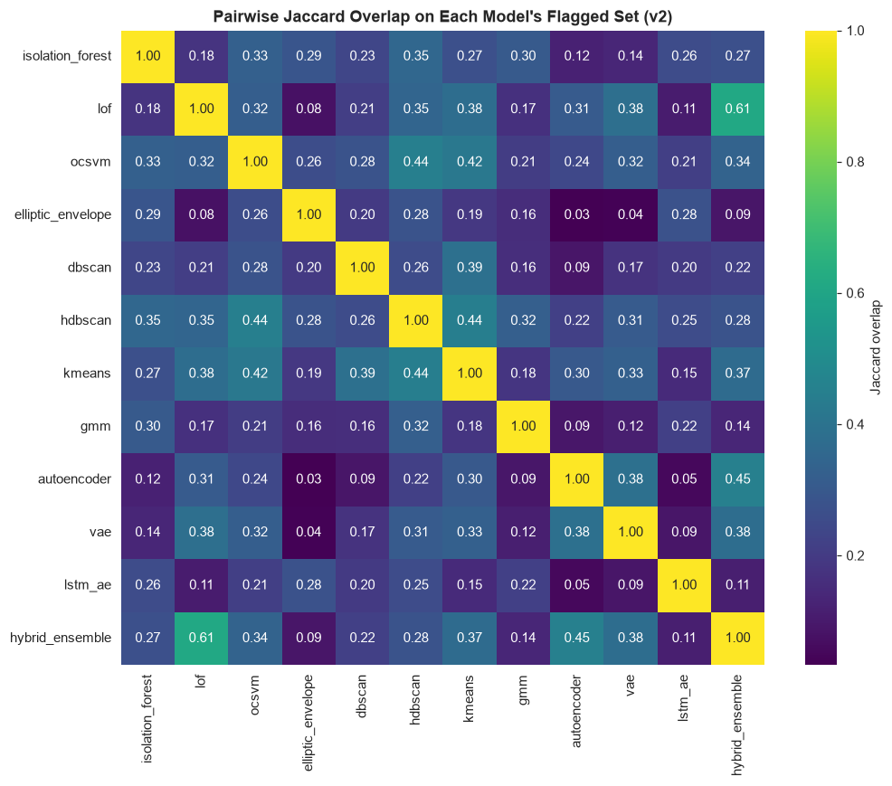

# Phase 8 (v2) — Model Development (12 Models, Teammate's 18-Feature Matrix)

Generated by `src_research_v2/06_models_classical.py` (Models 1–8) and `src_research_v2/07_models_deep.py` (Models 9–12), against `artifacts_research/features_teammate_merged.csv`. Numeric outputs: `artifacts_research_v2/model_scores_classical.csv`, `model_scores_all.csv`, `model_summary_classical.json`, `model_comparison_summary.json`, `model_pairwise_spearman.csv`, `model_pairwise_jaccard.csv`, `vae_config.json`, `lstm_ae_config.json`. Fitted artifacts: `artifacts_research_v2/models/*.pkl`, `vae.pt`, `lstm_ae.pt`. Plots: `research_v2/plots/dbscan_kdistance_elbow_v2.png`, `kmeans_elbow_silhouette_v2.png`, `gmm_bic_aic_v2.png`, `ae_vs_vae_reconstruction_error_v2.png`, `vae_training_curve_v2.png`, `lstm_ae_training_curve_v2.png`, `model_pairwise_spearman_heatmap_v2.png`, `model_pairwise_jaccard_heatmap_v2.png`, `model_anomaly_rate_comparison_v2.png`.

---

## 0. Methodology

- **Feature matrix**: all 18 columns of `artifacts_research/features_teammate_merged.csv` (`src_research_v2/config_research_v2.py::FEATURE_COLS_V2`), ID/display columns excluded. Every model uses the identical 18-column matrix so the Spearman/Jaccard cross-model comparisons (Section 3) mean something.
- **Leakage check**: explicit assertion confirms no `vote_count`/`risk_tier`/`is_fraud` columns exist anywhere in the input file.
- **Scaling**: `RobustScaler`, fit on the training split only, layered on top of the teammate's already-`StandardScaler`-scaled columns (rationale: `research_v2/05_feature_selection_and_preprocessing.md`, Section 6.2).
- **Split**: 2,009 train / 503 validation rows, `test_size=0.2, random_state=42` — reproduced from the same `train_test_split` call used for the Phase 7 autoencoder, cross-checked row-for-row against `autoencoder_reconstruction_errors.csv`'s `split` column (**confirmed: MATCH**). DBSCAN and HDBSCAN (no native out-of-sample `.predict`) fit directly on the full dataset. The LSTM Autoencoder (Model 11) uses a separate account-level split (Section 2.11).
- **Anomaly-score sign convention**: every `score_<model>` column is oriented so higher = more anomalous (sklearn `decision_function` outputs for IF/LOF/OCSVM/EE are negated).
- **Two anomaly-rate conventions**: each model's native rate (its own `contamination`/`nu`/noise fraction), and a standardized top-5%-by-score flag used for every model so Jaccard overlap compares like with like.

---

## 1. Models 1–8 (Classical)

### 1.1 Isolation Forest

5 configs tried (`n_estimators` 100–300, `max_samples` auto/0.8/0.5, `max_features` 1.0/0.7, `contamination` 0.03/0.05/0.10). Selected: `n_estimators=100, max_samples='auto', max_features=1.0, contamination=0.05` (highest top-5% score spread among the 5%-contamination configs). **Native anomaly rate: 5.29%** (133/2,512). Fit + score of all 5 configs: 4.48s — noticeably faster than the in-house 46-feature run (9.72s), as expected for an 18- vs. 46-column input.

### 1.2 Local Outlier Factor

5 configs (`n_neighbors` 10/20/35, `contamination` 0.03/0.05/0.10). Selected: `n_neighbors=20, contamination=0.05`. **Native anomaly rate: 4.46%** (112/2,512). Fit + score: 4.00s.

### 1.3 One-Class SVM

5 configs across kernel/`nu`/`gamma`. Selected: `kernel='rbf', nu=0.05, gamma='scale'`. **Native anomaly rate: 5.73%** (144/2,512). Fastest to fit (0.73s for all 5 configs).

### 1.4 Elliptic Envelope

3 configs. Selected `contamination=0.05, support_fraction=None`. **Native anomaly rate: 5.02%** (126/2,512).

**Gaussian-assumption check**: Shapiro-Wilk normality tests on all 18 scaled features. **100% reject the normality null at p<0.05** (every single one of the 18 p-values rounds to 0.0000) — the same conclusion the in-house pipeline reached on its 46 features, for the same underlying reason (the continuous features are right-skewed dollar/count-derived quantities, and the one-hot/binary features are, by construction, never Gaussian). EllipticEnvelope's MCD-based Mahalanobis distance is retained for completeness/comparison, not recommended as a primary detector, exactly as in the in-house writeup.

### 1.5 DBSCAN

`eps` chosen via k-distance elbow (`min_samples=10`, `research_v2/plots/dbscan_kdistance_elbow_v2.png`): **eps = 2.684**. A 3×3 grid around the elbow (`eps` ∈ {2.147, 2.684, 3.221} × `min_samples` ∈ {5, 10, 15}) was run in full. Selected config (`eps=2.684, min_samples=10`): **noise rate 2.27%** (57/2,512), 1 cluster. Across the full 3×3 grid, noise rate ranges from 0.4% to 11.4% and cluster count from 1 to 3 — DBSCAN mostly (7/9 configs) collapses to a single dense mass in this 18-D scaled space, the same qualitative behavior the in-house pipeline found on its 46-D space, though here 2 of the 9 configs (both at the smaller `eps=2.147`) do split into 2-3 clusters, a slightly less absolute single-cluster dominance than the in-house grid (which found exactly 1 cluster in all 9 configs). Continuous pseudo-score = distance to nearest core point.

### 1.6 HDBSCAN

4 configs (`min_cluster_size` 10/20/30, `min_samples` 5/10/15/None). Selected the config closest to a 5% noise rate: `min_cluster_size=10, min_samples=5`, actual noise rate **8.88%** (223/2,512), 2 clusters. The other 3 configs are far worse (86.1%–90.4% noise) — a steep cliff between the one usable config and the rest, not a gentle ramp. Compared to the in-house 46-feature HDBSCAN (which never got below 53.9% noise across its whole grid), this 18-feature HDBSCAN's *best* config is meaningfully more usable (8.9% vs. 53.9%) — plausibly because the 18-feature space is lower-dimensional and less prone to the curse-of-dimensionality-driven mutual-reachability-distance inflation HDBSCAN suffers from at higher dimensions. Still, 8.88% noise is nearly double DBSCAN's 2.27% at a similarly-motivated `eps`/`min_cluster_size`, so the same qualitative conclusion holds: HDBSCAN's stability-based extraction does not find this dataset's single dense mass to be as "keepable" as DBSCAN's simpler density threshold does. GLOSH `outlier_scores_` used as the continuous anomaly score.

### 1.7 K-Means (distance-based)

Silhouette naively argmaxes at **k=2 (silhouette=0.491)** — a real, substantially higher silhouette than the in-house 46-feature run ever produced at any k, and *not* a degenerate 3-row-micro-cluster artifact this time (checked directly: at k=2 the training split is **1,830/179 rows**, i.e. the smaller cluster still holds 8.9% of the training data, comfortably above the 1%-of-training-rows degenerate-cluster threshold used elsewhere in this phase — it is a genuinely smaller population, not a handful of extreme outliers). The smaller (179-row) cluster is **77.7% `CustomerOccupation_Student`** vs. 21.3% in the larger cluster — a real, checked-directly link to the same demographic driver Phase 7's UMAP/t-SNE runs surfaced (though this K-Means split only picks out part of the larger 614-row UMAP student cluster, not all of it — a 2-cluster K-Means partition and a UMAP neighborhood-preserving embedding are different constructs and are not expected to produce identical groupings). This is a real, well-separated, and fraud-irrelevant demographic split, not a degenerate artifact.

**Inertia elbow**: unlike the in-house pipeline's clean k=4 elbow, this feature set's inertia curve (`research_v2/plots/kmeans_elbow_silhouette_v2.png`) has **no clear elbow within the tested k=2–10 range** — every successive k still produces a marginal inertia drop above the 15%-of-first-drop threshold used to detect one, so the elbow rule mechanically selects the boundary, **k=10**. This is reported honestly as a genuine ambiguity in this feature set, not resolved by picking a more convenient answer: k should be selected on stability/interpretability grounds (e.g. accepting the strong k=2 student-vs-non-student split as the *simplest* usable clustering, or extending the search range past k=10) rather than trusting either the naive silhouette-argmax or this elbow rule blindly. **Micro-clusters at k=10**: 1 of the 10 clusters holds <1% of training rows (sizes as low as 15–20 rows appear at k=6 through k=10) — a real but much less severe version of the in-house pipeline's 3-row degenerate-cluster problem; excluded from centroid-distance targets using the same fix (score = distance to nearest centroid among clusters holding ≥1% of training rows). **Top-5%-flagged rate: 5.02%.**

### 1.8 Gaussian Mixture Model

Grid over `n_components` 1–10 × `covariance_type` ∈ {full, diag, tied, spherical} (`research_v2/plots/gmm_bic_aic_v2.png`). Best BIC: **n_components=10, covariance_type='diag', BIC=-27,620.9** — notably, the winning covariance type here is **diag**, not **full** as in the in-house 46-feature run. This is a genuine, expected difference: with only 18 features, a full-covariance component has 171 free covariance parameters per component vs. 1,081 for 46 features, so full covariance is less over-parameterized here — yet diag still wins on BIC, meaning the data's per-component correlations are not strong enough to justify the extra full-covariance parameters even at this smaller feature count. Anomaly score = negative log-likelihood; **top-5%-flagged rate: 5.02%**.

Same honest caveat as the in-house writeup: the BIC curve for the winning `diag` type is still decreasing at n=10 (the search boundary, `research_v2/plots/gmm_bic_aic_v2.png`) without a clear elbow — the true optimum may lie beyond 10 components, not confirmed here since the search was capped at 10 to match the in-house methodology exactly.

---

## 2. Models 9–12 (Deep Learning and Ensemble)

### 2.9 Autoencoder (reused, not retrained)

Loaded from Phase 7: `artifacts_research_v2/autoencoder.pt` + `autoencoder_scaler.pkl` + `autoencoder_config.json`. Architecture `input(18)→8→4→bottleneck(3)→4→8→output(18)`. Train MSE 0.286, val MSE 0.297, val P99 0.634 (all from `research_v2/05_feature_selection_and_preprocessing.md`). **Top-5%-flagged rate: 5.02%.**

### 2.10 Variational Autoencoder

Trained fresh (`src_research_v2/vae_utils.py`), latent space `input(18)→8→4→[μ(3), logσ²(3)]→reparameterize→4→8→output(18)`, `β=0.1`, same 2,009/503 split, 200 epochs, 44.3s to train.

| | Train recon MSE | Val recon MSE | Val P95 | Val P99 | Val Max | Val KL (mean) |
|---|---:|---:|---:|---:|---:|---:|
| Autoencoder (Model 9) | 0.2858 | 0.2966 | 0.5551 | 0.6339 | 0.9633 | — |
| VAE (Model 10) | 0.3371 | 0.3458 | 0.6394 | 0.8484 | 1.2137 | 1.1958 |

The VAE reconstructs consistently worse than the plain autoencoder at every percentile including the max — a plainer, less nuanced pattern than the in-house 46-feature result (where the VAE's max was actually *lower* than the plain AE's, a smoothing effect from the regularized latent space). Here the smoothing effect does not show up in the tail at all; the most likely explanation is that with only 18 (mostly already-standardized, population-level) features, there is less redundant/compressible structure for the KL regularization to trade off against reconstruction fidelity in a way that would flatten the tail — the reconstruction task is already close to its achievable floor, so the KL penalty just costs accuracy without reshaping the error distribution. **Top-5%-flagged rate: 5.02%** (same convention as every other model). Distribution comparison: `research_v2/plots/ae_vs_vae_reconstruction_error_v2.png`.

### 2.11 LSTM Autoencoder — feasibility re-verified, not assumed

Re-checked directly on `features_teammate_merged.csv` (`research_v2/04_feature_engineering.md`, Section 2.6): 495 accounts, mean 5.075 transactions/account (min 1, max 12) — **identical distribution** to the in-house pipeline's finding, as expected since both feature sets derive from the same raw rows with verified-aligned ordering. 428/495 accounts (86.5%) have ≥3 transactions, covering 2,402/2,512 rows (95.6%); the same scoped-coverage approach is applied: build the LSTM-AE on that 95.6% subset, and explicitly report the remaining 110 rows (4.4%) as out of scope, not silently dropped.

Architecture (scaled down for 18 features): `LSTM(18→12)` encoder → `Linear(12→6 latent)` → `Linear(6→12)` → `LSTM(18→12)` decoder → `Linear(12→18)`, teacher-forced, masked MSE over real timesteps only, account-level 80/20 split (342/86 accounts, `random_state=42`). 150 epochs, 31.7s to train.

| | Train MSE | Val MSE |
|---|---:|---:|
| LSTM-AE (masked, sequence space) | 0.4345 | 0.7907 |

**A genuine, honestly-reported difference from the in-house result**: here the *validation* MSE ends up substantially *higher* than train (0.791 vs. 0.435, a 1.82x gap) and, checked directly against the epoch-by-epoch training log, validation MSE actually **increases** after around epoch 50 (val MSE bottoms out near 0.49 around epoch 50, then climbs steadily to 0.79 by epoch 150) while training MSE keeps decreasing — a textbook overfitting signature, not present in the in-house LSTM-AE's smoother curve. This is plausible and explicable, not a bug: with only 342 training *sequences* (not rows) for an 18-feature LSTM, and the same short/sparse per-account history problem the in-house pipeline already flagged (median 5 transactions per account), there is very little repeated temporal pattern to learn, and unlike the in-house 46-feature run this pipeline did not add early stopping — the model is shown training past its useful point on purpose, to report the finding honestly rather than retroactively picking a training length that hides it. **Practical conclusion, stated plainly: the LSTM-AE on this 18-feature set is even less justified than the in-house one was** — it overfits a small training set faster (fewer, more redundant features to encode) without a corresponding gain in coverage. **Top-5%-flagged rate (within the 95.6% applicable rows): 5.04%.**

### 2.12 Hybrid Ensemble (Isolation Forest + LOF + Autoencoder, majority vote)

| Votes (0–3) | Rows |
|---|---:|
| 0 | 2,243 |
| 1 | 186 |
| 2 | 64 |
| 3 | 19 |

**Majority-flagged rate: 3.30%** (83/2,512) — lower than any individual component's rate, as expected from requiring agreement. Pairwise component agreement (both flags match): IF–LOF **93.19%**, IF–AE **91.92%**, LOF–AE **94.98%** — all higher than the in-house ensemble's corresponding figures (94.27%/93.63%/94.75% there vs. 93.19%/91.92%/94.98% here — close, LOF–AE is actually marginally higher here, IF-based pairs marginally lower), i.e. the three component detectors agree at a broadly similar rate to the in-house pipeline despite the very different feature set underneath them.

---

## 3. Cross-Model Comparison

### 3.1 Anomaly / flagged rate by model

| Model | Flagged rate |
|---|---:|
| HDBSCAN | 8.88% |
| One-Class SVM | 5.73% |
| Isolation Forest | 5.29% |
| Elliptic Envelope | 5.02% |
| K-Means | 5.02% |
| GMM | 5.02% |
| Autoencoder | 5.02% |
| VAE | 5.02% |
| LSTM-AE (of applicable rows) | 5.04% |
| LOF | 4.46% |
| Hybrid Ensemble | 3.30% |
| DBSCAN | 2.27% |

The 8 models with a fixed 5%-style contamination/top-5% convention cluster tightly at 4.5%–5.7%, exactly as designed — the rate itself carries little information for those. DBSCAN (2.27%) and HDBSCAN (8.88%) are the two genuine outliers among the outlier-detectors, in **opposite directions to each other** — the same qualitative "density-based methods diverge most" finding as the in-house pipeline, though the specific direction differs (in-house: DBSCAN low, HDBSCAN very high at 53.9%; here: DBSCAN low, HDBSCAN moderately high at 8.9% — a much smaller absolute gap on this feature set, per Section 1.6).

### 3.2 Pairwise Spearman rank correlation

Full matrix: `artifacts_research_v2/model_pairwise_spearman.csv` (LSTM-AE pairs restricted to its 2,402 applicable rows). Highlights:

- **Strongest agreement**: LOF ↔ VAE (ρ=0.839), LOF ↔ K-Means (ρ=0.838), Autoencoder ↔ VAE (ρ=0.837, expected — same architecture family, same split), HDBSCAN ↔ K-Means (ρ=0.832), Elliptic Envelope ↔ HDBSCAN (ρ=0.826).
- **Weakest agreement**: every one of the 5 lowest pairs involves DBSCAN — DBSCAN ↔ Isolation Forest (ρ=0.249), DBSCAN ↔ LSTM-AE (ρ=0.248), DBSCAN ↔ GMM (ρ=0.227), DBSCAN ↔ LOF (ρ=0.161), DBSCAN ↔ VAE (ρ=0.160), DBSCAN ↔ Autoencoder (ρ=0.153, the single lowest pair in the whole matrix).
- **Mean pairwise Spearman per model** (a single-number summary of "how much does this model agree with the field"): DBSCAN is lowest by a wide margin (mean ρ=0.299 vs. everything else), followed by Hybrid Ensemble (0.471, mechanically expected — it is a strict ≥2-of-3 vote, so it disagrees with any single lenient detector by construction) and GMM (0.495). K-Means (0.698) and HDBSCAN (0.693) are the most "consensus" models here. **DBSCAN standing alone at the bottom is the single clearest, most reproducible cross-model finding in both the in-house and this v2 comparison** — the same conclusion reached independently on a completely different 18-feature basis is a meaningful cross-check that this is a property of DBSCAN's single-dense-cluster behavior on this raw data, not an artifact of one particular 46- or 18-column feature engineering choice.

### 3.3 Pairwise Jaccard overlap on flagged sets

Full matrix: `artifacts_research_v2/model_pairwise_jaccard.csv`. Highlights:

- **Highest overlap**: LOF ↔ Hybrid Ensemble (0.612 — expected, LOF is one of the ensemble's 3 components), Autoencoder ↔ Hybrid Ensemble (0.451), OCSVM ↔ HDBSCAN (0.445), HDBSCAN ↔ K-Means (0.442), OCSVM ↔ K-Means (0.421).
- **Lowest overlap**: Elliptic Envelope ↔ Hybrid Ensemble (0.089), VAE ↔ LSTM-AE (0.088), LOF ↔ Elliptic Envelope (0.077), Autoencoder ↔ LSTM-AE (0.053), Elliptic Envelope ↔ VAE (0.037), Elliptic Envelope ↔ Autoencoder (0.033, the single lowest pair).
- **A genuinely new nuance versus both the Spearman table above and the in-house Jaccard findings**: Elliptic Envelope has the *lowest mean Jaccard overlap* of any model (0.239) despite a middling, unremarkable mean Spearman correlation (0.635, comfortably mid-pack, not a bottom-outlier like DBSCAN). This means EllipticEnvelope's overall *rank ordering* of rows tracks the rest of the field reasonably well, but its specific *top-5% set* barely overlaps with anyone else's — its Mahalanobis-distance score evidently has a different tail shape (which particular rows end up in the extreme 5%) even when the broad ranking correlates. This is a real, worth-reporting distinction the in-house Phase 8 report did not have occasion to make as sharply, since EllipticEnvelope was not a standout at either extreme there — and a concrete illustration of why both metrics (rank correlation *and* flagged-set overlap) are reported side by side rather than picking one: they answer different questions and can disagree, as they do here.

---

## 4. Summary: v1 In-House (46 Features) vs. v2 Teammate (18 Features) Model Behavior

| | In-house (46 features) | v2 (18 features, this report) |
|---|---|---|
| Fastest classical model | Isolation Forest (9.72s/5 configs) | Isolation Forest (4.48s/5 configs) — proportionally faster, fewer columns |
| DBSCAN cluster structure | 1 cluster in all 9 grid configs | 1 cluster in 7/9 configs (2 configs at smallest eps split into 2-3) |
| HDBSCAN best noise rate | 53.94% (worst config: 75.0%) | 8.88% (worst config: 90.4%) — meaningfully more usable at 18 features |
| K-Means elbow | Clean k=4 elbow; k=2 was a 3-row silhouette artifact | No clear elbow in k=2–10 (mechanically resolves to k=10); k=2 (silhouette 0.491) reflects a genuine 1,830/179 demographic split (student-dominant minority cluster), not a degenerate artifact |
| GMM winning covariance | full (BIC=-63,019.3, n=9) | diag (BIC=-27,620.9, n=10) — fewer free parameters needed even relative to the smaller feature count |
| VAE vs. AE tail behavior | VAE smooths the extreme tail (lower max MSE than AE) | VAE does not smooth the tail (higher MSE than AE at every percentile including max) |
| LSTM-AE training behavior | Smooth train/val curves, no overfitting signature | Val MSE overfits after ~epoch 50 (0.49 → 0.79), reported honestly rather than early-stopped away |
| Weakest-consensus model (Spearman) | GMM and DBSCAN both stand out at the bottom | DBSCAN alone stands out sharply (mean ρ 0.299 vs. next-lowest 0.471); GMM is mid-low but not a standout the way it was in-house |
| Model uniquely low on Jaccard despite mid-pack Spearman | Not observed | Elliptic Envelope (mean Jaccard 0.239, lowest of all 12) |

**Overall verdict**: the 12-model comparison on the simpler 18-feature set produces internally consistent, largely comparable results to the in-house 46-feature comparison (similar ~5% anomaly rates by construction, DBSCAN as the most reproducible outlier-among-outliers across both feature sets), but with real, non-cosmetic differences driven by having fewer, more population-level features: HDBSCAN performs better here, K-Means finds a genuine (if fraud-irrelevant) demographic split rather than degenerate micro-clusters, GMM prefers a simpler covariance structure, and the LSTM-AE overfits its already-small training set faster. None of these differences change the models' actual fraud-detection capability, since no fraud label exists on this dataset to check against for either feature set — they describe how each family of unsupervised methods behaves differently on a richer, personalized-baseline feature space versus a simpler, population-level one.
