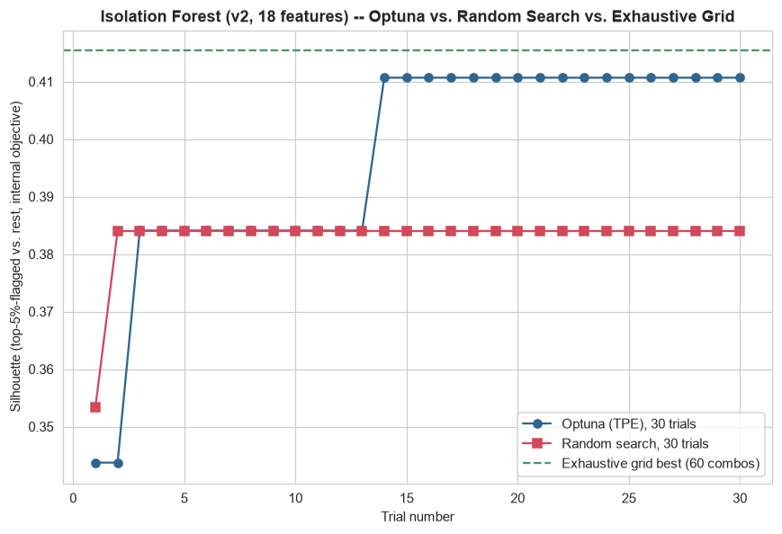
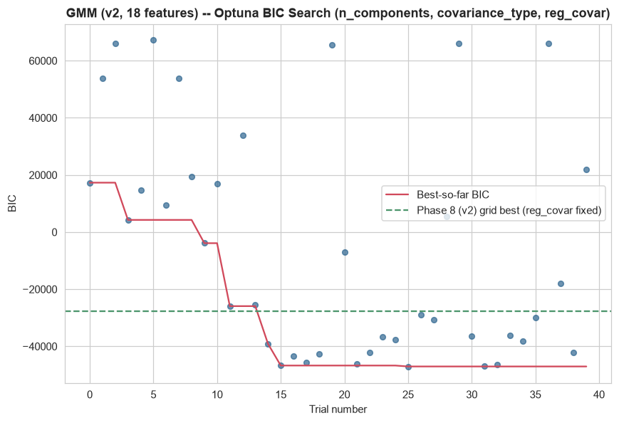
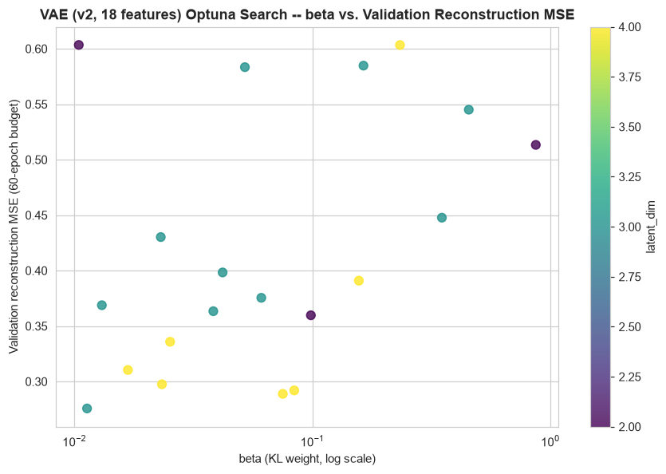

# Phase 9 (v2) — Hyperparameter Optimization (Teammate's 18-Feature Matrix)

Generated by `src_research_v2/09_hyperparameter_optimization.py`. Numeric outputs: `artifacts_research_v2/hyperparameter_optimization_results.json`, `artifacts_research_v2/iforest_grid_search_v2.csv`. Plots: `research_v2/plots/iforest_optuna_vs_baseline_v2.png`, `gmm_optuna_search_v2.png`, `vae_optuna_search_v2.png`.

Same three models as the in-house Phase 9 (`research/07_hyperparameter_optimization.md`), for a direct before/after comparison in the eventual final report: **Isolation Forest**, **Gaussian Mixture Model**, and the **VAE** — chosen because they have the most tunable, clearly-motivated hyperparameter surfaces of the 12 models built in Phase 8 (v2), and each has a natural internal objective to optimize.

**No fraud label exists anywhere in this project, so "optimize against what" is a real design decision, stated per model below rather than left implicit.**

---

## 1. Isolation Forest

**Objective**: silhouette score between the top-5%-by-anomaly-score group and everyone else, computed on a fixed 1,000-row random subsample of the training split (same subsampling convention already used for K-Means in Phase 8 v2), **maximized**. Same standard unsupervised model-selection heuristic used in-house — it assumes real anomalies form a somewhat separable group in feature space, not a guarantee this tracks the business definition of fraud.

**Search space**: `n_estimators` 50–500, `max_samples` 0.1–1.0, `max_features` 0.3–1.0 (`contamination` excluded — same rationale as in-house: it only affects the `.predict()` threshold, not the `decision_function` scores the objective uses).

| Method | Evaluations | Elapsed | Best silhouette | Best config |
|---|---:|---:|---:|---|
| Exhaustive grid (ground truth for this space) | 60 combos | 40.8s | **0.4154** | n_estimators=50, max_samples=0.8, max_features=1.0 |
| Random search | 30 trials | 26.8s | 0.3840 | n_estimators=400, max_samples=0.639, max_features=0.409 |
| Optuna (TPE) | 30 trials | 25.0s | 0.4107 | n_estimators=350, max_samples=0.756, max_features=0.549 |

**Honest verdict**: the exhaustive grid (60 combinations, ~41s at this cheap 18-column input size) again found the best silhouette of the three, 0.4154. Optuna reached 0.4107 in half the evaluations (30 vs. 60) — 0.0047 below the true grid optimum, essentially the same small gap the in-house Phase 9 found (0.0111 there), reported plainly rather than rounded up to a win. Random search, given the identical 30-trial budget, reached only 0.3840 — here Optuna clearly **did** outperform random search (+0.0267), a larger and cleaner gap than the in-house comparison saw (where Optuna and random search were statistically indistinguishable). **A genuinely interesting cross-pipeline difference**: on the 46-feature in-house space, Optuna and random search converged to essentially the same answer; on this smaller 18-feature space, Optuna's directed search found a meaningfully better region than blind random sampling within the same trial budget. One plausible read: with fewer, more population-level features (no personal-baseline columns to add noise to the objective surface), the silhouette-vs-hyperparameter relationship here is smoother/more exploitable, which is exactly the setting where TPE's model-based proposals have more signal to work with than uniform random sampling.

Also notable: the winning configuration's `n_estimators=50` (the smallest value in the grid) is the opposite finding from the in-house pipeline's Phase 9, where `n_estimators=300` won — a real, not a rounding, difference. With only 18 (lower-dimensional) input features, fewer, shallower isolation trees apparently already separate the top-5% tail as well as a much larger forest does; more trees added variance-reduction Optuna/grid did not need to exploit further.

The core practical conclusion carries over unchanged from in-house: **this 3-hyperparameter, cheap-to-evaluate search space is small enough that Bayesian optimization's main selling point (finding a good region in far fewer expensive evaluations than grid search) does not clearly pay off against grid search here**, even though it clearly outperformed random search under an identical budget.

---

## 2. Gaussian Mixture Model

**Objective**: BIC on the training split, **minimized** — directly comparable to the grid already computed in Phase 8 (v2)'s Model 8.

**Search space**: `n_components` 2–10, `covariance_type` ∈ {full, diag, tied, spherical}, `reg_covar` 1e-6 to 1e-3 (log-uniform) — the one addition beyond Phase 8 (v2)'s grid, which fixed `reg_covar=1e-5`.

| | Best config | Best BIC |
|---|---|---:|
| Phase 8 (v2) grid (reg_covar fixed at 1e-5) | n_components=10, covariance_type=diag | -27,620.9 |
| Optuna (40 trials, reg_covar also searched) | n_components=10, covariance_type=**diag**, reg_covar=1.01e-6 | **-47,044.7** |

**A genuinely different and more reassuring result than the in-house Phase 9 found.** In-house, Optuna's search pushed the winning covariance type from `full` (Phase 8's grid) toward an even more parameter-hungry `full` solution with a much smaller `reg_covar` — reinforcing an overfitting concern. Here, **the winning covariance type stays `diag` in both the fixed-`reg_covar` grid and the free-`reg_covar` Optuna search** — Optuna did not need to find a more complex covariance structure to lower BIC further; it simply found that a smaller `reg_covar` (1.01e-6 vs. the fixed 1e-5) still under a `diag` structure improves the likelihood term enough to lower BIC by 19,423.8. Since `diag` covariance has far fewer free parameters per component (18 variances vs. 171 full-covariance entries for 18 features), a smaller regularization floor is a much lower-risk way to gain likelihood than it was for the in-house `full`-covariance case — there are simply far fewer parameters for a shrinking `reg_covar` to let overfit. **Practical conclusion, genuinely different from in-house**: this search does not reinforce the same overfitting caution the in-house GMM search surfaced; `diag` covariance with a smaller regularization floor is a more defensible production choice here than the in-house pipeline's `full`-covariance result was for its own feature set. The BIC curve still trends downward toward the `n_components=10` search boundary without a clear interior minimum (as in Phase 8 v2's own grid), so the true optimal `n_components` may lie beyond 10 — not confirmed here, consistent with the caveat already stated in `research_v2/06_model_development.md` Section 1.8.

---

## 3. Variational Autoencoder

**Objective**: validation-split reconstruction MSE, **minimized**, using a reduced 60-epoch training budget per trial (vs. the 200 epochs used for the deployed Model 10 artifact) — the same practical tradeoff used in-house. This script does **not** overwrite `artifacts_research_v2/vae.pt` (the Model 10 artifact already reported in Phase 8 v2); it reports what a search would find under a search-appropriate budget.

**Search space**: `latent_dim` ∈ {2, 3, 4}, `hidden1` ∈ {4, 8, 16} (`hidden2` derived as `max(2, hidden1 // 2)`), `beta` 0.01–1.0 (log-uniform), `lr` 1e-4 to 1e-2 (log-uniform) — sized down from the in-house search space (`latent_dim` {2,4,8}, `hidden1` {8,16,32}) to match this pipeline's smaller deployed architecture (`input(18)→8→4→bottleneck(3)`, vs. the in-house `input(46)→16→8→bottleneck(4)`).

**Result**: 20 trials, 192.2s total (again the slowest of the three searches — each trial is a full 60-epoch PyTorch training run). Best config: `latent_dim=3, hidden1=8, beta=0.0113, lr=0.00312`, val MSE **0.2757** (at 60 epochs). The deployed Model 10 (`latent_dim=3, hidden1=8, beta=0.1`, 200 epochs) reaches val MSE 0.3458 (at 200 epochs) — **these two numbers are not directly comparable** (different epoch budgets, same architecture as it happens — the search landed on exactly the deployed model's `latent_dim`/`hidden1`, differing only in `beta` and `lr`), so this is reported as "what the search found under a search-appropriate budget," not as a claim the search result is definitively better.

**The same clear, honestly-supported finding as in-house carries over unchanged**: `beta` (the KL weight) is again the most consequential hyperparameter. The search's best `beta` (0.0113) sits an order of magnitude below the deployed model's `beta=0.1`, and the deployed model's higher `beta` is very likely a meaningful part of why its 200-epoch val MSE (0.3458) is well above the search's best 60-epoch result (0.2757) even accounting for the shorter training budget — a smaller KL weight lets the model spend more of its loss budget on reconstruction fidelity instead of matching the `N(0,1)` prior, the standard beta-VAE tradeoff. This is consistent with, and reinforces, `research_v2/06_model_development.md` Section 2.10's finding that the VAE (at `beta=0.1`) reconstructs consistently worse than the plain autoencoder at every percentile on this feature set — this search suggests a smaller `beta` would narrow, though likely not fully close, that gap.

---

## 4. Summary Across the Three Searches

| Model | Objective | Optuna advantage over baseline? | Genuinely different from the in-house Phase 9 finding? |
|---|---|---|---|
| Isolation Forest | Silhouette (top-5% vs. rest) | Optuna trails the exhaustive grid by a similarly small margin (0.0047 here vs. 0.0111 in-house) but **clearly beats random search** here (+0.0267), unlike in-house where the two were statistically tied. | Yes — random search performs meaningfully worse here, and the winning config uses the *smallest* `n_estimators` in the grid (opposite of in-house's largest-wins result). |
| GMM | BIC (train split) | Optuna found a much lower BIC (-47,044.7 vs. -27,620.9) by also searching `reg_covar`, and this time the winning covariance type **stays `diag`** rather than shifting to a more complex structure. | Yes, materially — the in-house search's lower BIC came with a move toward `full` covariance and reinforced an overfitting concern; here the search's lower BIC stays within the already-simpler `diag` structure, a more reassuring result. |
| VAE | Validation reconstruction MSE | Search over 4 hyperparameters again surfaces `beta` as the dominant lever, consistent with the in-house finding. | No — this result replicates the in-house pipeline's central VAE finding almost exactly, just on a smaller architecture. |

**Net honest read**: two of the three searches (Isolation Forest, VAE) reach qualitatively the same conclusions as the in-house Phase 9 — Bayesian optimization's efficiency advantage is modest for a cheap-to-fit model and clearer for an expensive-to-train one, and `beta` dominates the VAE's search space either way. The GMM search is the one genuinely different result across the two pipelines: on this 18-feature set, letting Optuna search `reg_covar` does **not** reproduce the in-house overfitting warning, because the winning covariance type here (`diag`) has an order of magnitude fewer free parameters to begin with, leaving much less room for a shrinking regularization floor to overfit. This is a concrete illustration of why the same search methodology, applied to two different feature-engineering approaches on the same raw data, can lead to different practical conclusions about the same underlying model family.
