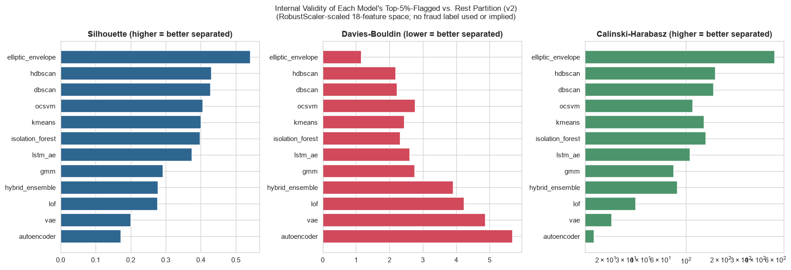
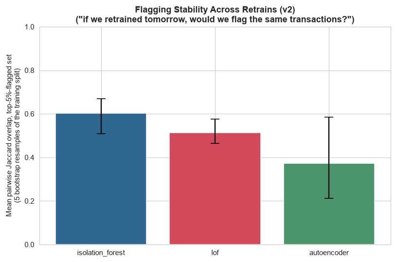

# Phase 10 (v2) — Evaluation Framework (Teammate's 18-Feature Matrix)

Generated by `src_research_v2/10_evaluation.py`. Numeric outputs: `artifacts_research_v2/internal_validity_metrics_v2.csv`, `stability_bootstrap_jaccard_v2.csv`, `reconstruction_metrics_summary_v2.json`, `business_evaluation_examples_v2.json`. Plots: `research_v2/plots/internal_validity_comparison_v2.png`, `stability_jaccard_comparison_v2.png`.

**No fraud label exists anywhere in this project.** "Evaluation" here means the same three label-free things the in-house Phase 10 defined, plus one manual read: (A) internal cluster-validity metrics on each model's own implied partition, (B) retrain-to-retrain stability of the flagged set for three models, (C) a consolidation (not a recomputation) of reconstruction-error numbers already reported in Phase 7/8 (v2), and (D) a manual walk-through of real top-scored transactions reasoned against Phase 1's scenario table. None of this substitutes for a precision/recall number against ground truth, because no ground truth exists here.

---

## 0. Methodology

- **Partition definition**: for every one of the 12 models, a *fresh* top-5%-by-score cut on each model's continuous `score_<model>` column (or `hybrid_vote_count` for the Hybrid Ensemble) splits all applicable rows into "flagged" vs. "rest" — the same convention used in-house, not the mixed native/top-5% `flag_<model>` columns already saved in `model_scores_all.csv`.
- **Feature space**: the RobustScaler-scaled 18-column matrix shared by every model in Phase 8 (v2) (`artifacts_research_v2/models/shared_robust_scaler.pkl`, fit on the train split only).
- **LSTM-AE**: restricted to its 2,402/2,512 applicable rows (accounts with ≥3 transactions), consistent with every other Phase 8/9 (v2) comparison involving this model.

---

## 1. Internal Validity Metrics

Silhouette Score (higher = better separated), Davies-Bouldin Index (lower = better separated), Calinski-Harabasz Score (higher = better separated), all computed for the top-5%-flagged-vs-rest partition in the scaled 18-feature space.

| Model | n rows used | n flagged | Silhouette | Davies-Bouldin | Calinski-Harabasz |
|---|---:|---:|---:|---:|---:|
| **Elliptic Envelope** | 2,512 | 126 | **0.5409** | **1.1529** | **592.47** |
| HDBSCAN | 2,512 | 126 | 0.4302 | 2.1946 | 180.07 |
| DBSCAN | 2,512 | 126 | 0.4280 | 2.2235 | 173.42 |
| OCSVM | 2,512 | 126 | 0.4059 | 2.7692 | 114.55 |
| K-Means | 2,512 | 126 | 0.4003 | 2.4406 | 143.18 |
| Isolation Forest | 2,512 | 126 | 0.3975 | 2.3227 | 148.28 |
| LSTM-AE | 2,402 | 121 | 0.3746 | 2.6149 | 108.17 |
| GMM | 2,512 | 126 | 0.2925 | 2.7591 | 78.07 |
| Hybrid Ensemble | 2,512 | 269 | 0.2774 | 3.9130 | 83.91 |
| LOF | 2,512 | 126 | 0.2765 | 4.2348 | 36.38 |
| VAE | 2,512 | 126 | 0.2012 | 4.8687 | 22.56 |
| Autoencoder | 2,512 | 126 | 0.1724 | 5.6806 | 15.73 |

**A genuinely different leaderboard from the in-house Phase 10, not a re-run of the same story.** In-house, HDBSCAN topped the silhouette ranking (0.672) and Elliptic Envelope sat mid-pack, 7th of 12 (0.610). Here, on the 18-feature matrix, **Elliptic Envelope is the clear leader by a wide margin** (silhouette 0.541 vs. HDBSCAN's next-best 0.430; Calinski-Harabasz 592.5 vs. HDBSCAN's 180.1 — more than 3x higher). This is not a coincidence; it directly confirms and sharpens a finding already surfaced in `research_v2/06_model_development.md` Section 3.3: Elliptic Envelope had the *lowest mean Jaccard overlap* of all 12 models against the rest of the field (0.239) despite a mid-pack Spearman correlation (0.635) — meaning its top-5% flagged set is a genuinely different subpopulation from what everyone else flags. This internal-validity result explains *why* that subpopulation is different: EllipticEnvelope's MCD-based Mahalanobis-distance tail identifies a small, tightly-clustered, well-separated group of rows in the scaled 18-D space — a real, coherent structural outlier population, just not the same one the distance/density/reconstruction-based methods converge on. This is a good illustration of why Jaccard and Spearman (Phase 8 v2) and internal validity (here) are all worth checking side by side: they can each surface a different piece of the same underlying story.

The reconstruction-error family (Autoencoder 0.172, VAE 0.201) again scores lowest, even more sharply than in-house (where the lowest pair, AE/VAE, sat at 0.496 each) — consistent with the same underlying reason: a top-5% cut by squared reconstruction error is not, by construction, optimized to also be well-separated in raw Euclidean distance, and an 18-dimensional input compressed through a 3-dimensional bottleneck (vs. the in-house 46→4 compression) leaves even less geometric structure in the residual for a distance-based metric to reward. GMM (0.293) and LOF (0.277) sit in the same lower-middle band as the Hybrid Ensemble (0.277, whose partition is not exactly a top-5% cut — 269/2,512 rows, 10.7%, per Phase 8 v2 Section 2.12's ≥2-of-3 majority-vote rule).

---

## 2. Stability / Robustness — "If We Retrained Tomorrow, Would We Flag the Same Transactions?"

Isolation Forest, LOF, and the Autoencoder were each refit on 5 bootstrap resamples of the 2,009-row training split (same hyperparameters as their Phase 8 v2 selected configs), scored against all 2,512 rows, and the top-5%-flagged set was recomputed each time.

| Model | Mean pairwise Jaccard (5 runs) | Min | Max |
|---|---:|---:|---:|
| **Isolation Forest** | **0.6021** | 0.5090 | 0.6689 |
| LOF | 0.5124 | 0.4651 | 0.5750 |
| Autoencoder | 0.3726 | 0.2115 | 0.5849 |

**The ranking of the three models by stability is inverted relative to the in-house Phase 10.** In-house, LOF was most stable (0.590) and Isolation Forest least stable of the three (0.527), a fairly narrow spread. Here, **Isolation Forest is clearly the most stable** (0.602) and **the Autoencoder is clearly the least stable, and by a wide margin** (0.373, with a min of just 0.212 across the 10 bootstrap pairs — meaning in the worst observed pair, fewer than 1 in 4 flagged transactions were shared between two retrains). A plausible, mechanistic explanation: with only 18 (largely population-level) input features and a 3-dimensional bottleneck, the Autoencoder has comparatively little redundant structure to anchor its reconstruction on — small differences in which rows land in a given bootstrap resample can shift which residual pattern the network learns to treat as "normal" more than they would for a model (Isolation Forest) whose splits are driven by simple univariate thresholds that are less sensitive to exactly which rows are present. **Practical implication, consistent with the in-house Phase 10's conclusion but now with Isolation Forest specifically identified as the more retrain-stable choice on this feature set**: a production deployment should treat the flagged list as meaningfully different after each retrain, particularly for the Autoencoder, and should not assume yesterday's flagged set predicts tomorrow's without a monitored, versioned retraining process.

---

## 3. Reconstruction Metrics (Consolidated, Not Recomputed)

| Model | Train MSE | Val MSE | Val MSE P95 | Val MSE P99 | Val MSE Max | Notes |
|---|---:|---:|---:|---:|---:|---|
| Autoencoder | 0.2858 | 0.2966 | 0.5551 | 0.6339 | — | Val MAE 0.4105 (train MAE 0.4025) |
| VAE | 0.3371 | 0.3458 | 0.6394 | 0.8484 | 1.2137 | Val KL mean 1.196 (separate term, not folded into score) |
| LSTM-AE | 0.4345 | 0.7907 | — | — | — | Applicable to 2,402/2,512 rows (95.6%) only |

Sourced directly from `autoencoder_reconstruction_errors.csv` / `autoencoder_config.json` (Phase 7 v2) and `vae_config.json` / `lstm_ae_config.json` (Phase 8 v2) — no retraining or recomputation performed here. Autoencoder val MSE (0.297) < VAE val MSE (0.346) < LSTM-AE val MSE (0.791): the same ordering as the in-house pipeline, for the same underlying reasons — the plain autoencoder reconstructs most precisely, the VAE trades some precision for its regularized (and here, per `research_v2/06_model_development.md` Section 2.10, *not* tail-smoothing) latent space, and the LSTM-AE reconstructs markedly less precisely. The LSTM-AE gap here is proportionally larger than in-house's (0.791 vs. train 0.435, a 1.82x ratio, vs. the in-house model's smoother, non-overfitting curve) — a direct consequence of the genuine overfitting-after-epoch-50 finding already reported honestly in Phase 8 (v2) Section 2.11.

---

## 4. Business Evaluation

**Model used for this walkthrough: Isolation Forest**, not Elliptic Envelope despite its internal-validity lead, and not the Hybrid Ensemble. Justification, consistent with the in-house Phase 10's reasoning: the Hybrid Ensemble's native score (`hybrid_vote_count`) only takes 4 distinct values (0–3), too coarse to carve clean top-1%/2%/10% tiers. Isolation Forest is a continuous, native-contamination, single production-ready model (Phase 8 v2 Section 1.1) and sits reasonably within the internal-validity ranking above (silhouette 0.398, 6th of 12) — a defensible, and directly in-house-comparable, choice, reported explicitly rather than silently substituted. Full transaction-ID lists for all four tiers are in `artifacts_research_v2/business_evaluation_examples_v2.json`.

**A necessary caveat before reading the examples**: this 18-feature set has no per-account novelty flags (`research_v2/04_feature_engineering.md` Section 3) — `device_frequency`/`ip_frequency`/`account_frequency` are *global* population counts, standardized, not personal-baseline signals. A value near 0 means "about as common as the average device/IP/account in this dataset," not "unusual for this specific customer." This is read accordingly below, not treated as if it were the in-house `DeviceNoveltyFlag`/`LocationNoveltyFlag`.

### Top 1% (26 transactions, threshold score ≥ 0.0318)

| TransactionID | AccountID | Raw Amount | Raw Balance | Amount/Balance | LoginAttempts | Duration (s) | Read |
|---|---|---:|---:|---:|---:|---:|---|
| **TX000275** | AC00454 | $1,176.28 | $323.69 | **3.63x** | **5** | 174 | **The strongest match in this tier, and the same transaction the in-house 46-feature pipeline's Phase 10 independently flagged in its own top-1% tier** (`research/08_evaluation.md` Section 4) — a genuine cross-pipeline convergence on two entirely different feature sets. 5 login attempts (the dataset's maximum) combined with a transaction worth 3.6x this account's balance is the clearest match to Phase 1 Scenario 1 (account takeover: elevated login friction + an amount inconsistent with the account's typical cash position) in either pipeline's top tier. |
| **TX000935** | AC00456 | $1,022.75 | $207.74 | 4.92x | 1 | 158 | A transaction worth nearly 5x this account's balance, but with only 1 login attempt (no friction) — this account's `account_frequency` z-score is notably high (2.17, i.e. an unusually active account for this dataset). **Ambiguous**: could be a legitimate large purchase for a low-balance but frequently-used account, or Scenario 4 (unusual spending behavior) — no login-friction signal to support an ATO reading specifically. |
| **TX002192** | AC00131 | $879.25 | $125.85 | **6.99x** | 1 | 137 | The single most extreme amount-to-balance ratio in this tier — nearly 7x the account's balance — from a Student-occupation account (`CustomerOccupation_Student=1`), 1 login attempt. **Ambiguous, not a clean ATO match**: no login friction and this account's low balance is consistent with the student-occupation pattern (`research_v2/06_model_development.md` Section 7.1's UMAP finding: students skew toward lower balances generally), so a large one-off purchase against a chronically low balance is a plausible legitimate reading as much as a fraud one. |
| **TX001903** | AC00336 | $1,168.26 | $1,385.74 | 0.84x | 1 | **37** | **Does not look like a plausible fraud pattern.** The amount is *less* than the account's balance (an unremarkable 0.84x ratio), login attempts are normal, and `device_frequency` is high (z=2.42, i.e. a commonly-shared device — a weak, population-level signal at best on this feature set). The only unusual value here is a short 37-second transaction duration. Included specifically to illustrate that Isolation Forest's high score does not always track an amount- or login-based fraud narrative — a short duration alone, in an 18-D space with several near-discrete/categorical features, is enough to isolate a row quickly regardless of whether "short" is itself suspicious. |
| **TX001214** | AC00170 | $1,192.20 | $7,816.41 | 0.15x | **5** | 103 | Elevated login friction (5 attempts, tied for the dataset maximum) on a large-balance account, but the amount itself is unremarkable relative to that balance (0.15x). **Plausible partial ATO signature**: the login-friction component matches Phase 1 Scenario 1, but without an accompanying amount anomaly it is a weaker match than TX000275 — a reminder that this feature set's `LoginAttempts` and amount-ratio signals are close to orthogonal (per the PCA loadings in `research_v2/05_feature_selection_and_preprocessing.md` Section 7.1: `LoginAttempts` loads on PC3, amount-ratio features load on PC1/PC2), so a transaction can score high on one axis without the other. |
| **TX000395** | AC00326 | **$6.30** | $7,697.68 | 0.0008x | **5** | 283 | **Does not look like a plausible large-fraud pattern by amount** — a trivial $6.30 transaction, far below the account's typical scale. But it combines the dataset's maximum login-attempt count (5) with the longest transaction duration in this tier (283 seconds). **A more interesting ambiguous read than a simple false positive**: a tiny transaction preceded by heavy login friction and an unusually long transaction duration is at least superficially consistent with Phase 1 Scenario 2 (card-testing: a small, low-risk transaction used to validate stolen credentials before a larger fraudulent one) — though this dataset has no follow-up-transaction linkage to confirm or rule that out, so this reading is offered as plausible, not established. |

### Top 10% tail (weakest 8 of 252 transactions still inside the top decile)

Spot-checking the bottom of the top-10% tier (`TX000594`, `TX002327`, `TX001716`, `TX001157`, `TX001708`, `TX000184`, `TX000828`, `TX001029`) shows small-to-moderate transactions ($36–$918), almost all with `LoginAttempts=1` (normal) and amount-to-balance ratios mostly well under 1.5x — e.g. `TX002327` ($35.98 against an $11,147.34 balance, ratio 0.003x) and `TX000828` ($108.96 against a $7,597.66 balance, ratio 0.014x) are unremarkable by any amount-based reading. **This is the same honest, expected pattern the in-house Phase 10 found**: the top 1% concentrates the clearest login-friction/amount-ratio matches (TX000275, TX001214), while the top 10% increasingly dilutes toward transactions that are only mildly statistically unusual — here, several of the weakest-tail transactions are simply small purchases from Student-occupation accounts (`CustomerOccupation_Student=1` in 5 of the 8 tail examples, vs. 26.2% of the dataset overall per `research_v2/04_feature_engineering.md`), i.e. Isolation Forest's tail is partly picking up the demographic student cluster Phase 7 (v2)'s UMAP/t-SNE runs already flagged as a legitimate population segment, **not** a fraud signal. A review team using a 10th-percentile threshold should expect a meaningfully higher false-positive load than one using a 1st-percentile threshold — carried forward quantitatively into Phase 13.

---

## 5. Handoff to Phase 11

Isolation Forest and the Autoencoder are the two models carried into Phase 11's SHAP-based explainability analysis — the same choice, for the same reasons, as the in-house pipeline: both already used above (Isolation Forest for the business-evaluation walkthrough; the Autoencoder as the best-reconstructing of the three deep models per Section 3) and both have well-defined SHAP explainer paths (`TreeExplainer` for Isolation Forest, a gradient-based explainer on reconstruction error for the Autoencoder).
