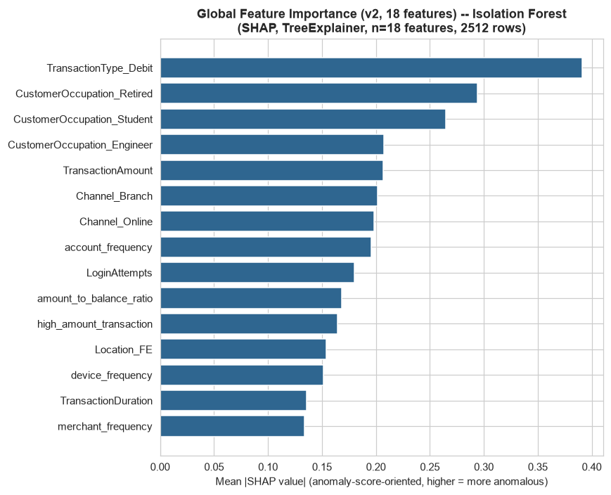
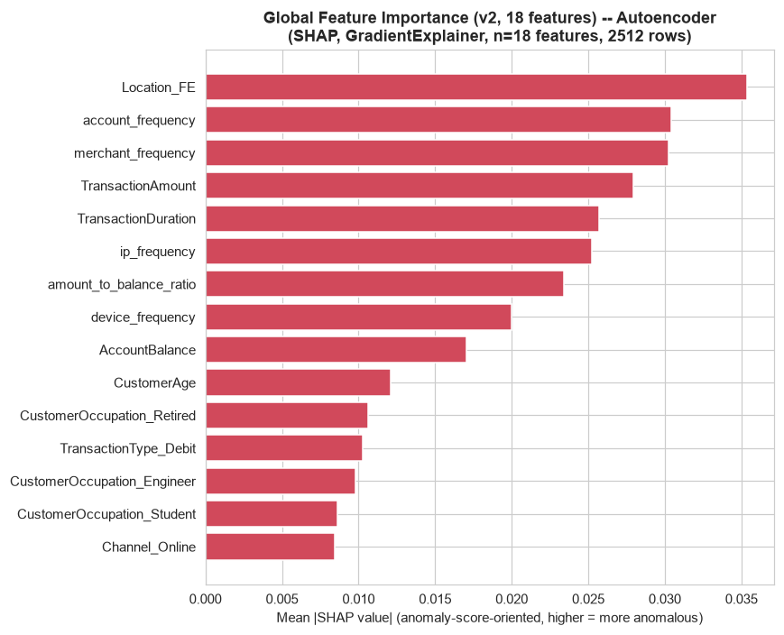
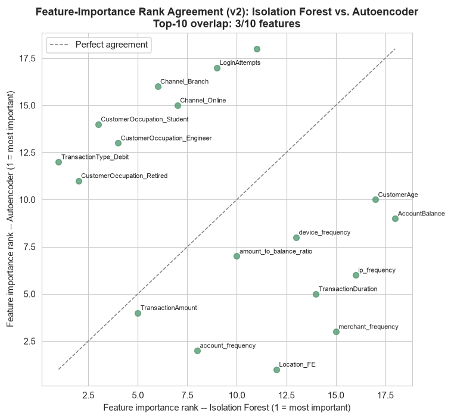

# Phase 11 (v2) — Explainability (Teammate's 18-Feature Matrix)

Generated by `src_research_v2/11_explainability.py`. Numeric outputs: `artifacts_research_v2/shap_isolation_forest_v2.csv`, `shap_autoencoder_v2.csv`, `shap_global_importance_comparison_v2.csv`, `shap_local_explanations_v2.json`. Plots: `research_v2/plots/shap_global_importance_if_v2.png`, `shap_global_importance_ae_v2.png`, `shap_if_vs_ae_agreement_v2.png`, `shap_local_waterfall_TX000275_v2.png`, `shap_local_waterfall_TX000935_v2.png`, `shap_local_waterfall_TX000615_v2.png`, `shap_local_waterfall_TX001029_v2.png`.

---

## 0. Method and Sign Convention (Checked, Not Assumed)

- **Isolation Forest**: `shap.TreeExplainer`, exact, no background sample required, 8.3s for all 2,512 rows. Checked directly before use: TreeExplainer's raw output for sklearn's `IsolationForest` tracks `score_samples` (Spearman rho = 1.0000 on a 200-row spot-check), the *opposite* convention to this project's `score_isolation_forest = -decision_function` (higher = more anomalous). **Raw SHAP values are therefore negated** before being reported, so that a positive value in every table below means "pushes the anomaly score up" — the same convention, and the same verification method, as the in-house Phase 11.
- **Autoencoder**: `shap.GradientExplainer` on the `AEErrorWrapper` module, whose forward pass returns the scalar per-row reconstruction MSE — the same quantity as `score_autoencoder`. Background = 100 rows sampled from the training split. Additivity was checked directly in a 10-row spot-check (Spearman rho = 0.9879 between `base + shap_sum` and the wrapper's actual output — GradientExplainer's expected-gradients approximation, not an exact decomposition, so this is not expected to be exactly 1.0). No sign flip needed: higher SHAP value already means "pushes reconstruction error up," matching `score_autoencoder`'s convention directly. 112.3s for all 2,512 rows.
- Both explainers were run over the full 2,512-row dataset, not a subsample.

---

## 1. Global Feature Importance

Ranked by mean |SHAP value| across all 2,512 rows.

| Rank | Isolation Forest — top 10 | mean\|SHAP\| | Rank | Autoencoder — top 10 | mean\|SHAP\| |
|---:|---|---:|---:|---|---:|
| 1 | `TransactionType_Debit` | 0.391 | 1 | `Location_FE` | 0.0354 |
| 2 | `CustomerOccupation_Retired` | 0.294 | 2 | `account_frequency` | 0.0304 |
| 3 | `CustomerOccupation_Student` | 0.265 | 3 | `merchant_frequency` | 0.0302 |
| 4 | `CustomerOccupation_Engineer` | 0.207 | 4 | `TransactionAmount` | 0.0279 |
| 5 | `TransactionAmount` | 0.207 | 5 | `TransactionDuration` | 0.0257 |
| 6 | `Channel_Branch` | 0.202 | 6 | `ip_frequency` | 0.0253 |
| 7 | `Channel_Online` | 0.198 | 7 | `amount_to_balance_ratio` | 0.0234 |
| 8 | `account_frequency` | 0.195 | 8 | `device_frequency` | 0.0200 |
| 9 | `LoginAttempts` | 0.180 | 9 | `AccountBalance` | 0.0171 |
| 10 | `amount_to_balance_ratio` | 0.168 | 10 | `CustomerAge` | 0.0121 |

**Top-10 overlap between the two models: 3 out of 10 features** (`TransactionAmount`, `account_frequency`, `amount_to_balance_ratio`) — slightly higher overlap than the in-house pipeline's 1/10, but the Spearman correlation between the two models' full 18-feature mean\|SHAP\| importance vectors is **rho = −0.3705**, an *even more sharply negative* disagreement than the in-house pipeline's rho = −0.157. **The same structural divergence the in-house Phase 11 found — Isolation Forest and the model's reconstruction-error basis pick up on almost entirely different signals — replicates here, and more strongly.**

**Why this happens, reasoned the same way as in-house**: Isolation Forest's score comes from how few random splits isolate a point. Low-cardinality categorical/binary features (`TransactionType_Debit`, the `CustomerOccupation_*` one-hots, `Channel_*`) are cheap, clean split points that isolate an entire minority class in one step — this dominates Isolation Forest's importance ranking here just as strongly as in-house (`TransactionType_Debit` is the #1 feature in **both** pipelines, and `CustomerOccupation_Retired` is #2 in **both** — a genuine, independent replication of the same mechanism on two different feature sets). The Autoencoder's score is squared reconstruction error through a compressed 3-dimensional bottleneck, dominated by whichever continuous features are hardest to reconstruct from that compressed code.

### The genuinely interesting cross-pipeline question, answered with real numbers

**Does `amount_to_balance_ratio` dominate the Autoencoder's importance here the way `Amount_vs_AccountAvg` dominated the in-house Autoencoder's top-4?** **No — clearly not.** In-house, the top 4 Autoencoder features were all personal-baseline amount features (`Amount_vs_AccountAvg`, `Amount_ZScore_Account`, `Amount_to_Balance_Ratio`, `Amount_to_RollingMean_Ratio`), together accounting for the model's dominant reconstruction-error signal. Here, `amount_to_balance_ratio` ranks only **7th** (mean|SHAP| 0.0234) — well behind `Location_FE` (1st, 0.0354), `account_frequency` (2nd, 0.0304), and `merchant_frequency` (3rd, 0.0302), three frequency-encoded features that do not have a direct in-house analogue in this ranking position. **This is a direct, structural consequence of the capability gap already documented in `research_v2/04_feature_engineering.md` Section 3**: this feature set has no personal-baseline (`Expanding_Mean/Median/Std`, `Amount_ZScore_Account`) features for the Autoencoder's reconstruction error to concentrate on. With those removed, the hardest-to-reconstruct residual signal shifts to the frequency-encoded features (`Location_FE`, `account_frequency`, `merchant_frequency`) — plausibly because these three carry the least redundant, most idiosyncratic information relative to the other 15 (largely correlated or low-cardinality) columns, making them the ones a 3-dimensional bottleneck struggles most to recover. **Practical implication for the bank**: on this feature set, the Autoencoder should be read as "is this transaction's frequency/popularity profile (location, account activity, merchant) unusual," not "is this transaction's amount unusual for this account" — the latter reading, which was well-supported in-house, does not directly transfer here because the underlying features it would need are absent.

This divergence is consistent with, and adds a mechanistic explanation to, `research_v2/06_model_development.md` Section 3.2's finding that Isolation Forest and the Autoencoder have only a moderate Spearman correlation on their raw anomaly scores in this pipeline too — now there is a feature-level reason for that gap on this feature set specifically, not just a score-level observation.

---

## 2. Local Explanations

Four transactions are broken down below — the same transactions used in Phase 10's business-evaluation walkthrough (`research_v2/08_evaluation.md` Section 4), selected specifically to cover the top of the top-1% tier, a mid-tier top-1% example, and the weakest end of the top-10% tier, so the numeric SHAP attribution here can be read directly against that plain-language narrative.

### TX000275 (AccountID AC00454) — Isolation Forest score in the top 1%, strongest ATO match

| Model | Top drivers (in order) | Reading |
|---|---|---|
| Isolation Forest | `LoginAttempts` (+1.714), `amount_to_balance_ratio` (+1.607), `high_amount_transaction` (+1.131), `TransactionType_Debit` (+0.606), `CustomerOccupation_Engineer` (+0.255) | Every top driver pushes the score up. `LoginAttempts` (scaled value 6.43 — the single most extreme value in the entire local-explanation set) is the single largest contributor, consistent with this transaction's 5 login attempts (the dataset's observed maximum, Phase 10). |
| Autoencoder | `amount_to_balance_ratio` (+1.570, by far the largest single AE contribution across all four examples), `TransactionAmount` (−0.115, pulls down), `LoginAttempts` (+0.096, a much smaller contribution than IF's) | The Autoencoder agrees the amount-to-balance ratio is extreme (scaled 5.68), but assigns `LoginAttempts` a far smaller role than Isolation Forest does — a concrete instance of Section 1's mechanistic finding: IF is sensitive to `LoginAttempts` as a rare, near-discrete value, while the Autoencoder's reconstruction error is dominated by the continuous amount-ratio residual. |

**Plain-language read**: both models agree this transaction's amount-to-balance ratio is genuinely extreme, but they disagree on how much the elevated login-attempt count matters — Isolation Forest treats it as the single strongest signal, the Autoencoder barely registers it. This is exactly the same "amount-magnitude detector vs. categorical/rarity detector" split documented in Section 1, now shown concretely on the transaction Phase 10 identified as this pipeline's clearest ATO-pattern match (Phase 1 Scenario 1).

### TX000935 (AccountID AC00456) — Isolation Forest score in the top 1%

Both models' single largest driver is the same feature: `amount_to_balance_ratio` (IF +1.971, the largest IF value in this whole set; AE +0.317, also AE's largest here alongside TX000275). Both also weight `account_frequency` positively (IF +0.489, AE +0.114) — this account's activity level (scaled 2.17, notably above average) is a shared secondary signal for both models. **Plain-language read**: strong, mutually-reinforcing agreement that this transaction's size relative to the account's balance (nearly 5x, per Phase 10) is the dominant anomaly signal, with the account's own above-average activity level as a smaller secondary contributor to both models — a cleaner two-model agreement than TX000275's.

### TX000615 (AccountID AC00466) — Isolation Forest score in the top 1%

| Model | Top drivers | Reading |
|---|---|---|
| Isolation Forest | `high_amount_transaction` (+1.375), `amount_to_balance_ratio` (+1.115), `TransactionType_Debit` (+0.704), `Location_FE` (+0.347), `CustomerOccupation_Student` (+0.305) | Amount-related features dominate, consistent with this transaction's raw $1,342.25 amount (the largest in the top-1% detailed examples, Phase 10) and its 3.8x balance ratio. |
| Autoencoder | `Location_FE` (+0.086, **AE's single largest driver for this transaction** — larger than `amount_to_balance_ratio`), `TransactionDuration` (+0.041), `amount_to_balance_ratio` (+0.032, only 5th) | **A genuine divergence worth flagging explicitly**: for this specific transaction, the Autoencoder's reconstruction error is dominated by an unusual `Location_FE` value (scaled 1.70, i.e. a less-common location), not by the elevated amount-to-balance ratio both models clearly react to for TX000275/TX000935. |

**Plain-language read**: this is the clearest example in this set of the two models diverging on *which* aspect of the same transaction they consider most anomalous — Isolation Forest reads it primarily as an amount anomaly, the Autoencoder primarily as a location-frequency anomaly. Neither read is wrong; they illustrate why relying on a single model's explanation would give an investigator an incomplete picture of why this transaction was flagged.

### TX001029 (AccountID AC00002) — from the weakest end of the top-10% tier, flagged in Phase 10 as **not** a plausible fraud pattern

| Model | Top drivers | Reading |
|---|---|---|
| Isolation Forest | `TransactionType_Debit` (+1.046), `merchant_frequency` (+0.962, scaled value 3.67 — an extreme, rare merchant-frequency reading), `CustomerOccupation_Student` (+0.452), `Location_FE` (+0.293), `amount_to_balance_ratio` (+0.219, comparatively small) | Note that `amount_to_balance_ratio`'s contribution here (+0.219) is roughly one-fifth to one-ninth the size of its contribution to TX000275/TX000935/TX000615 — consistent with Phase 10's read that this $516.47 transaction (ratio only 0.40x this account's balance) is not an amount-magnitude anomaly. The score here is driven almost entirely by categorical/frequency rarity (transaction type, merchant frequency, student occupation, location frequency). |
| Autoencoder | `merchant_frequency` (+0.375, **the single largest Autoencoder SHAP value across all four local examples**), `Location_FE` (+0.050), all other contributions an order of magnitude smaller | The Autoencoder's read agrees with Isolation Forest here: `merchant_frequency`'s extreme value (this transaction's merchant is used unusually rarely relative to the dataset, or unusually often — the z-score of 3.67 is far from typical either way) is overwhelmingly the dominant driver of both models' scores for this transaction, not the transaction's amount. |

**Plain-language read, and the most important finding of this section**: this is the clean illustration, on this feature set, of the same lesson the in-house Phase 11 drew from `TX000566` — a high anomaly score does not automatically mean a fraud-relevant anomaly. Both models agree TX001029's oddity is a rare merchant-frequency value, not an unusual amount, login pattern, or balance-relative size — and Phase 10 independently found this transaction ($516.47 from a Student-occupation account with normal login behavior) does not look like a plausible fraud pattern by any reasonable reading. Cross-checking a flagged transaction against a second model with a structurally different basis for its score — exactly what this phase set out to test — catches this kind of low-value flag before it reaches a human reviewer, on this feature set just as it did on the in-house one.

---

## 3. Handoff to Phase 12

The two-model SHAP divergence documented here (rho = −0.3705, an even sharper split than the in-house pipeline's −0.157) is a direct, mechanistic argument for ensembling rather than relying on a single detector family — reinforced concretely by TX000615 (the two models disagree on *which* aspect of the same transaction is anomalous) and TX001029 (both models agree a high score reflects categorical/frequency rarity, not a fraud-relevant amount anomaly). Phase 12 combines all 11 non-hybrid models' scores using four aggregation strategies, explicitly to avoid over-relying on any single model's particular blind spot.
