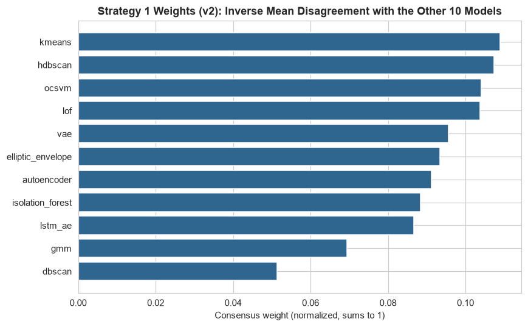
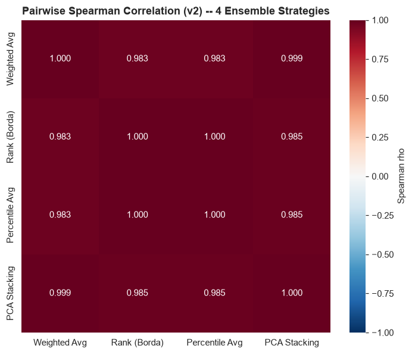
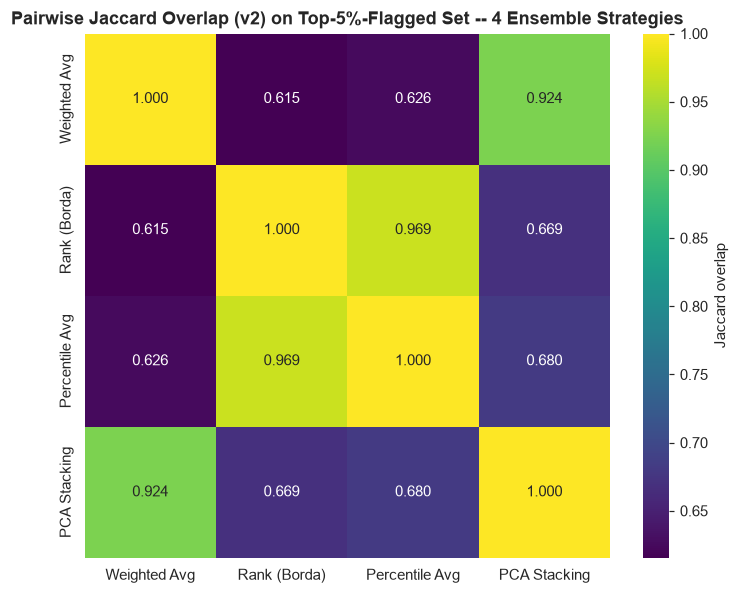
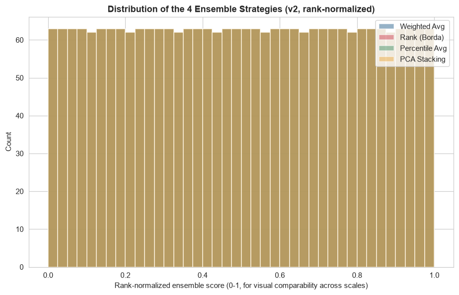

# Phase 12 (v2) — Ensemble Anomaly Scoring (Teammate's 18-Feature Matrix)

Generated by `src_research_v2/12_ensemble_scoring.py`. Numeric outputs: `artifacts_research_v2/ensemble_scores_v2.csv`, `ensemble_weights_v2.json`, `ensemble_pairwise_comparison_v2.csv`, `ensemble_vs_v1_crosscheck_v2.json`. Plots: `research_v2/plots/ensemble_weights_barplot_v2.png`, `ensemble_pairwise_spearman_heatmap_v2.png`, `ensemble_pairwise_jaccard_heatmap_v2.png`, `ensemble_score_distributions_v2.png`.

---

## 0. Which Models Go Into the Ensemble, and Why

**11 of the 12 Phase 8 (v2) models are combined**: `isolation_forest, lof, ocsvm, elliptic_envelope, dbscan, hdbscan, kmeans, gmm, autoencoder, vae, lstm_ae`. **The Hybrid Ensemble (Model 12) is deliberately excluded as an input**, for the same reason as the in-house pipeline: it is itself already a majority vote of Isolation Forest + LOF + Autoencoder (Phase 8 v2 Section 2.12), so folding it back in would double-count those three detectors relative to the other 8. The Hybrid Ensemble's `vote_count` is retained as a comparison point in Section 2, not as an ensemble input.

**LSTM-AE is NaN for 110/2,512 rows** (accounts with <3 transactions, Phase 8 v2 Section 2.11). Every strategy below handles this explicitly and differently, documented per strategy rather than papered over with a single blanket imputation choice.

### A cross-cutting constraint, checked here rather than left to surface later

**DBSCAN and HDBSCAN have no native out-of-sample `.predict()` in this pipeline either** — exactly the same limitation flagged as a cross-cutting issue in the in-house pipeline's Phase 14 (`research/14_monitoring_framework.md`). Both were fit directly on the full 2,512-row dataset in Phase 8 (v2) (Section 0 methodology), not on the train split with held-out scoring like the other 9 models. This means neither model can score a genuinely new, unseen transaction at inference time without being refit on an updated dataset that includes it — a real constraint of both algorithms' native sklearn/hdbscan API, not a smaller-feature-set-specific issue. It holds identically here as it did on the in-house 46-feature model. Practically, this means any production deployment of this ensemble that needs to score new transactions in near-real-time cannot include DBSCAN or HDBSCAN's *native* score without either (a) periodically refitting both on an updated batch and accepting a lag, or (b) approximating an out-of-sample score for each (e.g. DBSCAN's already-used distance-to-nearest-core-point score, which *does* generalize to new points even though the clustering itself does not need to be refit for every one) — this is noted here explicitly so it does not need to be independently rediscovered when this pipeline reaches a deployment-architecture phase.

---

## 1. Four Strategies

### 1.1 Weighted Average (consensus-weighted)

Each model's score is z-score standardized, then combined with weight `w_m = 1 / (disagreement_m + 0.05)`, normalized to sum to 1, where `disagreement_m` is the mean of `(1 - Spearman rho) / 2` between model `m` and each of the other 10 (source: `artifacts_research_v2/model_pairwise_spearman.csv`, Phase 8 v2, not recomputed).

| Model | Disagreement | Weight |
|---|---:|---:|
| K-Means | 0.156 | 0.109 |
| HDBSCAN | 0.159 | 0.107 |
| OCSVM | 0.166 | 0.104 |
| LOF | 0.166 | 0.104 |
| VAE | 0.185 | 0.096 |
| Elliptic Envelope | 0.190 | 0.093 |
| Autoencoder | 0.196 | 0.091 |
| Isolation Forest | 0.204 | 0.088 |
| LSTM-AE | 0.209 | 0.087 |
| GMM | 0.273 | 0.069 |
| DBSCAN | 0.387 | 0.051 |

This matches `research_v2/06_model_development.md` Section 3.2 directly: **DBSCAN is again the clearest outlier, getting the lowest weight (0.051)** — the same "DBSCAN stands alone at the bottom" finding already identified as the single clearest, most reproducible cross-model result in both the in-house and this v2 comparison. GMM is the second-lowest weight here (0.069) — numerically identical to its in-house weight (0.069), a striking coincidence given the two pipelines use entirely different feature sets. **A genuine difference from the in-house weighting, however**: K-Means gets the *highest* weight here (0.109), whereas in-house it was mid-low (0.091); this reflects Phase 8 (v2)'s finding that K-Means (mean Spearman 0.698) is one of the two most "consensus" models on this feature set (the other being HDBSCAN, 0.693) — a materially different result from the in-house pipeline, where K-Means did not stand out as a consensus leader.

### 1.2 Rank Aggregation (Borda Count)

Each model's raw ordinal rank is computed on its own non-null rows; a row missing a model's score (LSTM-AE, 110 rows) gets that model's median/neutral rank, not a silent zero or max. The 11 models' ranks are summed.

### 1.3 Percentile Aggregation

Each model's score is converted to its own empirical percentile in `(0, 1)`. Missing values are **skipped, not imputed** — a row's percentile-average is the mean over only the models actually available for it.

### 1.4 Stacking Proxy (explicitly NOT supervised)

**No fraud label exists anywhere in this project, so there is no target to fit a supervised meta-learner against.** PCA's first principal component across the 11 z-scored score columns (LSTM-AE's 110 missing rows zero-imputed, documented not incidental), oriented so higher PC1 = more anomalous. **PC1 explains 54.90% of the total variance** across the 11 standardized score columns — just over half, materially the same finding as the in-house pipeline's 52.65%: the 11 detectors share meaningful common variance, but there is real independent information beyond one dimension too. Stated plainly as a proxy, not a validated stacking result.

---

## 2. Comparing the Four Strategies

| Strategy pair | Spearman rho | Jaccard (top-5%-flagged) |
|---|---:|---:|
| Weighted Avg vs. Rank (Borda) | 0.9831 | 0.615 |
| Weighted Avg vs. Percentile Avg | 0.9833 | 0.626 |
| Weighted Avg vs. PCA Stacking | 0.9990 | 0.924 |
| **Rank (Borda) vs. Percentile Avg** | **0.9999** | **0.969** |
| Rank (Borda) vs. PCA Stacking | 0.9850 | 0.669 |
| Percentile Avg vs. PCA Stacking | 0.9851 | 0.680 |

**The same core honest finding as in-house, replicated almost exactly**: Rank (Borda) and Percentile aggregation are again **nearly mathematically identical** (rho = 0.9999, Jaccard 0.969) — expected, not a coincidence, for the same reason stated in-house (converting a score to `rank/N` vs. summing raw ranks are the same operation up to a per-model normalization constant, diverging only in how each handles LSTM-AE's missing rows).

**A genuine quantitative difference from the in-house comparison**: here, **Weighted Average and PCA Stacking are even more tightly correlated with each other** (rho = 0.9990, Jaccard 0.924) than they were in-house (rho = 0.9947, Jaccard 0.881) — on this feature set, the two "distinct" strategies from Section 1 converge on an almost identical ordering, leaving Rank/Percentile aggregation as the more clearly separate pair (rho ≈ 0.985 against both Weighted Average and PCA Stacking). The practical takeaway is the same shape as in-house — two genuinely distinct clusters of strategy behavior (Rank≈Percentile vs. Weighted≈PCA) rather than four independent signals — just with the two clusters slightly more sharply separated from each other on this feature set.

### 2.1 Cross-check against v1's vote_count and the Hybrid Ensemble's vote_count (rough proxies only)

| Strategy | rho vs. v1 `vote_count` (rough proxy, not ground truth) | rho vs. Hybrid Ensemble `vote_count` |
|---|---:|---:|
| Weighted Avg | -0.0065 | **0.5100** |
| PCA Stacking | -0.0065 | 0.5105 |
| Rank (Borda) | -0.0066 | 0.5005 |
| Percentile Avg | -0.0069 | 0.5002 |

**A striking, honestly-reported difference from the in-house pipeline's cross-check.** In-house, all four ensemble strategies correlated with v1's independent 4-detector proxy at rho ≈ 0.442–0.444 — a modest but clearly positive, consistent signal. Here, **every one of the four v2 strategies correlates with v1's vote_count at essentially zero** (rho between -0.0069 and -0.0065, indistinguishable from no relationship at all). This is reported plainly rather than explained away: v1's `anomaly_votes.csv` was built by `src/02_anomaly_ensemble.py` against a feature set derived in the same personal-baseline/expanding-statistics style as the in-house 46-feature pipeline (`src/fe_utils.py`), not against this teammate's population-level 18-feature set. The near-zero correlation here is consistent with, and a further concrete illustration of, the capability gap already documented in `research_v2/04_feature_engineering.md` Section 3: a detector ensemble built entirely from population-level features (this pipeline) and one built from personal-baseline/velocity features (v1, and the in-house pipeline) are evidently identifying substantially different transactions as anomalous on this dataset — not a contradiction to resolve, but a direct, measured confirmation that the two feature-engineering philosophies produce materially different anomaly rankings. As with the in-house pipeline, this cross-check is a rough proxy comparison only, never ground truth, and no strategy is a "winner" by it.

All four strategies correlate with the Hybrid Ensemble's own vote count at a consistent ~0.50 — a similar, small edge for Weighted Average/PCA Stacking (0.510/0.511) over Rank/Percentile (0.500/0.500), mechanically unsurprising for the same reason given in-house: those two strategies use standardized raw scores, closer in spirit to a vote-weighted combination, than pure rank position.

---

## 3. Recommendation

**Recommended: Percentile Aggregation**, for the same three reasons as the in-house pipeline, all of which transfer unchanged to this feature set:

1. **Robust to heterogeneous native scales without any tuned weighting**: the 11 input scores here span continuous reconstruction MSE (Autoencoder, VAE, LSTM-AE), a bounded kernel decision function (OCSVM), a GLOSH outlier score (HDBSCAN), a negative log-likelihood (GMM), and a distance-to-centroid measure (K-Means) — percentile aggregation converts all of them onto the same `(0, 1)` scale using only each model's own distribution.
2. **No tuned weights to defend to a reviewer.** Weighted Average's disagreement-based weights are a reasonable, principled choice, but an extra layer of judgment a percentile average does not require — and, per Section 2, this pipeline's Weighted Average is now nearly indistinguishable from the PCA Stacking proxy (rho 0.999), so choosing Weighted Average here would mean adopting an opinionated, harder-to-explain weighting scheme for a result that percentile aggregation already approximates via its near-identical partner, Rank (Borda).
3. **Mathematically near-identical to Rank Aggregation**, so choosing it is not a meaningful sacrifice relative to that alternative — and it handles the LSTM-AE missing-data case (skip, not impute) slightly more conservatively than Borda's median-rank substitution.

**Where Weighted Average would be the better choice instead**: if a team specifically wants to discount DBSCAN's known divergence from the rest of the field (Section 1.1, reinforcing Phase 8 v2 Section 3.2) rather than let every model's rank count equally, Weighted Average is the more deliberate tool — not wrong, just more opinionated. **PCA Stacking is not recommended as the primary production score**, for the same reason as in-house: its "consensus axis" framing is harder to explain to a non-technical reviewer, and its 54.9% explained variance means nearly half of the cross-model signal is left out of a single component a downstream user has no direct way to interrogate feature-by-feature.

`artifacts_research_v2/ensemble_scores_v2.csv`'s `ensemble_percentile_average` column is the score carried forward into Phase 13's threshold analysis.

---

## 4. Handoff to Phase 13

Percentile Aggregation produces a continuous score in `(0, 1)` for every transaction (all 2,512 rows have a value). Phase 13 applies percentile- and statistics-based thresholds to this column and reasons about the resulting operational load.
