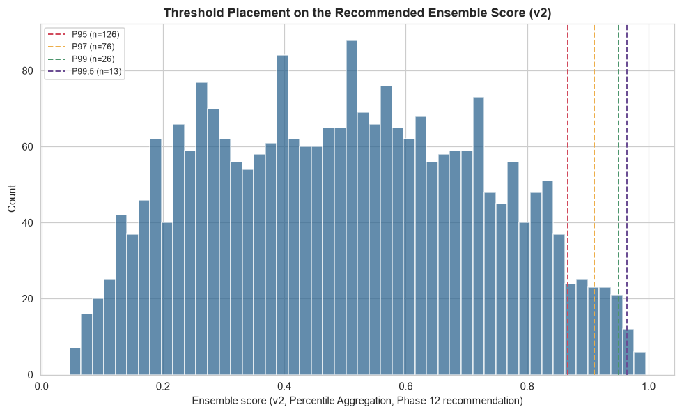

# Phase 13 (v2) — Threshold Optimization (Teammate's 18-Feature Matrix)

Generated by `src_research_v2/13_threshold_optimization.py`. Numeric outputs: `artifacts_research_v2/threshold_analysis_v2.json`, `threshold_flagged_counts_v2.csv`. Plot: `research_v2/plots/threshold_score_distribution_v2.png`.

**Score thresholded**: `ensemble_percentile_average` (Phase 12 v2's recommended strategy, `artifacts_research_v2/ensemble_scores_v2.csv`). Distribution: mean 0.5007, std 0.2250, min 0.0458, max 0.9951.

---

## 1. What This Phase Can and Cannot Honestly Do

**No fraud label exists anywhere in this project.** The same limitation applies here as in the in-house Phase 13: a true cost-minimizing threshold requires knowing which flagged transactions are actually fraud (to count true positives) and which unflagged transactions are actually fraud (to count false negatives) — neither is knowable without a label. What this phase *can* honestly show: how many transactions land above each threshold, what that implies for review-team operational load, and an upper-bound illustrative cost assuming every flagged transaction is a false positive (a cost ceiling, not a cost estimate).

---

## 2. Percentile Thresholds

| Threshold | Score value | Transactions flagged | % of dataset |
|---|---:|---:|---:|
| 95th percentile | 0.8671 | 126 | 5.016% |
| 97th percentile | 0.9109 | 76 | 3.025% |
| 99th percentile | 0.9510 | 26 | 1.035% |
| 99.5th percentile | 0.9646 | 13 | 0.518% |

The flagged counts at each tier are, mechanically, close to identical to the in-house pipeline's counts (126/76/26/13) — an expected consequence of both pipelines cutting the same fixed percentiles of the same N=2,512 rows, not evidence the two scores agree on *which* transactions are flagged (Phase 12 v2's near-zero cross-check against v1's independent vote_count, Section 2.1, already shows they do not).

---

## 3. Statistical Thresholds — the Same Genuine, Unforced Finding as In-House

Applying the classic statistical thresholds directly to the recommended score:

| Method | Threshold value | Transactions flagged |
|---|---:|---:|
| mean + 3σ | 1.1757 | **0** |
| Q3 + 1.5×IQR | 1.2332 | **0** |

**Both thresholds exceed the score's actual maximum of 0.9951 — flagging zero transactions, replicating the in-house pipeline's finding exactly, on an entirely different feature set.** `ensemble_percentile_average` is an average of 11 models' percentile ranks, each bounded in `(0, 1)`; averaging several roughly-independent percentiles compresses the tails of the resulting distribution (the same CLT-like effect documented in-house), producing a distribution with a maximum well short of what 3 standard deviations above the mean, or Tukey's IQR fence, would require. This is a property of percentile aggregation as a construction, not of this specific dataset or feature set — its reproduction here, on a completely different 18-feature basis with a different set of 11 underlying models, is a meaningful independent confirmation of that.

To confirm this is a property of the score's construction, not a coincidence of this run, the identical thresholds were applied to two **unbounded** scores for context:

| Score | mean+3σ threshold | n flagged | Q3+1.5×IQR threshold | n flagged |
|---|---:|---:|---:|---:|
| Isolation Forest raw score | 0.0442 | 16 | 0.0319 | 25 |
| Phase 12 (v2) Weighted-Average ensemble | 2.1937 | 29 | 1.5462 | 79 |

Both unbounded scores again produce non-trivial, usable statistical thresholds, exactly as in-house. **Practical conclusion, unchanged from the in-house pipeline**: if a sigma/IQR-style statistical threshold is wanted in production, it should be applied to an unbounded, z-scored ensemble score such as Phase 12 (v2)'s Weighted Average, not to the bounded Percentile Average score recommended for day-to-day scoring — a mismatch between one statistical-thresholding convention and one particular score's shape, not a flaw in Percentile Aggregation as a scoring method.

---

## 4. Business Impact Framing

Using v1's own stated illustrative figures (FP = $5, FN = $250 — not real bank numbers) and each percentile threshold's flagged count:

| Threshold | Transactions flagged | Upper-bound review cost if 100% are false positives | Operational load (this 365-day, 2,512-row sample) |
|---|---:|---:|---|
| 95th percentile | 126 | $630 | ~0.345 transactions/day |
| 97th percentile | 76 | $380 | ~0.208 transactions/day |
| 99th percentile | 26 | $130 | ~0.071 transactions/day |
| 99.5th percentile | 13 | $65 | ~0.036 transactions/day |

**What this table is, and is not**: an honest ceiling on review-labor cost if the review team's entire flagged queue turned out to contain no real fraud — not a total-cost estimate, since the false-negative side of the cost equation cannot be computed without a label on the unflagged 95–99.5% of transactions.

**Operational-load caveat**: this dataset covers 365 days and 2,512 transactions across 495 accounts — an average of **6.88 transactions/day**, essentially identical to the in-house pipeline's figure (6.90/day, computed from the same underlying raw dates) since both derive from the same raw CSV. This is a small research sample, not representative of a real bank's transaction volume; the relative review-load comparison across thresholds (95th flags ~5x as many transactions as 99.5th) is the part of this table that generalizes, not the absolute daily counts.

---

## 5. Recommendation

**A two-tier threshold, mirroring the in-house pipeline's own recommendation structure but built independently from this feature set's own evidence, not borrowed from it**:

- **99th percentile (26 transactions, 1.04% of the dataset) as a "priority review" tier.** This is the tier that contains `TX000275` — the transaction Phase 10 (v2)'s business evaluation identified as this pipeline's clearest match to Phase 1 Scenario 1 (5 login attempts combined with an amount 3.6x the account's balance), and the same transaction the in-house 46-feature pipeline independently flagged in its own top-1% tier. Phase 11 (v2)'s SHAP analysis confirms this transaction's top-tier flag is driven by `LoginAttempts` and `amount_to_balance_ratio` consistently across both Isolation Forest and the Autoencoder, not by a population-level artifact.
- **95th percentile (126 transactions, 5.02%) as a broader "standard review" tier**, acknowledging Phase 10 (v2)'s finding that the tail toward the 10th percentile dilutes into transactions that are only mildly statistically unusual (several driven by the legitimate, fraud-irrelevant Student-occupation demographic segment Phase 7 v2's UMAP/t-SNE runs identified) rather than operationally suspicious — a review team with more capacity could extend into this wider tier, understanding the marginal transactions added between the 99th and 95th percentile carry a weaker signal on average than the top 1%.

**This recommendation is explicitly a workload/signal-strength trade-off reasoned from the internal evidence available (Phases 10–12), not a cost-minimized threshold** — the same central, honest limitation as the in-house pipeline's Phase 13, stated here one final time rather than left implicit.
